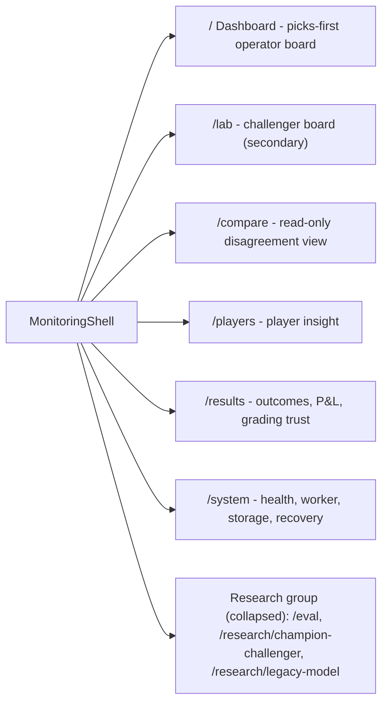
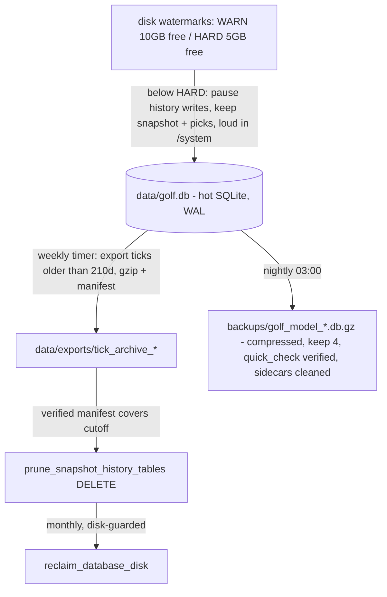
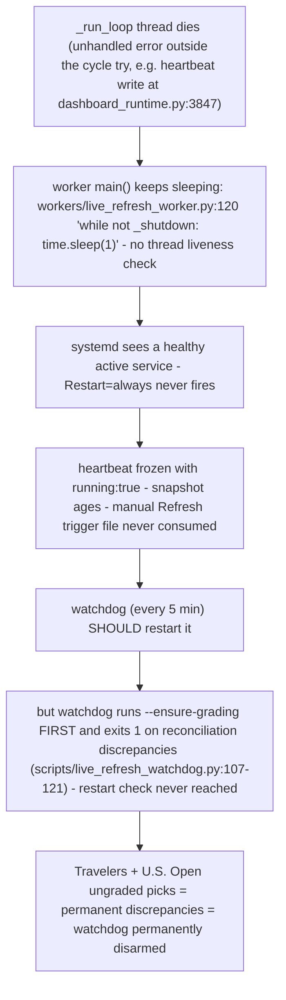

# UI-First Recovery Plan — Golf Model Operator Terminal

**Repo:** `golf-model` · **Production:** https://golf.ancc.blog/ (VPS `/opt/golf-model`, branch `main`)
**Written:** 2026-07-06, from live diagnosis of the production box (evidence embedded below).
**Operator:** Solo, non-technical. Desktop-first; mobile must work (responsive, not parity).
**Status:** PLAN ONLY — no app code changes in this PR.

---

## How to read this plan (plain English)

Four things are wrong, in this order of importance:

1. **The site looks and feels unprofessional** — competing headers, the same number shown three different ways, dense walls of digits, pages that feel abandoned, healthy and broken states that look identical. This plan's biggest section is a full UI/UX program with a written design contract and a page-by-page spec.
2. **The server keeps running out of disk space** — the database is 12.7 GB and growing, each nightly backup is another 12 GB, and the automatic cleanup that was supposed to run has silently never deleted a single row. Disk-full events have taken the dashboard down before and will again.
3. **The app stops updating when no browser tab is open** — right now, on the production box, the background worker has been a zombie for 17+ hours and the watchdog that should have restarted it is broken in a way that guarantees it never will (details in Section 3).
4. **Picks are not all being logged and graded** — the John Deere Classic ended yesterday; the database holds 95 dashboard picks for it, none graded, and the UI shows only ~3. Two older events (Travelers, U.S. Open) still carry 24 and 16 ungraded +EV picks.

The build order is: a short **Phase 1 reliability stabilizer** (so the new UI has real, honest data behind it), then the **UI program** (the bulk of the work), then **permanent storage** and **grading permanence**. The stabilizer is deliberately small — six tightly-scoped units — and must not grow into a backend mega-project.

**The one rule that overrides everything: a beautiful UI must never hide the truth.** Every redesigned page must show broken, stale, or unhealthy states loudly and honestly until the underlying problems are actually fixed. If the worker is down, the new dashboard says so in plain English — it does not show a polished board of yesterday's numbers pretending everything is fine.

---

## Binding program rules (apply to every PR)

### Priority order (do not rebalance)

1. UI/UX — most planning detail, most design rigor, as many PRs as the redesign honestly needs (no quota).
2. Permanent storage — never lose KEEP_FOREVER data; disk stays above a safe floor forever.
3. Always-on background refresh — progress must never depend on an open browser tab.
4. Pick logging + grading integrity — every board-visible +EV pick logged; every completed event fully graded.

### Frozen zone contract

Prediction models and pick outputs are **frozen for this entire program**. The following may not change behavior:

- `src/models/*` (composite, course_fit, form, momentum, weights, prob_engine_v1)
- `src/value.py`, `src/matchup_value.py`, `src/matchups.py`
- `src/kelly.py`, `src/portfolio.py`, `src/exposure.py`
- `src/config.py` prediction weights/thresholds
- `run_predictions.py`, `src/services/golf_model_service.py` pick **generation**
- `backtester/pit_models.py`, `backtester/strategy.py`
- `backtester/dashboard_runtime.py` **compute** paths (rankings/matchups/value generation)

**Allowed to change:** serve/cache/UI layer, grading ops pipeline (freeze/log/grade/reconcile — not scoring math), storage/retention/backup automation, background worker reliability (`_run_loop`, heartbeat, locks, persistence tails in `dashboard_runtime.py`), read-only APIs, all frontend code.

**CI guard (already exists — keep green):** the `frozen-zone-guard` job in [.github/workflows/ci.yml](.github/workflows/ci.yml) runs [scripts/ci/frozen_zone_guard.sh](scripts/ci/frozen_zone_guard.sh) against [docs/frozen-zone-paths.txt](docs/frozen-zone-paths.txt) and fails any PR touching those paths without the `frozen-zone-override` label. Two gaps to close in unit S5:
- `backtester/dashboard_runtime.py` is not in the paths file because only its *compute* sections are frozen (the worker loop and persistence tails must stay editable). Guard: every PR touching that file must state in its description which functions changed and confirm none are in the compute list; the existing byte-identity test (`tests/test_champion_challenger.py`) plus snapshot-contract tests are the behavioral backstop.
- Every PR description must include the line: `Frozen zone: untouched (frozen-zone-guard green)` or an explicit override justification.

### Non-negotiable data rules

- **KEEP_FOREVER, never auto-deleted:** `picks`, `pick_outcomes`, `pick_ledger`, `grading_audit_log`, `results`, `prediction_log`, `tournaments`, `runs`, `weight_sets`, `calibration_curve`, `market_performance`, required `rounds`/`metrics` (see [docs/storage-retention.md](docs/storage-retention.md)).
- Disposable high-growth data (`live_snapshot_history`, verbose `market_prediction_rows` payloads, rotated backups, WAL bloat) may be archived then pruned — **archive-before-prune only**, never delete-first.
- **+EV-only policy preserved:** only `ev > 0` picks are persisted, graded, or shown as trust metrics ([docs/frontend-overhaul/14-grading-trust-contract.md](docs/frontend-overhaul/14-grading-trust-contract.md)).
- Every change ships as a small PR describable in one sentence to a non-technical operator. No mega-rewrite PRs.
- **Ship cadence:** merge → deploy via `./deploy.sh --update` (from laptop) or `--update-local` (on the VPS) → run the relevant Section 6 verification rows → log to the verification file. Units that add env keys, endpoints, systemd units, or conventions update [docs/AGENTS_KNOWLEDGE.md](docs/AGENTS_KNOWLEDGE.md) in the same PR.

### Skills map (reuse of the v5 mapping in [.cursor/plans/golf-model-master-upgrade-plan-prompt.md](.cursor/plans/golf-model-master-upgrade-plan-prompt.md))

| Wave | Vendored skills to read and follow (`.cursor/skills/<name>/SKILL.md`) |
|---|---|
| Phase 0 diagnosis | `codebase-onboarding`, `parallel-exploring`, `api-smoke-testing`, `systematic-debugging`; plus `verify-this` (cursor-team-kit) |
| Phase 1 stabilizer (S-units) | `systematic-debugging`, `incident-response`, `monitoring-terminal-errors`, `writing-tests`, `grinding-until-pass` |
| UI program (U-units) | `using-ui-stack`, `visual-qa-testing`, `verifying-in-browser`, `accessibility-auditing`, `responsive-testing`, `dark-mode-testing`, `comparing-branches-visually`, `screenshotting-changelog`; plus `deslop` and `react-best-practices` (plugins) |
| Storage (D-units) | `database-design`, `incident-response`, `writing-tests` |
| Grading (G-units) | `systematic-debugging`, `writing-tests`, `grinding-until-pass` |
| Every PR | `creating-pr`, `writing-commit-messages`, `babysitting-pr` (or `loop-on-ci`), `reviewing-code` |

---

# 0. Phase 0 — Diagnosis checklist and prior-plan audit

## 0.1 Evidence already collected (2026-07-06, production box)

This plan is grounded in a live read-only diagnosis. Snapshot of what is true right now:

| Fact | Evidence |
|---|---|
| Worker is a zombie: process alive 2 days, heartbeat frozen at `2026-07-06T02:59Z` (~17 h stale), `refresh_state: idle`, snapshot 17.8 h old | `data/live_refresh_heartbeat.json`; `GET /api/live-refresh/status` → `heartbeat_age_seconds: 61564`, `run_count: 0` |
| Operator's Refresh press queued but never consumed | `data/live_refresh_manual_trigger.json` written 19:49 UTC, still present |
| Ops health honest about it | `GET /api/ops/health` → `ok: false, summary: worker_heartbeat_stale` |
| Watchdog runs every 5 min but **never restarts the worker**: its `--ensure-grading` step exits 1 on grading discrepancies *before* the restart check runs | [scripts/live_refresh_watchdog.py](scripts/live_refresh_watchdog.py) lines 107–121 return before `evaluate()`; journal shows `grading reconciliation reported discrepancies` → `status=1/FAILURE` every 5 minutes |
| Watchdog is also a resource hog: each 5-min run re-grades the season and peaks at **6.1 GB RAM** on an 8 GB box | `systemctl show golf-live-refresh-watchdog.service -p MemoryPeak` → 6155784192 |
| John Deere Classic (tournament_id 26, event_id 30): 95 cockpit picks (91 matchup, 4 top20, all +EV) + 163 lab picks; **0 `results` rows, 0 `rounds` rows, 0 `pick_outcomes`** | read-only SQLite queries |
| Travelers and U.S. Open carry **24 and 16 ungraded +EV picks (post-results)** per the authoritative reconciliation; raw unfiltered `picks` row counts differ (e.g. Travelers 140 cockpit rows / 101 with outcomes) because reconciliation applies the +EV/results filters — treat reconciliation as truth, and note the phantom-count risk (R11) | `output/audits/grading_reconciliation_20260629.md`; `GET /api/ops/health` → `grading.events_with_ungraded_positive_ev: 2` |
| DB is 12.76 GB: `market_prediction_rows` 5.3 GB (2.80 M rows), `pick_ledger` 5.0 GB (2.66 M rows), `live_snapshot_history` 0.64 GB, ~1 GB indexes | `dbstat` scan; `/api/data-health` flips **red** above 10 GB (`src/data_health.py`) |
| Automatic retention prune has **never deleted a row**: the archive-before-prune gate requires an archive manifest whose cutoff string-equals a per-second timestamp recomputed at prune time — unsatisfiable outside tests | `src/cold_archive.py::snapshot_history_cutoff_utc` + `src/db.py::prune_snapshot_history_tables`; `data/exports/` contains zero `tick_archive_*` directories |
| `backups/` = 12 GB holding **one** real backup plus 54 orphaned `-shm`/`-wal`/`-journal` sidecars; rotation globs only `golf_model_*.db`/`.db.gz` | `src/backup.py::_backup_globs`; `ls backups/` |
| All disk guards are env-gated and **off** in production (`DISK_FREE_MB_WARN`, `DISK_FREE_MB_HARD`, `SNAPSHOT_HISTORY_RETAIN_DAYS`, `MARKET_PREDICTION_SLIM_PAYLOAD` unset) | `src/disk_guard.py`, `src/backup.py`, `.env` |
| Disk: 75 GB volume, 50% used, 37 GB free — fine today, but one more uncompressed backup generation cycle (`keep=4` × 12 GB) exceeds free space | `df -h` |
| Frozen-zone CI guard already exists and passes | `.github/workflows/ci.yml` job `frozen-zone-guard` |

## 0.2 Diagnosis checklist (run before implementation, and after any incident)

All commands are read-only. Run on the VPS at `/opt/golf-model` (or against https://golf.ancc.blog for the `curl` ones).

### Disk / SQLite / backups

```bash
df -h /                                          # HEALTHY: >15 GB free.  BROKEN: <10 GB free (warn), <5 GB (critical)
du -sh data backups output data/exports          # HEALTHY: sum comfortably below 60% of disk
ls -lah data/golf.db*                            # HEALTHY: -wal under ~200 MB. BROKEN: -wal in GBs (checkpoint starved)
ls -lah backups/ | tail -20                      # HEALTHY: only golf_model_*.db(.gz) files, newest from last night
                                                 # BROKEN: *.db-shm/-wal/-journal orphans, or newest backup older than ~26 h
sqlite3 "file:data/golf.db?mode=ro" "PRAGMA quick_check;"        # HEALTHY: "ok"
sqlite3 "file:data/golf.db?mode=ro" "SELECT COUNT(*) FROM market_prediction_rows;"   # trend this number week over week
ls data/exports/                                 # HEALTHY (after D1): tick_archive_* dirs exist. TODAY: none (known broken)
```

### Worker / always-on refresh

```bash
systemctl is-active golf-dashboard golf-live-refresh golf-agent golf-live-refresh-watchdog.timer golf-backup.timer
                                                 # HEALTHY: all "active"
curl -s https://golf.ancc.blog/api/live-refresh/status | python3 -m json.tool | head -40
                                                 # HEALTHY: heartbeat_age_seconds < 900, snapshot_age_seconds < stale_after_seconds,
                                                 #          split_brain_reasons empty
                                                 # BROKEN: "worker heartbeat stale (...)" — worker thread dead or wedged
curl -s https://golf.ancc.blog/api/ops/health | python3 -m json.tool
                                                 # HEALTHY: ok:true, summary:"healthy", grading.status:"ok"
stat -c '%y %n' data/live_refresh_heartbeat.json data/live_refresh_snapshot.json data/live_refresh_manual_trigger.json 2>/dev/null
                                                 # HEALTHY: heartbeat mtime < 15 min old; manual_trigger absent (consumed)
python3 scripts/live_refresh_watchdog.py --json  # dry-run: HEALTHY: restart:false. BROKEN: restart:true with reasons
journalctl -u golf-live-refresh -n 100 --no-pager | tail -30      # look for "Live refresh cycle failed", tracebacks
journalctl -u golf-live-refresh-watchdog.service -n 50 --no-pager # BROKEN today: "grading reconciliation reported discrepancies" + exit 1
```

### Grading / picks

```bash
curl -s 'https://golf.ancc.blog/api/grading/season?year=2026&tour=pga' | python3 -m json.tool | tail -60
                                                 # HEALTHY: latest completed event status "graded", ungraded_positive_ev_count 0
python3 scripts/grading_reconciliation.py        # HEALTHY: exit 0, "Status: ok". BROKEN: exit 1 + per-event gap table
python3 scripts/grading_reconciliation.py --source lab_sandbox    # same check for the lab lane
curl -s https://golf.ancc.blog/api/live-refresh/status | python3 -m json.tool | grep -A8 last_auto_grade
                                                 # HEALTHY: recent timestamp + status complete/already_graded
                                                 # BROKEN today: null (worker dead → auto-grade never ran)
sqlite3 "file:data/golf.db?mode=ro" "SELECT t.name, p.source, COUNT(*), SUM(po.id IS NOT NULL)
  FROM picks p JOIN tournaments t ON t.id=p.tournament_id
  LEFT JOIN pick_outcomes po ON po.pick_id=p.id
  WHERE p.tournament_id >= (SELECT MAX(id)-3 FROM tournaments) GROUP BY 1,2;"
                                                 # HEALTHY: graded count == picks count for completed events
curl -s https://golf.ancc.blog/api/data-health | python3 -m json.tool | head -40
                                                 # HEALTHY: status green/yellow; latest backup integrity "ok"
```

### Plain-English healthy vs broken

- **Healthy week:** every `systemctl` unit active; heartbeat under 15 minutes old; snapshot age under ~1 hour; `ops/health` says `healthy`; latest completed event `graded` with `Ungraded +EV = 0`; reconciliation exits 0; disk >15 GB free; last night's backup exists, is compressed, and passes `quick_check`.
- **Broken (today):** worker heartbeat 17 h old and Refresh presses ignored; watchdog failing every 5 minutes on a grading gate; John Deere completely ungraded; two older events carrying ungraded picks; DB red at 12.7 GB with cleanup that has never worked; a backups folder full of corpses.

## 0.3 Prior-plan audit — landed vs TODO

Sources audited: `.cursor/plans/golf-model-master-upgrade-plan-prompt.md` (v5 prompt, in-repo), the executed master plan `golf_operator_terminal_master_4e2650d4.plan.md`, `fix_event_grading_56d76423.plan.md`, `bulletproof_event_grading_f756359b.plan.md`, `fix_stale_refresh_lie_517899b4.plan.md` (all Cursor-level plan files), and `remaining_overhaul_items_1f095a68.plan.md`.

> **Note:** `.cursor/plans/remaining_overhaul_items_5374a86c.plan.md` is **not present in this branch/repo** — only the master-plan prompt is committed under `.cursor/plans/`. An earlier variant (`remaining_overhaul_items_1f095a68.plan.md`) exists at the Cursor user level and was used for the audit. Likewise `fix_event_grading_*.plan.md` lives at the Cursor user level, not in-repo.

### Landed (do NOT re-plan; verify only)

| Item | Evidence in repo |
|---|---|
| MonitoringShell with Dashboard/Lab/Compare/Eval/Players/Results/System nav | `frontend/src/components/monitoring/monitoring-shell.tsx` |
| Single shell `FreshnessIndicator` + honest freshness copy + auto stale refresh | `frontend/src/components/monitoring/freshness-indicator.tsx`, `frontend/src/lib/freshness-state.ts`, PR #176 |
| SWR warm cache (sessionStorage + IndexedDB) + `/api/live-refresh/summary` | `frontend/src/lib/warm-snapshot.ts`, `warm-snapshot-idb.ts`, `app.py` summary endpoint |
| Background grade jobs (`ops_jobs` table, `POST /api/ops/jobs/grade`, job polling) | `src/ops_jobs.py`, `src/routes/ops_jobs.py` |
| Analytics workspace on `/results` reading graded picks | `frontend/src/pages/analytics-workspace-page.tsx`, PR #177 |
| App shell decomposition (`App.tsx` → `frontend/src/app/app-content.tsx`) | in place |
| Legacy route redirects (`/matchups`, `/grading`, `/track-record`, `/cockpit-lab`, `/lab/picks`, `/research/diagnostics`) | `frontend/src/app/app-content.tsx` routes |
| Grading APIs: `/api/grading/season`, `/api/grading/event-picks`, ops-health grading section | `src/routes/grading_season.py`, `src/routes/ops.py` |
| Grade endpoint hardening (180 s timeout, `to_thread`, status handling, query invalidation) | `frontend/src/lib/api.ts`, `app.py` |
| Frozen-zone CI guard | `scripts/ci/frozen_zone_guard.sh`, `docs/frozen-zone-paths.txt`, CI job |
| Worker liveness partial fix (idle heartbeat each loop, status merge from heartbeat file) | `backtester/dashboard_runtime.py::_run_loop` line 3847, PR #176 |
| a11y CI (axe, 5 routes, 0 critical), bundle budget CI, screenshot matrix | `frontend/e2e/a11y-monitoring.spec.ts`, `frontend/scripts/check-bundle-budget.mjs` |

### NOT landed — carried forward into this plan (verbatim source noted)

| Item | Source plan | Carried into |
|---|---|---|
| Remove results-table gate in `freeze_completed_event_picks` (results acquisition: DG fetch → `rounds` fallback before `awaiting_results`) | bulletproof PR1 | S4 |
| Delayed-event gradeable detection (`is_event_gradeable`: `end_date` passed + rounds/results evidence, even if DG says `in_progress`) | bulletproof PR1 | S4 / G1 |
| Persist `last_auto_grade_at`/`last_auto_grade_status` to SQLite (survives worker restart; currently in-memory, `null` after crash) | bulletproof PR1 | S5 |
| Faster post-completion retry cadence while an event awaits results | bulletproof PR1 | G1 |
| `src/player_key_resolver.py` (display-name, dg_id, fuzzy resolution at score time) — **confirmed absent** | bulletproof PR2 | G2 |
| Explicit **void** outcomes for unresolvable +EV picks (no silent `continue` skips in `src/learning.py::score_picks_for_tournament` lines 149–152) | bulletproof PR2 | G2 |
| Post-score hard gate: never report `complete` while reconciliation shows ungraded +EV | bulletproof PR2 | G2 |
| Store and use DG `fetch_matchup_outcomes` for matchup grading (currently fetched then discarded, `scripts/grade_tournament.py` line ~218) — **confirmed absent** | bulletproof PR3 | G3 |
| Structured grade reports (scored/voided/skipped lists) surfaced in UI/ops | bulletproof PR4 | G4 + U6/U7 |
| Watchdog/CI hard gates on grading (redesigned — the naive version is what broke the watchdog) | bulletproof PR4 | S2 + G4 |
| Secondary-bet Pending cells prefer DB outcomes (`PastSecondaryGradeCell`) | fix_event_grading PR2 | U5b (verify first — may have partially landed in #176/#177) |
| Frontend grade-mutation status-path tests | fix_event_grading PR3 | G4 |
| Monitoring V3 leftovers: EmptyState consolidation (7 implementations), inline-style audit, Storybook coverage | remaining_overhaul | U4, U11 |

## 0.4 Entry criteria to start implementation

1. This plan merged.
2. Operator confirms priority order and the out-of-scope list (Section 7).
3. S0 (production recovery, no code) executed — worker alive again, John Deere grading attempted — so UI work starts against live data. If DG has no John Deere results yet, S0 documents that state; it does not block U1.
4. CI green on `main` (`pytest`, frontend `typecheck/test/build`, `frozen-zone-guard`).

---

# 1. UI/UX Program (the centerpiece)

## 1.1 Vision

An operator terminal that feels intentional, calm, and instantly trustworthy. A non-technical operator opens golf.ancc.blog and answers, in under 30 seconds, without scrolling hunting or guessing:

1. **Is the system healthy?** (one chip, plain English)
2. **What event are we in?** (one headline)
3. **What are the picks right now?** (first content on the board)
4. **Did the last event grade fully?** (one number: Ungraded +EV, and it is 0)
5. **What needs my attention?** (zero or one banner, never a stack)

Design personality: quiet quantitative terminal. Dense but ordered; mono numerals in tables; one accent per meaning; zero decoration that could be mistaken for information. Dark theme is the primary QA target; light must pass.

## 1.2 Fatal failures to eliminate — where each lives today

Every failure below is tied to a real location so redesign PRs can prove it's gone.

| # | Fatal failure | Where it lives today (evidence) |
|---|---|---|
| F1 | Competing headers/CTAs on one page | Three page-header systems + the shell headline: `EventCommandHeader` (`frontend/src/components/product/event-command-header.tsx`) repeats the event name already in the shell top bar; `HeroBand` (`frontend/src/components/monitoring/hero-band.tsx`) on Players/Grading/Champion-Challenger/Legacy-model; `TerminalPageHeader` (`frontend/src/components/ui/terminal-page-header.tsx`) on Results/System/Compare/Eval/Picks |
| F2 | Duplicate metrics for one concept | Combined P&L appears on `/` (`EventCommandHeader` KPI), `/results` Grading KPI strip, `/results` Analytics KPI strip, `/eval` `TrackMetricsCard`, and `/compare` KPI band. Rankings/composite appear on `/` and `/players`. |
| F3 | Dense number-walls, no hierarchy | `frontend/src/components/monitoring/dashboard/prediction-workspace-page.tsx` stacks 8 sections; `frontend/src/pages/players-page.tsx` (687 lines) KPI grid + 8 collapsible chart sections with equal visual weight |
| F4 | Dead/legacy pages that feel primary | Unreachable `TrackRecordPage` (`frontend/src/pages/legacy-routes.tsx` lines 401–573, near-duplicate of GradingPage); `frontend/src/pages/diagnostics-page.tsx` ≈ copy of `system-page.tsx`; dead `legacy-route-gate.tsx`; dead lazy consts in `app-content.tsx` lines 43–48; "Diagnostics (legacy)" nav item that is just a second System link; command-menu entries for three redirect-only routes (`frontend/src/components/command-menu.tsx`) |
| F5 | Lab internals leaking into the main dashboard | `TrackBadge` config hashes and research instrumentation visible from primary flows; diagnostics funnel expanded by default on `/` |
| F6 | Healthy and broken states look identical | No global disk/grading state on any page except `/system`; a dead worker shows a small amber pill at the **bottom of the nav drawer** (`monitoring-shell.tsx` `frameStatus` slot) — invisible on mobile with drawer closed; board renders cached numbers with identical styling |
| F7 | Inconsistent cards/tables/fonts/buttons across routes | 6+ card systems, 7 empty-state implementations, 5+ status chips, 6 KPI tile variants, 4 table systems (inventory in §1.7); 6,871 lines of CSS across 4 generational layers (`terminal-base.css` 2,858 → `terminal-visual-v2.css` 867 → `terminal-monitoring-v3.css` 730 → `product-shell.css` 423) that override each other; hard-coded palette islands in `frontend/src/pages/page-shared.tsx`, `legacy-route-gate.tsx`, and chart literal `#22C55E` in `legacy-routes.tsx` line 183 |
| F8 | Unreadable mobile layouts | Four different page-gutter systems (`.model-command-center` 1440 px cap, `.monitor-research-page`, `.product-page--satellite`, `.route-page-shell`); analytics drawer is a hand-rolled `position:fixed` div, not the shared Sheet; raw `<table>` in `analytics-workspace-page.tsx` with no scroll region |
| F9 | Unclear or equally-loud actions | Shell header shows Grade + Refresh + theme + command menu at equal weight; pages add their own CTAs (players search, analytics export, eval promote) with no shared primary/secondary language |

## 1.3 Design contract

**Written first, before any redesign PR** (unit U1), as `docs/design/ui-design-contract.md` — the single normative reference every UI PR links to and every review checks against. Contents below are the contract's substance; U1 formalizes them against the actual current token values in `frontend/src/styles/themes.css`.

### 1.3.1 Tokens (single source: `frontend/src/styles/themes.css`)

- **Type scale (formalize existing):** `--text-2xs` 10 · `--text-xs` 11 · `--text-sm` 12 · `--text-md` 13 · `--text-base` 15 · `--text-lg` 18, plus two display steps for page/section titles (`--text-xl` ~22, `--text-2xl` ~28) so `HeroBand`-scale titles stop improvising. Roles: table text = `sm`, UI copy = `md`, KPI value = `lg`/`xl` mono, page title = `xl`, event headline = `2xl`.
- **Fonts (unchanged, already contracted):** Zodiak (display), Switzer (body), Fragment Mono (numerics only — `.num`, KPI values, table numeric columns). Banned fonts list stays per [docs/frontend-overhaul/11-monitoring-design-system.md](docs/frontend-overhaul/11-monitoring-design-system.md).
- **Spacing scale:** `--space-1..8` (4/8/12/16/20/24/28/32 px). Rhythm rules: page sections separated by `--space-6`; card/panel padding `--space-4`; intra-card stacks `--space-2`/`--space-3`; bento hairline grids keep the 1 px gap. No raw pixel margins in TSX (`scripts/check-inline-styles.sh` becomes a PR gate for touched files).
- **Radius/borders/surfaces/elevation:** `--r-sm` 4 / `--r-md` 6 / `--r-lg` 8; surfaces `--surface`/`--surface-2`/`--surface-3` with `--border`/`--border-mid`/`--border-hi`; shadows only `--shadow-surface|raised|overlay`. One card = `--surface` + `--border` + `--r-md`; overlays (drawers/sheets/menus) = `--surface-2` + `--shadow-overlay`.
- **Status colors — usage rules (the important part):**
  - `--green`/`--amber`/`--red` (+ `-bg` pairs) mean **system or outcome status only**: freshness, worker health, disk state, W/L/Push badges, graded/ungraded.
  - EV/edge numerics use `--accent-edge` — never the health green — so "healthy system" and "positive edge" stop sharing a color meaning.
  - Turf palette (`--turf-*` in `terminal-monitoring-v3.css`) is decorative accent only (hero eyebrow, brand moments), never state.
  - Nothing else is colored. If a color doesn't answer "what state is this in?", it's `--text`/`--text-muted`.
- **Motion policy:** minimal. `--ease` 160 ms for hover/expand; `NumberFlow` allowed on KPI value changes; route transition ≤ 120 ms fade; no shimmer longer than the actual load; everything honors `prefers-reduced-motion` (existing `InteractionProvider`). No animation theater — nothing moves unless data changed or the user acted.

### 1.3.2 Action language

| Kind | Look | Rule |
|---|---|---|
| Primary | filled button | Max **one** per page header + the shell's Refresh. It's the answer to "what would the operator most likely do here". |
| Secondary | outline/ghost | Everything else actionable. |
| Destructive | red outline + typed confirm | Promote/rollback (`/eval`), any restore action. Never one click. |
| Quiet | text/icon button | Density toggles, expanders, copy-link. |

Shell owns global actions (Refresh primary, Grade secondary, theme/command quiet). A page may not repeat a shell action as its own button; it links or defers.

### 1.3.3 Pick-card / pick-row anatomy (one definition, used everywhere picks render)

Order, left→right (row) or top→bottom (card): **(1)** market chip (`72-hole` / `Round 2` / `Top 20` — `market_type` always visible, round vs tournament never ambiguous), **(2)** pick player vs opponent (pick emphasized), **(3)** edge % in mono `--accent-edge`, **(4)** best odds + book, **(5)** model prob vs implied prob (small, muted), **(6)** tier badge (STRONG/GOOD/LEAN — existing thresholds), **(7)** status slot (pre-event: blank; live: position context; graded: W/L/Push/Void badge in status colors). One expand affordance for detail (drivers, all-books line list). No other buttons on a pick.

### 1.3.4 Table anatomy

`ProDataGrid`/`HeroDataGrid` (`frontend/src/components/ui/pro-data-grid.tsx`) is the only table. 32 px rows; numeric columns right-aligned mono with `tabular-nums`; sticky header; virtualized >80 rows; sort affordance on sortable headers only; loading = shimmer rows inside the frame (never a blank panel); empty = `EmptyState` inside the frame; row hover `--row-hover`; horizontal scroll region with `--layout-table-edge-pad` on mobile, first column sticky. The raw `<table>` in `analytics-workspace-page.tsx` and `ui/data-table.tsx` usages migrate to this.

### 1.3.5 Status-banner anatomy

One component (`StatusBanner`, built in U4): icon + short bold title + one plain-English sentence + optional single action + optional "Details → System" link. Tones: info / warn / danger. **One page-level banner slot per page**, rendered under the page header: highest-severity state wins; additional states collapse into a "+ n more" popover. This kills banner soup structurally (today: `TrustStatusBanner` + `snapshotNotice` + hydration banner + `WorkspaceAlerts` + grading banners can stack).

### 1.3.6 Shell anatomy

Top bar: brand/hamburger · event headline + one-line sub (course · field) · center mode switch (Live/Upcoming/Past — Dashboard/Lab routes only) · right cluster: **FreshnessChip** (moves here from the drawer bottom — always visible, incl. mobile) · Refresh (primary) · Grade (secondary) · command/theme (quiet). Nav drawer: Product group (Dashboard, Lab, Compare, Players, Results, System) + collapsed Research group (Eval, Champion vs Challenger, Legacy model). Page content: one gutter system — `.page-shell` (max-width 1440 px, `clamp(12px, 2vw, 24px)` padding) for every route; data-dense regions inside may go full-bleed within it. No page invents its own chrome: exactly one `PageHeader` per page (title, subtitle, ≤1 primary action, banner slot below).

### 1.3.7 One-metric-one-home rule

Each metric has exactly one authoritative home; every other surface may show a **status chip that links there**, never a second copy of the number.

| Metric | Home | Others may show |
|---|---|---|
| Live/upcoming +EV picks & edges | `/` (and `/lab` for lab lane) | count chip elsewhere |
| Season P&L, ROI, hit rate, units | `/results` → Analytics | "Results →" link |
| Last-event graded record + Ungraded +EV | `/results` → Grading (trust strip) | ✓/✗ chip on `/` linking there |
| Dashboard-vs-Lab disagreement/overlap | `/compare` | — |
| Player skill/form/course fit detail | `/players` | rank number inside pick detail rows |
| Worker/disk/backup/job health | `/system` | FreshnessChip + global banners |
| Calibration, CLV, Brier, promotion gates | `/eval` (tier-2) | — |

## 1.4 Information architecture



| Route | Owns (exclusively) | Explicitly does NOT own |
|---|---|---|
| `/` | Current event board: top +EV plays, rankings, secondary markets, leaderboard, full picks, market diagnostics (collapsed) | Season P&L (chip → `/results`), grading detail, worker internals, lab data |
| `/lab` | Same board shape for the challenger lane, visibly secondary (lane stripe + one-line lane note) | Research instrumentation detail (→ `/eval`), any pretense of being the betting board |
| `/compare` | Dashboard-vs-Lab rank deltas, pick overlap, matchup disagreements, per-event + history scopes; lab-gated | Its own P&L season narrative (KPIs limited to comparison metrics) |
| `/players` | Field board, per-player profile (skills, form, course history, round log) | A second dashboard: no event KPI strip, no picks board |
| `/results` | Historical truth: Grading tab (trust strip, season table, per-event graded picks) + Analytics tab (filters, KPIs, ledger, export) | Live board data |
| `/system` | Ops hub: worker, grading pipeline, storage/disk/backups, background jobs, recovery actions, technical detail collapse | Model config editing (stays out entirely) |
| `/eval` + `/research/*` | Tier-2 research: promotion gates, challenger metrics, legacy model view | Nav prominence — collapsed group, standard header, shared states |

**Legacy route dispositions** (all decided; U3/U11 execute):

| Route/artifact | Disposition |
|---|---|
| `/matchups`, `/grading`, `/track-record`, `/cockpit-lab`, `/lab/picks`, `/research/diagnostics` | Keep existing redirects (already landed); remove their command-menu entries and any visible "legacy routes still work" copy |
| `TrackRecordPage` (`legacy-routes.tsx` 401–573) | Delete (unreachable duplicate) |
| `frontend/src/pages/diagnostics-page.tsx` (`/research/diagnostics-legacy`) | Merge unique content into `/system` "Technical details" collapse, then delete page + route |
| `frontend/src/pages/legacy-route-gate.tsx`, `ui/data-grid.tsx` stub, dead lazy consts in `app-content.tsx` 43–48, deprecated `SuiteShell`/`CockpitWorkspace` | Delete (with test updates) |
| "Diagnostics (legacy)" nav item | Remove from `RESEARCH_NAV` |

## 1.5 Shell redesign (`MonitoringShell` as the single design anchor)

File: `frontend/src/components/monitoring/monitoring-shell.tsx` (+ `terminal-monitoring-v3.css` shell rules).

1. **Global freshness/status always visible in plain language.** Move `FreshnessIndicator` from the drawer-bottom `frameStatus` slot into the top bar right cluster (compact chip: green "Live · 4m" / amber "Stale · 3h" / red "Worker down"). Clicking opens a small popover with the honest detail (snapshot age, worker heartbeat age, last refresh outcome) and a "Open System" link. Drawer-bottom slot removed.
2. **Global banner rail.** A single shell-level slot under the top bar for program-wide dangers only: disk floor breached, worker down >15 min, grading discrepancies. Initially fed by the worker-down/split-brain fields the `LiveSnapshotProvider` already derives; upgraded in U4 to the shared `useOpsHealth` hook once S5 enriches `/api/ops/health` with disk + grading fields. These appear on every page (the honesty rule); page-level banners handle page-scoped states. Severity dedupe: shell rail suppresses the same state from re-rendering in the page slot.
3. **Consistent page header.** Every route renders one standardized `PageHeader` (evolve `frontend/src/components/ui/terminal-page-header.tsx`; retire `HeroBand` page usage): eyebrow (section), title, one-line subtitle, ≤1 primary action, banner slot. Shell headline keeps global event context; page titles stop repeating it (F1).
4. **One content width system.** `.page-shell` gutter applied by the shell around all routes; delete per-page gutter classes (`.monitor-research-page`, `.product-page--satellite`, `.route-page-shell` route wrappers) as pages are redesigned.
5. **Nav cleanup.** Product/Research groups per §1.4; Research collapsed by default; remove legacy nav item + command-menu legacy entries; keep hover prefetching.
6. Mode switch (Live/Upcoming/Past) renders only on `/` and `/lab` (it's board state, not global state).

## 1.6 Page-by-page redesign specs

Format per page: purpose · above-the-fold order · removed/demoted · components · empty-state copy · error/stale/disk/grading treatment · mobile · plain-language Definition of Done.

### `/` — Dashboard (operator board) — units U5a/U5b

- **Purpose:** answer "what are the picks right now, and can I trust this board" in under 10 seconds.
- **Above the fold, in order:** shell (event + freshness) → page banner slot (one state max) → **Top +EV plays** (pick rows per §1.3.3, best 5–8, filter toolbar right-aligned) → board tabs (Rankings / Secondary markets / Leaderboard / Full picks). Below: Market diagnostics (collapsed `DiagnosticsFunnel`), context rail content (course/weather feed) folded into a collapsed "Event context" section, compact "Last event" chip row (graded ✓ / n ungraded → links `/results`).
- **Removed/demoted:** `EventCommandHeader`'s duplicated event title (shell owns it) and its Combined P&L KPI (home = `/results`; replaced by the "Last event" chip); `ResultsPreview` card (same chip); `TrustStatusBanner`/`snapshotNotice`/hydration banner/`WorkspaceAlerts` stack → single banner slot; diagnostics funnel collapsed by default; `TrackBadge` config-hash detail behind the expand (F5).
- **Components:** reuse `ModelCommandSection`, `ProDataGrid`, `ModelFilterToolbar`, `PlayerInsightDrawer`; build `PickRow`/`PickCard` (U4), `StatusBanner` (U4), `LastEventChip` (U5a).
- **Empty-state copy:** no event: *"No PGA event this week. Next up: {name}, starting {date}. The board fills in automatically when Data Golf posts the field."* No picks yet: *"No +EV picks right now. Books have posted {n} matchup lines; none clear the edge threshold. Early-week markets are usually thin — check back after odds settle."*
- **Error/stale/disk/grading:** stale snapshot → amber banner *"Showing saved data from {age} ago — the live worker hasn't updated. Refresh is queued."* with the board still visible but the freshness chip amber; worker down → red banner *"The background worker is down, so this board stopped updating at {time}. Open System to restart it."*; disk risk → shell rail (red) *"Storage is almost full. History logging is paused to protect your picks — open System."*; partial grading → "Last event" chip turns amber with count.
- **Mobile:** existing `model-section-nav` pattern; top plays as stacked cards; tables in scroll regions with sticky player column; 44 px targets.
- **DoD (operator judges):** *"Open the site during an event week. Within 10 seconds you can say the event name, read today's top picks with their edge %, and see one green Live chip. No number appears twice. At most one banner. On your phone, picks are readable without pinching. If I kill the worker, the page tells you in red within a minute — in words, not a mystery blank."*

### `/results` — outcomes, P&L, grading trust (historical truth) — units U6a/U6b

- **Purpose:** the one place that answers "did we win, and did every pick get graded".
- **Above the fold:** page header (title "Results", primary action **Grade event**) → banner slot (ungraded/auto-grade states) → **GradingTrustStrip** (Last graded · +EV picks · **Ungraded +EV** — the trust number) → tabs **Grading | Analytics**. Grading tab: season events table (chronological, one row per event: status chip `graded/partial/awaiting results/no data`, lanes, P&L) with expandable graded-pick rows (pick anatomy incl. Void badge from G2). Analytics tab: filter bar (lane/book/market/EV/date, URL-synced, presets) → KPI band (units, ROI, hit rate, picks) → rollup table → virtualized pick ledger → CSV export.
- **Removed/demoted:** `TrackRecordPage` duplicate deleted; raw `<table>` → `HeroDataGrid`; hand-rolled fixed-position player drawer → shared `Sheet`; hardcoded chart color `#22C55E` → tokens; "legacy routes still work" copy gone.
- **Components:** reuse `GradingTrustStrip`, `MacroKpiStrip`, `HeroDataGrid`, `BarTrendChart`; build `SeasonEventRow` (status-first), `VoidBadge`.
- **Empty-state copy:** no graded events: *"Nothing graded yet this season."* Latest event pending: *"{Event} finished {time} ago. Results usually arrive from Data Golf 2–6 hours after the final putt — auto-grade will run by itself. Ungraded picks are listed below so nothing hides."*
- **Error/stale/disk/grading treatment:** this page is the loud home of grading truth — ungraded +EV > 0 → amber banner with the count and a Grade event action; grade job running → progress line (existing `ops_jobs` polling); reconciliation discrepancy (from ops health) → red banner *"The grading ledger doesn't add up for {n} events — open System for the recovery steps."*
- **Mobile:** KPI band wraps 2-up; event rows collapse to status + P&L; ledger table scrolls.
- **DoD:** *"After Sunday, open Results: the trust strip reads Ungraded +EV = 0 (or shows exactly which picks are waiting and why, in words). Every graded pick shows W/L/Push/Void — never a blank. The Analytics tab answers 'DraftKings matchups last month' in three clicks, and the export button gives you the same rows as the screen."*

### `/system` — health, worker, storage, recovery — unit U7

- **Purpose:** the never-SSH ops hub: what's healthy, what's broken, what to click to fix it.
- **Above the fold:** page header (title "System", subtitle "Health and recovery") → overall status line (one sentence: *"All systems normal"* / *"2 problems need attention"*) → four status panels in a bento grid, each with a status chip + plain-English state + one action: **Worker** (heartbeat age, last cycle, next run, action: Restart worker — new guarded endpoint from S5), **Grading pipeline** (last auto-grade, reconciliation status, ungraded count, action: Grade event / Run reconciliation job), **Storage** (DB size, disk free vs floors, WAL size, last backup + integrity, last archive/prune, action: Run cleanup job — D3), **Background jobs** (latest `ops_jobs` rows). Below: "Technical details" collapse (absorbs `diagnostics-page.tsx` content: data-health coverage tables, snapshot diagnostics), runbook links.
- **Removed/demoted:** footer link to `/research/diagnostics-legacy` (page deleted); raw `fetch` calls in `ops-health-panel.tsx` move into `frontend/src/lib/api.ts`.
- **Components:** reuse `BentoGrid`/`BentoPanel`, `DataHealthPanel` (extended by D-units), `OpsHealthPanel` (rebuilt on the shared hook); build `SystemStatusPanel` (chip + sentence + action pattern).
- **Empty-state copy:** healthy: *"All systems normal. Worker updated {age} ago; last backup {time}, verified; disk {n} GB free; last event fully graded."*
- **Error/stale/disk/grading:** this page IS the treatment — every red/amber state renders its recovery action next to it, with the exact plain-English consequence (*"Picks are safe; live updates are paused"*).
- **Mobile:** panels stack; actions full-width.
- **DoD:** *"When something breaks, System tells you what broke, what it means for your picks, and gives you one button to fix it — and after S/D/G units land, that button actually works without SSH."*

### `/lab` — challenger board, clearly secondary — unit U8

- **Purpose:** same board as `/`, for the challenger model — obviously an experiment lane, never confusable with the betting board.
- **Above the fold:** persistent lab lane treatment (existing gold inset stripe retained) → one-line lane note chip (*"Challenger model — not the betting board. Validation pending."* linking `/eval`) → identical board layout to `/` (shared components, lab data).
- **Removed/demoted:** `LabResearchInstrumentationPanel` aside (calibration/CLV/AB queries) demoted to a collapsed "Research instrumentation" section at the bottom; banner row simplified (chip replaces paragraph); auto-log of displayed lab picks stays but gets a quiet confirmation line (*"{n} lab picks logged for grading"*) instead of silence.
- **Empty-state copy:** lab lane off: *"The Lab lane is turned off (saves CPU on the small server). Turn it on in settings to compute challenger boards; Dashboard is unaffected."*
- **Error/stale/disk/grading:** inherits every Dashboard state; adds lab-lane-specific state when `lab_upcoming/lab_live` sections are null (*"Lab lane on, but the last cycle failed — see System."*).
- **Mobile:** same as `/`.
- **DoD:** *"You can tell / and /lab apart at a glance from across the room (stripe + label), the lab page never shows the word 'pick' without 'lab' near it, and both boards feel like the same product."*

### `/players` — player insight, not a second dashboard — unit U9

- **Purpose:** answer "who is this player and why does the model like/dislike them".
- **Above the fold:** standard page header (title "Players", subtitle field context) → search + field board list (left) / selected player profile (right): identity header (name, rank in current field, model alignment chip) → skill profile → form → course fit → history. Section order fixed; charts keep `charts-v2.tsx` components.
- **Removed/demoted:** `HeroBand` + hand-rolled `terminal-kpi` strip → standard header; local `MetricCard`, local loading pulse, local error markup → shared kit (U4); the two raw `.profile-panel-card` sections adopt `BentoPanel`; duplicated event KPIs (field size etc.) removed (board context lives on `/`).
- **Empty-state copy:** no selection: *"Pick a player from the field list to see their full profile."* No field: *"No confirmed field yet for {event} — profiles unlock when Data Golf posts it."*
- **Error/stale/disk/grading:** profile fetch failure → inline `ErrorState` with retry (shared kit); stale snapshot only affects the "current field" framing — chip notes *"field as of {age}"*.
- **Mobile:** search collapses to a top bar; profile sections accordion; beeswarm/radar charts get fixed heights with horizontal scroll where needed.
- **DoD:** *"Search 'Scheffler', tap him, and in one screen understand his ranking, form, and course fit — with every panel styled like the rest of the app, and nothing pretending to be the dashboard."*

### `/compare` — read-only disagreement view, lab-gated — unit U10

- **Purpose:** show where Dashboard and Lab disagree so the operator can judge the challenger.
- **Above the fold:** standard header (subtitle "Dashboard vs Lab", champion/challenger badges as quiet chips) → scope tabs (This event / Track record) → disagreement summary strip (overlap %, mean rank delta, n disagreements — this page's unique metrics only) → rank-delta table → matchup pick diff table → drivers chart.
- **Removed/demoted:** duplicated P&L KPIs beyond comparison scope; ad-hoc `.card.compare-panel` notices → shared `EmptyState`/`StatusBanner`; config-hash detail into a quiet footer.
- **Empty-state copy:** lab off: *"Compare needs the Lab lane. It's currently off — Dashboard is unaffected."* No shared event data: *"No overlapping boards for this event yet — both lanes need at least one computed board."*
- **Error/stale/disk/grading:** inherits global states; comparison-specific failures render as one `EmptyState` with cause, never a half-rendered grid.
- **Mobile:** summary strip wraps; tables scroll.
- **DoD:** *"You can answer 'do the two models agree this week' in one glance at the summary strip, and read exactly which matchup picks differ — with zero editing controls anywhere on the page."*

### Research pages (`/eval`, `/research/champion-challenger`, `/research/legacy-model`) — inside U11

Tier-2: standard page header, shared state kit, collapsed Research nav group, "Promotion gates" subtitle on `/eval`. No feature work beyond consistency; promote/rollback keeps its typed-confirmation destructive pattern.

## 1.7 Shared component inventory (reuse-first; consolidation targets)

| Concept | Canonical (keep/evolve) | Duplicates to eliminate (locations) | Unit |
|---|---|---|---|
| App shell | `monitoring-shell.tsx` | deprecated `SuiteShell`/`CommandShell` (`components/shell.tsx`) after test migration | U3/U11 |
| Page header | `ui/terminal-page-header.tsx` → `PageHeader` w/ banner slot | `HeroBand` page usage; `EventCommandHeader` title duplication | U3 |
| Status/freshness chip | `monitoring/freshness-indicator.tsx` (compact top-bar variant) | `snapshot-chip.tsx`, `shell.tsx` `SidebarStatus`/`StatusPill`, `ui/status-dot.tsx`, raw `.status-pill` in players-page | U3/U4 |
| Trust/status banner | new `StatusBanner` | `product/trust-status-banner.tsx`, `workspace-alerts.tsx` stack, `term-notice` divs, grading `alert-banner`s | U4 |
| Event header | slimmed `EventCommandHeader` (Dashboard/Lab only) | — | U5a |
| Pick card/row | new `PickRow`/`PickCard` per §1.3.3 | ad-hoc pick renderings in `workspace-center-board.tsx`, `picks-page.tsx`, compare tables | U4→U5/U6/U10 |
| Metric tile | `MacroKpiStrip` (+ single `MetricTile`) | `EventCommandHeader` KPIs, `PlayersKpiCell`, players-page local `MetricCard`, `track-metrics-card.tsx` `MetricCell`, raw `.kpi-tile` in `legacy-routes.tsx` | U4 + page units |
| Empty state | `ui/empty-state.tsx` | `page-shared.tsx` EmptyState, `RecordsEmptyState` (legacy-routes), `PanelEmptyState` (event-modules), `WorkspaceEmptyState` (workspace-grade-cells), raw `.empty-state` divs (legacy-model, players), `PanelBackfill` (keep only as loading filler) | U4 + page units |
| Skeleton/loading | `ui/feedback-state.tsx` `LoadingState`/`PageSkeleton` + grid shimmer | `Skeleton` blocks ad-hoc, custom pulses (`players-profile-loading`), bare "Loading…" text | U4 + page units |
| Table | `ui/pro-data-grid.tsx` (+`HeroDataGrid` wrapper) | `ui/data-table.tsx`, raw `<table>` (analytics), `ui/data-grid.tsx` stub (delete) | U4/U6/U11 |
| Card/section frame | `BentoPanel` (satellite) + `ModelCommandSection` (board) — exactly two | shadcn `ui/card.tsx` stragglers, `PanelChrome`, `CockpitModule`, `.profile-panel-card`, `.results-preview-card`, `.tr-event` custom rows | page units |
| Action bar / filters | `model-filter-toolbar.tsx` + `ui/filter-bar.tsx` merged API | ad-hoc filter form in analytics page | U6b |

Rule: any new one-off component in a page PR needs a one-line justification in the PR description, or it's a review reject.

## 1.8 State design (distinct, unmistakable, honest)

Nine canonical states; the kit (U4) exports them; every page composes only these. Healthy and unhealthy must never share a silhouette.

| State | Visual | Copy pattern | Where |
|---|---|---|---|
| Loading | shimmer inside the component frame (rows for tables, blocks for KPIs); page skeleton on first mount only | none (short); "Still loading — the server is slow right now" after 8 s | component |
| Empty — no event | neutral `EmptyState`, calendar icon | next-event framing (see page specs) | board pages |
| Empty — no picks | neutral `EmptyState`, filter icon, diagnostics-aware | "{n} lines posted; none clear the threshold" (uses `diagnostics.state` reasons from the snapshot) | `/`, `/lab` |
| Stale snapshot | amber freshness chip + amber page banner; content still rendered | "Showing saved data from {age} ago…" + what's being done about it | global + board |
| Worker down | red freshness chip + red shell-rail banner | "The background worker stopped at {time}. Boards are frozen. Open System." | global |
| Disk risk | red shell-rail banner (from ops health disk fields, S5/D3) | "Storage almost full — history logging paused to protect picks. Open System." | global |
| Partial grading | amber banner on `/results`; amber "Last event" chip on `/` | "{n} +EV picks from {event} are not graded yet — here's why: {reason}" | `/results`, chip on `/` |
| Awaiting external results | info banner (not amber — it's normal) | "Results usually arrive 2–6 h after the final putt; auto-grade will run." | `/results` |
| Fully healthy | green chip; **zero banners**; content only | — | everywhere |

Data sources: `LiveSnapshotProvider` (`dataState`, `runtimeStatus`, ages), shared `useOpsHealth` hook polling `/api/ops/health` every 60 s (S5 adds disk + persisted auto-grade fields), `/api/grading/season` summary. No page invents its own state derivation.

## 1.9 UX quality bar (every UI PR must pass)

1. **10-second comprehension test:** a screenshot of the page, shown cold, answers its one-sentence purpose in ≤10 s (reviewer judges; screenshot in PR).
2. **No duplicate metric homes** on the page (§1.3.7 table respected).
3. **Spacing rhythm** matches the contract (spot-check padding/gaps against §1.3.1; no raw px in touched TSX — `bash scripts/check-inline-styles.sh` on touched files).
4. **Status colors only for real status** (§1.3.1 rules; EV numbers use the edge accent).
5. **Keyboard + a11y:** interactive elements reachable by tab in visual order, labeled (aria-label where text-free); `cd frontend && npm run test:a11y` green (0 critical, existing gate).
6. **No new console errors** in dev on the touched route (`verifying-in-browser` skill).
7. **Tests/typecheck/build green:** `cd frontend && npm run typecheck && npm run test && npm run build` (+ `npm run bundle:budget` when the main chunk is touched).
8. **Before/after screenshot evidence** in the PR (dark primary, light spot-check; 1280 + 375 widths; `screenshotting-changelog` skill; matrix via `npm run screenshots:matrix` when multiple routes touched).
9. **One-sentence PR description** a non-technical operator understands, plus the frozen-zone line (Binding rules).

## 1.10 Sequencing (design contract first; as many PRs as honestly needed)

U1 (contract) → U2 (tokens/CSS foundation) → U3 (shell) → U4 (state/component kit) → U5a+U5b (Dashboard) → U6a+U6b (Results) → U7 (System) → U8 (Lab) → U9 (Players) → U10 (Compare) → U11 (legacy deletion) → U12 (cohesion pass). Rationale: contract and shell define the frame every page snaps into; Dashboard first (highest traffic), then Results (grading trust is priority 4's face), then System (recovery surface for priorities 2–3), then secondary boards. No PR-count quota — U5/U6 are pre-split; further splits allowed whenever a unit exceeds Composer-2.5 size, never mega-merged.

## 1.11 UI acceptance tests (program exit)

- Non-technical operator, unprompted, answers in <30 s on production: healthy? · today's event? · today's picks? · did last event fully grade? (screen-recorded once, logged in `docs/frontend-overhaul/verification-YYYY-MM-DD.log`).
- No duplicate/contradictory metric for one concept anywhere (audit against §1.3.7 table, checked page by page).
- Every primary route uses: one `PageHeader`, one banner slot, contract spacing, canonical components (grep audit: zero imports of deleted duplicates).
- `cd frontend && npm run typecheck && npm run test && npm run build && npm run test:a11y` green; bundle budget green; screenshot matrix captured as the new baseline.
- Broken-state honesty drill: stop `golf-live-refresh` on staging/VPS for 20 min → every page shows the worker-down state; restart → states clear within one poll cycle. (Run during a non-event window; restart immediately after.)

---

# 2. Permanent storage architecture

## 2.1 What is actually filling the disk (measured)

| Consumer | Size today | Growth driver | Retention class (assigned) |
|---|---|---|---|
| `market_prediction_rows` | 5.3 GB / 2.80 M rows | every recompute × every book line × 3–5 sections, full `payload_json` per row (`MARKET_PREDICTION_SLIM_PAYLOAD` off) | ARCHIVE_THEN_PRUNE (210 d) + SLIM |
| `pick_ledger` | 5.0 GB / 2.66 M rows | `lifecycle='generated'` rows per tick (pick_key includes `snapshot_id`) duplicate MPR coverage with full payloads | **KEEP_FOREVER rows**; SLIM future payloads |
| `live_snapshot_history` | 0.64 GB | 2 full section JSON blobs per cycle | ARCHIVE_THEN_PRUNE (210 d) |
| DB indexes | ~1 GB | follows the above | follows parents |
| `backups/` | 12 GB | one uncompressed 12 GB copy/night; 54 orphaned `-shm/-wal/-journal` sidecars never cleaned (`src/backup.py::_backup_globs` misses them) | ROTATE (compressed, keep 4 + sidecar cleanup) |
| `data/exports/` | 5.4 GB | uncompressed tournament JSONL exports, no retention | COLD ARCHIVE (gzip; keep — it's the archive) |
| `output/research/` | 0.53 GB | autoresearch artifacts from `golf-agent` | INVESTIGATE → rotate >90 d to archive |
| `data/golf.db-wal` | 25 MB (today) | no scheduled checkpoint; grows under write pressure | bounded by D3 checkpoint job |
| Hidden liabilities | up to 12 GB each | `golf.db.pre_reclaim` / `golf.db.pre_restore` copies left by `reclaim_database_disk()` / `restore_backup()` | cleanup step in D3 runbook |
| journald | unbounded by app | worker + watchdog logs (watchdog dumps full JSON every 5 min today) | cap via `SystemMaxUse` (D5) |
| `data/courses/*.json` + runtime files (`live_refresh_cycle.lock`, heartbeat, trigger) | ~64 KB total | one JSON per course; lock is a 0-byte flock target | bounded — no action; counts reported in data-health |

Compounding defects (verified in code):
1. **Archive-before-prune gate is unsatisfiable** — `src/db.py::prune_snapshot_history_tables` requires `src/cold_archive.py::verified_archive_exists_for_cutoff(cutoff)` where the manifest's `time_window.before_utc` must **string-equal** a per-second cutoff recomputed at prune time. Export and prune never compute the same second outside `tests/test_archive_before_prune.py`. Result: the worker's 6-hourly prune (`dashboard_runtime.py::_maybe_prune_snapshot_history_tables`, line 354) has been a silent no-op forever; the skip is only visible in `snapshot.diagnostics.history_prune`.
2. **No export is ever scheduled** — `scripts/export_tournament_archive.py --tick-before-days` exists but nothing calls it (no timer, no worker hook); `data/exports/` has zero `tick_archive_*` directories.
3. **Every disk guard is env-gated and off** — `DISK_FREE_MB_WARN`, `DISK_FREE_MB_HARD` unset, so `src/disk_guard.py::warn_if_low_disk` returns `None` and `src/backup.py::_enforce_disk_hard_floor` never trips.
4. **Backups uncompressed** at 12 GB/copy with `keep=4` default (`deploy.sh` timer) — 48 GB of backups cannot fit; the practical effect is 1 retained copy and repeated mid-backup deaths (the 8 orphaned `-journal` files dated Jun 27–Jul 4 are corpses of failed runs).

## 2.2 Target architecture ("set and forget")



- **Hot DB stays writable, always.** Watermarks: WARN at 10 GB free, HARD floor at 5 GB free (75 GB disk). Below HARD: the worker skips high-volume history persistence (`store_market_prediction_rows`, `store_live_snapshot_sections`, generated-lifecycle ledger writes) but continues snapshot publishing, pick capture, freeze, and grading (tiny writes that protect KEEP_FOREVER truth); `/api/ops/health` gains `summary: disk_floor_breached`; shell rail banner appears everywhere (§1.8).
- **Cold archive under `data/exports/`**, gzip-compressed JSONL + SHA-256 manifest, written weekly *before* prune by the same job, so the gate passes by construction (export computes the cutoff, prune receives the same value).
- **Backups:** nightly compressed (`--compress`, gzip ≈ 2–3 GB for a 12 GB DB), keep 4, `PRAGMA quick_check` verification retained, rotation cleans sidecars and stale temp files. A failed backup leaves no debris and surfaces in `/api/data-health` + `/system`.
- **Automatic prune with archive gate** stays the law: DELETE only what a verified archive covers. Emergency bypass (`SNAPSHOT_PRUNE_REQUIRE_ARCHIVE=0`) remains documented, manual, and logged.
- **Surfacing:** `/system` Storage panel (U7) shows DB size, WAL size, disk free vs floors, last backup (+integrity), last archive, last prune result, with one "Run cleanup" action (background `ops_jobs` job: sidecar sweep → WAL checkpoint → archive+prune → guarded reclaim).

Retention classes table (normative; updates [docs/storage-retention.md](docs/storage-retention.md)):

| Class | Tables/paths | Policy |
|---|---|---|
| KEEP_FOREVER | `picks`, `pick_outcomes`, `pick_ledger`, `grading_audit_log`, `results`, `prediction_log`, `tournaments`, `runs`, `weight_sets`, `calibration_curve`, `market_performance`, required `rounds`/`metrics` | never auto-deleted; future rows may be slimmer (payload columns), rows never removed |
| ARCHIVE_THEN_PRUNE | `live_snapshot_history`, `market_prediction_rows` | 210 d (`SNAPSHOT_HISTORY_RETAIN_DAYS`), weekly export→verify→prune |
| SLIM | `market_prediction_rows.payload_json`, `pick_ledger.payload_json` (lifecycle='generated' rows only) | full payload once per snapshot (`MARKET_PREDICTION_SLIM_PAYLOAD=1`); ledger generated rows store `{}` payload going forward (normalized columns keep every queryable field; MPR keeps the dense payload) |
| ROTATE | `backups/` | compressed nightly, keep 4, sidecar cleanup, integrity check |
| COLD | `data/exports/` | gzip; permanent (it is the archive); size reported in data-health |
| INVESTIGATE | `shadow_event_simulations`, `ai_decisions`, `intel_events`, `challenger_predictions`, `ops_jobs`, `output/research/` | row-count caps + report in data-health; explicit policy decision deferred to D5 |

## 2.3 Emergency restore runbook (one page, written into `docs/runbooks/storage-recovery.md` in D4)

1. **Disk full, site degraded:** open `/system` → Storage → "Run cleanup". If the UI itself is down: `ssh root@<VPS>` → `cd /opt/golf-model` → `rm -f backups/*.db-shm backups/*.db-wal backups/*.db-journal golf.db.pre_reclaim` (never touch `data/golf.db*`) → `python3 -m src.backup --list` to confirm remaining good backup → restart services.
2. **DB corrupted / lost:** `python3 -m src.backup --verify <latest>` then `python3 -m src.backup --restore <latest>` (writes `golf.db.pre_restore` first) → `systemctl restart golf-dashboard golf-live-refresh` → re-grade anything after the backup timestamp via `python3 scripts/ensure_completed_event_grading.py --year 2026`.
3. **Archived history needed for analysis:** `data/exports/tick_archive_*/manifest.json` lists files; gunzip and query offline — KEEP_FOREVER tables were never pruned, so picks/outcomes/P&L are always in the live DB regardless.

## 2.4 Acceptance (storage)

- 30 consecutive days of continuous operation with disk free never below WARN (checked via the new disk fields in `/api/ops/health` history / `/system`).
- All KEEP_FOREVER tables queryable end-to-end (season P&L for 2026 identical before/after archive+prune runs; verified by `scripts/verify_season_record.py` and a reconciliation run).
- Kill test: fill disk to below HARD floor on a staging copy (or loop device) → boards stay up, picks still captured, `/` shows the red storage banner, worker never crash-loops; free space → everything resumes without manual action. A disk-full event can degrade history logging once — it can never silently take the boards down again.
- `data-health` returns to green (<5 GB warn threshold may stay amber until the first archive+prune completes; document expected timeline — first prune eligibility ≈ Aug 2026 for 210 d retention, sooner for slimmed payload savings and backup compression which land immediately).

---

# 3. Always-on background refresh

## 3.1 The failure chain, as found live (this is happening right now)



Confirmed on the box: worker pid 3545541 alive 2 days, heartbeat stale 17 h with `running: true`, `run_count 0` visible from the dashboard, `data/live_refresh_manual_trigger.json` unconsumed since 19:49, and the watchdog journal showing `grading reconciliation reported discrepancies` → `status=1/FAILURE` every 5 minutes. Additional aggravator: each watchdog run performs the full season grading sweep + reconciliation (6.1 GB peak RAM, ~50 s CPU on an 8 GB box) — heavy work in what should be a 1-second health check, and a plausible memory-pressure contributor to the thread death itself.

What is already correct (verify, don't rebuild): production is worker-owned (`golf-dashboard.service` pins `LIVE_REFRESH_EMBEDDED_AUTOSTART=0`, `LIVE_REFRESH_WORKER_OWNED=1`); the cycle lock is an `fcntl.flock` that dies with its process (a stale `data/live_refresh_cycle.lock` file is inert); snapshot publish happens before slow persistence tails; recompute has a hard timeout; manual Refresh writes a trigger file the worker consumes on its next loop; freshness UI is honest about staleness (PR #176). **No production code path requires an open browser tab** — the frontend's autostart/auto-refresh calls (`frontend/src/hooks/use-live-refresh-runtime.ts`, `app-content.tsx` auto stale refresh) are dev conveniences layered on top, not the engine.

## 3.2 Fixes (units S1, S2, S5 — kept deliberately small)

1. **Worker must die loudly when its engine dies (S1).** `workers/live_refresh_worker.py::main` watches the runtime thread (`start_live_refresh` returns it / expose `runtime_thread_alive()`): if the thread is dead and `_shutdown` is false → log CRITICAL, exit 1 → systemd `Restart=always` revives it within 10 s. Also move the per-iteration `_write_heartbeat()` (`dashboard_runtime.py` line 3847) inside the loop's `try/except` so an ENOSPC/transient write error degrades that iteration instead of killing the thread.
2. **Watchdog restarts first, always (S2).** Reorder `scripts/live_refresh_watchdog.py::main`: run `evaluate()` + restart *before* any grading work; grading problems must never disarm the restart. Add `systemctl reset-failed golf-live-refresh.service` before restart (survives crash-loop start-limit), and a `--max-grading-seconds` guard. Move `--ensure-grading` out of the 5-minute watchdog into its own `golf-grading-sweep.timer` (every 30 min, `MemoryMax=3G`, `Nice=10`) so the health check is light and grading sweeps can't starve the box.
3. **Persist auto-grade state (S5).** `last_auto_grade_at/status` lives only in worker memory (`_state`), so after every crash the UI shows `null`. Persist to a small `app_metadata` table on write; `get_live_refresh_status` and `/api/ops/health` read through to it.
4. **Freeze/grade/refresh loops on server timers only** (already true; re-asserted as the acceptance test below and by the S2 timer split). The frontend autostart hook stays for local dev but is a no-op against a healthy worker-owned production.

## 3.3 Acceptance (refresh)

- **Tab-closed test:** with an active cycle window, close all browser tabs for 30+ minutes; on reopen, `snapshot_age_seconds` < cadence + margin, heartbeat fresh, freshness chip green — zero manual action. Run once mid-week and once during a live tournament window.
- **Kill test:** `kill -9` the worker → back within ~15 s (systemd). Kill only the runtime thread (test hook / fault injection in tests) → process exits itself → systemd revives. Wedge simulation (SIGSTOP 40 min) → watchdog restarts it despite grading discrepancies existing.
- Manual Refresh from the UI while healthy → 202 → trigger consumed on next loop; while worker down → honest 503 with plain-English message (already implemented — verify).
- `journalctl -u golf-live-refresh-watchdog.service` shows exit 0 runs with restart-evaluation logged even while reconciliation reports discrepancies.

---

# 4. Pick logging + grading integrity

## 4.1 The just-ended event (John Deere Classic), reconstructed from the DB

| Chain stage | Expected | Found (2026-07-06) |
|---|---|---|
| Generation → +EV filter | picks generated all week | ✅ 95 cockpit picks (91 matchup + 4 top20, all `ev > 0`), 163 `lab_sandbox` picks in `picks` (tournament_id 26) |
| Official identity/dedupe | one row per identity, best odds | ✅ rows exist deduped (by `idx_picks_unique`) |
| Freeze / inventory readiness | pre-teeoff freeze + per-cycle readiness | present (needs verification queries below — `pre_teeoff_frozen` keyed by event_id only) |
| Results ingest | `results` rows within ~2–6 h of finish | ❌ 0 rows; `rounds` for event 30: 0 rows |
| Auto-grade on completion | worker `_maybe_auto_grade_completed_event` grades | ❌ never ran — worker died `02:59Z` right at event end (Section 3) |
| Watchdog sweep fallback | `ensure_all_completed_pga_events_graded` picks it up | ❌ structurally blind to this event: the sweep iterates events from `rounds.event_completed` (`src/event_pick_freeze.py::ensure_all_completed_pga_events_graded` line ~416) and John Deere has **no rounds rows**; also the freeze gates on the `results` table and returns `awaiting_results` without ever fetching results itself |
| Reconciliation | exit 0 | ❌ `discrepancies` (and note: reconciliation only flags events *with results*, so John Deere shows as deceptively "ok" in the Jun 29 report while being 0% graded) |
| `/results` trust strip | Ungraded +EV = 0 | ❌ stale/incomplete; UI showed "~3 picks, 2 ungraded" — the Past replay renders board-replay rows (frozen/last-live snapshot), not the 95 DB picks, when grading never produced outcomes |
| Older events | — | Travelers 24 and U.S. Open 16 ungraded +EV picks (post-results), stuck since ≤ Jun 29: the `score_picks_for_tournament` silent `continue` on missing `player_key` (`src/learning.py` lines 149–152) repeats on every re-grade — visible live in the watchdog journal (`Scoring skip: no results for player_key=...`) |

## 4.2 Root-cause hypotheses with verification steps (ranked)

R1–R11 below are concrete, code-grounded, and each has a read-only verification. The top four are effectively confirmed already.

| # | Hypothesis | Where | Verify (read-only) |
|---|---|---|---|
| R1 | **Worker death at event end** stopped results ingest + auto-grade for John Deere | Section 3 chain | heartbeat timestamps vs event end; `last_auto_grade_at: null` |
| R2 | **Sweep event-source blindness:** `ensure_all_completed_pga_events_graded` only sees events present in `rounds` with `event_completed` set — an event whose rounds were never synced is invisible forever | `src/event_pick_freeze.py` ~411–430 | `sqlite3 "SELECT event_id, MAX(event_completed) FROM rounds WHERE year=2026 GROUP BY event_id;"` → event 30 absent |
| R3 | **Results chicken-and-egg:** `freeze_completed_event_picks` returns `awaiting_results` when the `results` table is empty and never calls the DG results fetch itself (`fetch_event_results` lives in `scripts/grade_tournament.py`, which only runs *after* the gate passes) | `src/event_pick_freeze.py` line ~257 | code read + `results` count 0 for t26 while DG published results |
| R4 | **Silent scoring skips** leave picks ungraded forever with no outcome row (Travelers/U.S. Open 24+16) | `src/learning.py::score_picks_for_tournament` 149–152 | `journalctl -u golf-live-refresh-watchdog \| grep "Scoring skip"`; per-pick SQL join picks×outcomes×results |
| R5 | **UI shows replay rows, not DB picks**, when outcomes are missing — hence "~3 picks" instead of 95 | `use-workspace-past-replay.ts` + frozen board path | after S0 grades the event, Past tab should show full inventory; if not, inspect `pre_teeoff_frozen` payload row count for event 30 |
| R6 | **`pre_teeoff_frozen` keyed by event_id only (no year)** — a 2025 row with the same DG event_id blocks the 2026 freeze; freeze also fires on the first "live" cycle which may capture a thin early board | `src/db.py` (`pre_teeoff_frozen` PK), `dashboard_runtime.py::_maybe_freeze_pre_teeoff` | `sqlite3 "SELECT event_id, event_name, frozen_at FROM pre_teeoff_frozen ORDER BY frozen_at DESC LIMIT 10;"` — check years and payload sizes |
| R7 | **`market_type` omitted at persist:** `golf_model_service.py::_store_displayed_picks` doesn't set `market_type` for matchups, so a round matchup and a 72-hole matchup on the same pair collide in `idx_picks_unique` and one silently displaces the other (contract violation vs `official_pick_record`) | `src/services/golf_model_service.py` ~1261–1282 | `sqlite3 "SELECT market_type, bet_type, COUNT(*) FROM picks WHERE tournament_id=26 GROUP BY 1,2;"` — empty market_type across the board = confirmed |
| R8 | **`ev=None` rows dropped** by `filter_positive_ev` at freeze/backfill (displayed rows carrying `ev_pct` only never become picks) | `src/official_pick_record.py::filter_positive_ev` 203–208 | count MPR rows with `ev IS NULL` for the event |
| R9 | **Duplicate tournament rows** split picks vs grading (`get_or_create_tournament` matches name+year; freeze `_ensure_tournament` matches event_id+year) | `src/db.py` 1445, `src/event_pick_freeze.py` 15 | `sqlite3 "SELECT id,name,event_id,year FROM tournaments WHERE year=2026 AND (event_id='30' OR name LIKE '%Deere%');"` → exactly one row expected |
| R10 | **Grader mishandles market types:** `3ball` absent from `src/scoring.py::determine_outcome` (graded as loss via "Unknown bet type"); round matchups graded against 72-hole finish (the correct DG matchup-outcome data is fetched then discarded in `grade_tournament.py` ~218) | `src/scoring.py` 27–117 | inspect outcomes for `market_type LIKE '%round%'` and any 3ball picks |
| R11 | **Phantom ungraded counts** from inventory-vs-deduped arithmetic in `/api/grading/season::_build_lane_payload` (raw picks count minus deduped graded count) — could explain "2 ungraded" labels even when real coverage differs | `src/routes/grading_season.py` ~333 | compare season API `ungraded_positive_ev_count` vs direct SQL `picks LEFT JOIN pick_outcomes` count |

## 4.3 Recovery plan for the stuck events (S0 — ops actions, no PR)

Run on the VPS, in order; log outputs to `docs/frontend-overhaul/verification-2026-07-06.log`:

```bash
cd /opt/golf-model
systemctl restart golf-live-refresh && sleep 300
curl -s localhost:8000/api/live-refresh/status | python3 -m json.tool | head -30   # heartbeat fresh, snapshot regenerating
# John Deere: force the full grade path (fetches DG results itself, unlike the freeze gate)
venv/bin/python scripts/grade_tournament.py --event-id 30 --year 2026
# Season sweep + the two old events
venv/bin/python scripts/ensure_completed_event_grading.py --year 2026 --json
venv/bin/python scripts/grade_tournament.py --event-id 34 --year 2026   # Travelers, if sweep leaves gaps
venv/bin/python scripts/grading_reconciliation.py --write               # target: exit 0 (won't fully clear until G2 void handling for R4 stragglers)
```

Expected honest outcome: John Deere fully graded — the event ended >20 h ago so DG results should be available; if the fetch returns empty, record that in the log and re-run after the 2–6 h lag window rather than forcing anything. Travelers/U.S. Open reduce to the R4 stragglers, which stay visibly ungraded (not hidden) until G2 ships void handling — the UI must say so (§1.8 partial-grading state).

## 4.4 Permanent guarantees (S4 + G-units; bulletproof-plan items carried verbatim)

1. **Every board-visible +EV pick is frozen/logged** — per-cycle `ensure_event_grading_readiness` continues; G5 adds a **freeze-completeness test**: build a synthetic snapshot, run freeze/readiness, assert every +EV row in the board sections exists in `picks` + `pick_ledger` (including both matchup market types, exercising the R7 fix).
2. **Every completed event with available results is fully graded** — S4: sweep event source becomes DG schedule ∪ tournaments-with-picks (not `rounds`-only); freeze acquires results (DG fetch → `rounds` fallback) before ever answering `awaiting_results`; G1: delayed-event gradeable detection + faster retry cadence while awaiting; G2: player-key resolver then **explicit void outcomes** so no pick can be silently skipped, plus the post-score gate — `grade_tournament` may not report `complete` while reconciliation shows ungraded +EV; G3: matchup outcomes stored and used (round matchups graded on round results; `3ball` added to `determine_outcome`).
3. **Incomplete grading is loud** — G4: structured grade report (`scored/voided/skipped[]` with reasons) surfaced on `/results` (U6a renders it) and `/api/ops/health`; never-SSH recovery = Grade event button (background job, exists) + `/system` grading panel actions (U7). CI/watchdog gates return, correctly this time: the grading sweep timer alerts (non-zero → journal + ops health flag) but can never disarm the worker watchdog (S2 separation).
4. **+EV-only preserved throughout** — void outcomes apply only to `ev > 0` picks; reconciliation and trust metrics keep excluding non-positive EV (existing `src/grading_reconciliation.py` SQL).

## 4.5 Acceptance (grading)

- John Deere Classic: 95/95 cockpit and 163/163 lab picks graded or explicitly voided with reasons; Past tab shows full inventory with W/L/P/Void badges (no "~3 picks" illusion).
- `python3 scripts/grading_reconciliation.py` **and** `--source lab_sandbox` exit 0 on production.
- Trust strip on `/results`: **Ungraded +EV = 0** after the first post-fix event completes; the *next* live event (Genesis Scottish Open, event 541 — completing this Sunday) auto-grades within hours of DG results with zero manual action, tab closed.
- Automated coverage: freeze-completeness test (G5), silent-skip prevention test (G2: a pick whose player is missing from results yields a void outcome row, never a bare skip), delayed-event test, sweep-source test (an event with picks but no rounds gets graded), `market_type` separation test at persist (R7), 3ball/round-matchup grading tests (G3), season-API arithmetic test (R11).

---

# 5. Implementation plan — unit by unit

**Build order (chronological):** S0 → S1 → S2 → S3 → S4 → S5 (Phase 1 stabilizer, ~1 week of small PRs) → U1 → U2 → U3 → U4 → U5a → U5b → U6a → U6b → U7 → U8 → U9 → U10 → U11 → U12 (UI program) → D1 → D2 → D3 → D4 → D5 (storage permanence) → G1 → G2a → G2b → G3 → G4 → G5 (grading permanence). Backend D/G units are independent of UI units and may interleave after U4 if review capacity allows; never two PRs touching the same files in flight. Standard test gate for every unit: `export PATH="$HOME/.local/bin:$PATH" && python3 -m pytest tests/ -q --tb=short` and `cd frontend && npm run typecheck && npm run test && npm run build` (frontend-touching units add `npm run test:a11y`; bundle-affecting add `npm run bundle:budget`).

UI units come first below (priority 1 gets the detail); stabilizer units follow (they execute first chronologically). Each unit carries a **"Too big?"** flag meaning *"too big for a single Composer 2.5 agent run?"* — any unit marked borderline pre-declares its split so it never ships as a mega-PR.

## 5.1 UI program units

### U1 — Write the design contract
- **Why (plain English):** before repainting any room we write down the rules of the house — sizes, spacing, colors, and what each color is allowed to mean — so every later PR is judged against paper, not taste.
- **Files:** create `docs/design/ui-design-contract.md` (contents = §1.3, with exact token values read from `frontend/src/styles/themes.css`); add a "Design contract" pointer to `docs/AGENTS_KNOWLEDGE.md` §12.
- **Checklist:** transcribe §1.3.1–§1.3.7 · verify every named token exists in `themes.css` (list gaps for U2, e.g. missing `--text-xl/2xl`, `--accent-edge` audit) · metric-ownership table · action-language table · banned-pattern list (raw px, hardcoded hex, second banner, duplicate metric) · PR-checklist template block (§1.9) for copy-paste into every UI PR.
- **Tests:** none (docs) — CI must stay green trivially.
- **DoD:** a reviewer can reject a hypothetical bad PR by quoting a contract line for each of F1–F9.
- **Risk:** none. **Rollback:** revert doc. **Dependencies:** none. **Too big for Composer 2.5?** No.

### U2 — Token and CSS foundation (no visual redesign yet)
- **Why:** one source of truth for colors/sizes; today four CSS generations override each other and a few files hardcode their own colors, which breaks dark/light and any future change.
- **Files:** `frontend/src/styles/themes.css` (add missing tokens from U1 gap list; document layer order in a header comment); `frontend/src/index.css` (comment the load-order contract); delete hardcoded palettes: `frontend/src/pages/page-shared.tsx` (EmptyState + `TIER_STYLE` → tokens), `frontend/src/pages/legacy-route-gate.tsx` (goes away in U11 — here only if imports block), `frontend/src/pages/legacy-routes.tsx` line ~183 chart literal `#22C55E` → `var(--green)` via chart theme; `frontend/src/components/chart-theme-provider.tsx` (ensure charts read tokens).
- **Checklist:** add tokens · replace hardcoded hex in the three named files · `rg -n "#[0-9a-fA-F]{6}" frontend/src --glob '*.tsx'` — remaining hits are justified in the PR body · both themes screenshot-checked on `/`, `/results`, `/players`.
- **Tests:** standard gate; `npm run screenshots:matrix` before/after (should be near-identical — this unit is plumbing).
- **DoD:** zero unexplained hex literals in TSX; both themes render unchanged (±antialiasing).
- **Risk:** low (mechanical). **Rollback:** revert PR. **Dependencies:** U1. **Too big?** No.

### U3 — Shell unification (header, freshness, nav, gutters)
- **Why:** the shell is the frame every page hangs in. One page-header system, the freshness chip somewhere you can actually see it, a nav without ghost entries, one page width.
- **Files:** `frontend/src/components/monitoring/monitoring-shell.tsx` (FreshnessIndicator → top bar right cluster; global banner rail slot; drawer-bottom status removed; nav groups per §1.4; remove "Diagnostics (legacy)" item); `frontend/src/components/monitoring/freshness-indicator.tsx` (compact chip + detail popover variant); `frontend/src/components/ui/terminal-page-header.tsx` + `ui/page-header.tsx` (banner slot, subtitle, ≤1 action — becomes the standard `PageHeader`); `frontend/src/app/app-content.tsx` (apply `.page-shell` wrapper to all routes; mode switch only for `/` + `/lab`); `frontend/src/components/command-menu.tsx` (drop legacy entries); CSS: `.page-shell` in `frontend/src/styles/page-layouts.css`.
- **Checklist:** chip visible on mobile with drawer closed · popover shows snapshot age/heartbeat/last refresh + "Open System" · banner rail renders worker-down/split-brain dangers on every route (provider fields now; `useOpsHealth` upgrade lands with U4/S5) · one gutter on all routes (old wrappers still render inside until each page unit removes them) · nav hover-prefetch preserved · keyboard: chip and nav tabbable.
- **Tests:** standard gate + `npm run test:a11y`; update `frontend/src/App.route-gating.test.tsx` and shell tests; screenshots all primary routes both themes.
- **DoD:** operator sees freshness in the top bar on every page including phone; nav has six product entries + one collapsed research group; no route renders its own competing width.
- **Risk:** medium (touches every route's frame). **Rollback:** revert PR (pages still render — header/banner slots are additive props). **Dependencies:** U1, U2. **Too big?** Borderline — if the diff exceeds ~15 files, split U3a (freshness chip + banner rail) / U3b (PageHeader + gutters + nav).

### U4 — Shared state and component kit
- **Why:** build the standard bricks once — banner, empty state, loading, status chip, metric tile, pick row — so every page redesign consumes instead of reinvents, and the nine states of §1.8 look identical everywhere.
- **Files:** create `frontend/src/components/ui/status-banner.tsx` (tones, single-slot stacking helper `usePageBanner`), `frontend/src/components/ui/pick-row.tsx` (+`PickCard` variant, per §1.3.3, typed on existing `lib/types.ts` bet shapes), `frontend/src/hooks/use-ops-health.ts` (shared poll of `/api/ops/health`, 60 s, powers rail + `/system`); evolve `ui/empty-state.tsx` (icon + title + body + optional action; diagnostics-aware message helper moved from `lib/cockpit-matchups.ts::getMatchupStateMessage`), `ui/feedback-state.tsx` (LoadingState/PageSkeleton standardized, 8 s slow-hint), `ui/metric-chip.tsx` → `MetricTile` (single KPI primitive `MacroKpiStrip` consumes); stories for each (`*.stories.tsx`); unit tests for each.
- **Checklist:** all §1.8 states constructible from the kit · `StatusBanner` enforces one-slot rule · `PickRow` shows `market_type` chip always · reduced-motion respected · no page migrated yet (kit + stories only, so the PR stays small and reviewable).
- **Tests:** new component tests (`status-banner.test.tsx`, `pick-row.test.tsx`, `use-ops-health.test.ts`); standard gate.
- **DoD:** Storybook (`npm run storybook`) shows every state of every kit piece; kit exports documented in the design contract appendix.
- **Risk:** low (additive). **Rollback:** revert (nothing consumes it yet). **Dependencies:** U1–U3. **Too big?** No, because zero migration happens here.

### U5a — Dashboard `/`: header, top plays, banner honesty
- **Why:** the operator's home screen answers "what are the picks and can I trust them" — today it buries picks under duplicated headers, five possible banners, and a P&L tile that belongs on Results.
- **Files:** `frontend/src/components/monitoring/dashboard/prediction-workspace-page.tsx` (section order per §1.6; banner stack → `usePageBanner`); `frontend/src/components/product/event-command-header.tsx` (slim: drop duplicated title + Combined P&L KPI; keep event meta); create `frontend/src/components/product/last-event-chip.tsx` (graded ✓ / n ungraded → `/results`, fed by grading-season summary already fetched); `frontend/src/components/monitoring/dashboard/workspace-alerts.tsx` (fold into banner slot states); top plays section renders `PickRow`.
- **Checklist:** above-the-fold = banner slot → top plays → board tabs · one banner max (stale/worker-down/split-brain ranked) · P&L number gone from `/` (chip links instead) · diagnostics funnel collapsed by default · empty-state copy per §1.6 · `TrackBadge` hash detail demoted to expand.
- **Tests:** update `prediction-workspace-page.test.tsx` (banner precedence cases, chip states); standard gate + a11y; before/after screenshots (dark+light, 1280+375).
- **DoD:** 10-second test passes on a cold screenshot; with worker stopped, the page shows exactly one red banner in plain English and stale data stays visibly labeled.
- **Risk:** medium-high (busiest page). **Rollback:** revert PR — sections are re-ordered/re-skinned, data flow untouched. **Dependencies:** U4, S5 (for disk/worker fields in ops health; degrade gracefully if S5 not yet deployed). **Too big?** Yes if combined with tables — hence U5b split. Keep U5a to header/plays/banners only.

### U5b — Dashboard `/`: boards, full picks, past replay cells, mobile
- **Why:** the tables under the fold — rankings, secondary markets, leaderboard, full picks, past replay — need the contract's table anatomy, the shared states, and truthful graded cells.
- **Files:** `frontend/src/components/monitoring/dashboard/workspace-center-board.tsx`, `workspace-full-picks-panel.tsx`, `frontend/src/pages/picks-page.tsx` (embedded mode: shared empty/loading/error, `PickRow` detail expand), `workspace-grade-cells.tsx` (**carry-forward:** `PastSecondaryGradeCell` prefers DB graded outcome over leaderboard inference — verify against current code first, may be partially landed via #176/#177; explicit Graded/Ungraded/Awaiting-results labels, never bare "Pending"), `workspace-left-rail.tsx` (context content into collapsed section), mobile `model-section-nav` polish.
- **Checklist:** all tables `ProDataGrid` anatomy · full-picks tab reuses embedded `PicksPage` with shell chrome hidden and shared states · past replay: graded picks from `/api/grading/event-picks` render W/L/P badges; cells for ungraded picks say "Ungraded — grade event" not "Pending" · mobile: sticky first column, 44 px targets.
- **Tests:** `workspace-grade-cells` new tests (DB-outcome preference, label states); `use-workspace-past-replay.test.ts` extended; standard gate + a11y + screenshots.
- **DoD:** Past tab for Travelers shows the full graded inventory with W/L badges; no table on `/` deviates from the anatomy.
- **Risk:** medium. **Rollback:** revert. **Dependencies:** U5a. **Too big?** Borderline — if `picks-page.tsx` churn exceeds ~400 lines, split its embedded-mode cleanup into U5c.

### U6a — Results: Grading tab (the trust surface)
- **Why:** this is where the operator confirms "everything graded, nothing hidden" — it must be the loudest, clearest page in the app.
- **Files:** `frontend/src/pages/results-page.tsx` (standard `PageHeader`, primary action Grade event, tab bar); `frontend/src/pages/legacy-routes.tsx` `GradingPage` (rebuild season table on `ProDataGrid` with `SeasonEventRow` status-first pattern; expandable graded picks as `PickRow`s incl. Void badge; delete local `RecordsEmptyState`, raw `.kpi-tile` markup, local spinners — consume kit); `frontend/src/components/monitoring/grading-trust-strip.tsx` (restyle on kit; keep `data-testid`s `grading-ungraded-banner`/`grading-auto-grade-banner`); grading trend chart via chart theme tokens.
- **Checklist:** trust strip above tabs, Ungraded +EV unmistakable · per-event status chips (graded/partial/awaiting results/no data) with reason strings from the season API · structured grade-report display slot ready for G4 (renders when API provides it, hidden otherwise) · ESLint errors in `legacy-routes.tsx` cleared as it's rebuilt (the known pre-existing ones live here).
- **Tests:** `legacy-routes.test.tsx` updated (strip, banners, source toggle preserved); standard gate + a11y + screenshots.
- **DoD:** after a graded week: strip reads 0 and the page is calm; with today's data: Travelers/U.S. Open rows show amber "partial — n ungraded" with expandable detail of exactly which picks and why.
- **Risk:** medium. **Rollback:** revert. **Dependencies:** U4. **Too big?** No (Analytics tab is U6b).

### U6b — Results: Analytics tab
- **Why:** season truth (P&L, ROI, ledger) gets its one home with working filters, real tables, and an export that matches the screen.
- **Files:** `frontend/src/pages/analytics-workspace-page.tsx` (filter bar → shared `FilterBar`/toolbar API; raw `<table>` → `HeroDataGrid`; hand-rolled fixed drawer → `ui/sheet.tsx`; KPI band = `MacroKpiStrip` with units primary/ROI secondary; presets kept in `localStorage` key `golf.analytics.presets`; URL-synced params preserved).
- **Checklist:** filter → KPI → rollup → ledger order · CSV export button uses current filters (existing endpoint) · empty states per filter mismatch vs no data · player drawer opens the shared Sheet with pick history + link to `/players/:key`.
- **Tests:** analytics page tests extended (filter/URL sync, drawer); standard gate + a11y + screenshots.
- **DoD:** "DraftKings matchups last month" reachable in ≤3 interactions; exported CSV row count equals on-screen ledger count.
- **Risk:** low-medium. **Rollback:** revert. **Dependencies:** U6a. **Too big?** No.

### U7 — System: never-SSH ops hub
- **Why:** when something breaks, this page must say what broke, what it means, and give one button that fixes it — otherwise every incident becomes an SSH session the operator can't do.
- **Files:** `frontend/src/pages/system-page.tsx` (four `SystemStatusPanel`s per §1.6: Worker / Grading / Storage / Jobs; overall status sentence; Technical-details collapse absorbing `diagnostics-page.tsx` content); create `frontend/src/components/system/system-status-panel.tsx`; `frontend/src/components/monitoring/ops-health-panel.tsx` (rebuild on `useOpsHealth`; move raw `fetch` into `frontend/src/lib/api.ts`); `frontend/src/components/data-health-panel.tsx` (storage panel: DB/WAL/disk/backup/archive fields — consumes S5/D-unit API fields, renders "unknown" honestly until they ship); wire Restart-worker + Run-cleanup buttons to S5/D3 endpoints (buttons render disabled with "coming in a later update" tooltip until those land).
- **Checklist:** healthy = one green sentence + four green panels, zero banners · each unhealthy panel: plain-English consequence + one action · jobs panel shows latest grade/cleanup job with progress · delete `/research/diagnostics-legacy` footer link.
- **Tests:** new `system-page.test.tsx` state matrix (healthy / worker down / disk breach / grading gap); standard gate + a11y + screenshots.
- **DoD:** operator can restart the worker and run cleanup from the page (once S5/D3 land) and can always tell which of the four subsystems is unhappy in one glance.
- **Risk:** low-medium. **Rollback:** revert. **Dependencies:** U4; S5 for live fields (graceful without). **Too big?** No.

### U8 — Lab: clearly secondary challenger board
- **Why:** the lab must stay useful for weekly review while being impossible to mistake for the betting board.
- **Files:** `frontend/src/pages/cockpit-lab-page.tsx` (lane chip note; instrumentation aside → collapsed bottom section; banner row simplified); `frontend/src/pages/lab-picks-page.tsx` (auto-log quiet confirmation line; shared states); lane CSS in `product-shell.css`.
- **Checklist:** inherits every U5 pattern via shared components (no forked layout) · lane stripe + "Challenger — validation pending" chip → `/eval` · lab-lane-off and lab-cycle-failed empty/error states per §1.6.
- **Tests:** `cockpit-lab-page.test.tsx` updated; standard gate + a11y + screenshots.
- **DoD:** side-by-side screenshots of `/` and `/lab` are instantly distinguishable; no lab metric renders without lab labeling.
- **Risk:** low (mostly reuse). **Rollback:** revert. **Dependencies:** U5b. **Too big?** No.

### U9 — Players: insight page on the standard system
- **Why:** the deepest data page should feel like the same product — today it rolls its own header, KPI strip, cards, loading and error states.
- **Files:** `frontend/src/pages/players-page.tsx` (standard `PageHeader`; local `MetricCard`/pulse/error → kit; `.profile-panel-card` → `BentoPanel`; section order per §1.6); `frontend/src/components/players/field-board-panel.tsx` (table anatomy); `frontend/src/components/player-profile-sections.tsx` (states only — chart internals untouched).
- **Checklist:** search→profile flow unchanged functionally · `?player=` URL sync preserved · charts read theme tokens · no event-board KPIs on the page.
- **Tests:** players page tests updated; standard gate + a11y + screenshots (long-profile mobile scroll checked).
- **DoD:** page indistinguishable in styling language from Results/System; profile loads with skeletons instead of layout jumps.
- **Risk:** low-medium (big file, mechanical changes). **Rollback:** revert. **Dependencies:** U4. **Too big?** Borderline — if >~600 lines churn, split U9a (header/list/states) and U9b (profile sections/charts).

### U10 — Compare: read-only disagreement view
- **Why:** compare answers one question — where do the models disagree — and must stop echoing other pages' KPIs.
- **Files:** `frontend/src/pages/compare-page.tsx` (standard header; disagreement summary strip; scope tabs as real tabs); `frontend/src/components/compare/compare-kpi-band.tsx` (comparison metrics only), `compare-matchup-diff-table.tsx` + `compare-graded-picks-table.tsx` (table anatomy, `PickRow` where applicable), notices → kit states.
- **Checklist:** lab-gate empty state · no P&L season KPIs · config hashes to quiet footer · read-only (zero mutating controls).
- **Tests:** `compare-page.test.tsx` updated; standard gate + a11y + screenshots.
- **DoD:** one glance answers "do the models agree this week"; nothing on the page duplicates a metric homed elsewhere.
- **Risk:** low. **Rollback:** revert. **Dependencies:** U4. **Too big?** No.

### U11 — Legacy deletion and research-page consistency
- **Why:** dead code and ghost pages are where inconsistency regrows; delete them and bring the three research pages up to the standard frame.
- **Files:** delete `TrackRecordPage` block (`legacy-routes.tsx` 401–573), `frontend/src/pages/diagnostics-page.tsx` + its route, `frontend/src/pages/legacy-route-gate.tsx` (+ test), `frontend/src/components/ui/data-grid.tsx` stub, dead lazy consts (`app-content.tsx` 43–48), deprecated `SuiteShell`/`CockpitWorkspace` (`components/shell.tsx`, `components/cockpit/workspace.tsx` — after migrating `CockpitModeSwitch` out and updating the tests that pin them); standardize `frontend/src/pages/eval-page.tsx`, `champion-challenger-page.tsx`, `legacy-model-page.tsx` on `PageHeader` + kit states; retire `frontend/src/pages/page-shared.tsx` (move `buildMatchupKey`/`secondaryBadgeLabel` into `frontend/src/lib/`).
- **Checklist:** `rg` proves zero imports of each deleted artifact · redirects still work (`/matchups`, `/grading`, `/track-record`, `/cockpit-lab`, `/lab/picks`, `/research/diagnostics`) · eval promote/rollback flow untouched functionally.
- **Tests:** update/remove pinned tests; route-gating tests assert redirects; standard gate.
- **DoD:** `frontend/src` contains no unreachable page components; research pages pass the §1.9 bar at tier-2 depth.
- **Risk:** medium (deletions ripple into tests). **Rollback:** revert. **Dependencies:** U3–U10 (delete last). **Too big?** Borderline — split U11a (deletions) / U11b (research-page standardization) if the diff is noisy.

### U12 — Cross-page cohesion pass + evidence baseline
- **Why:** after page-by-page work, walk the whole app once against the contract and fix the seams — with a checklist, not vibes.
- **Files:** small diffs anywhere; `docs/design/ui-design-contract.md` appendix "cohesion audit YYYY-MM-DD"; new screenshot baseline into `docs/screenshots/` (matrix run); `docs/frontend-overhaul/verification-YYYY-MM-DD.log`.
- **Checklist (explicit, no "misc polish"):** per route × per §1.8 state: correct component, correct copy · §1.3.7 metric audit table filled in with "seen at" locations · spacing spot-check per route · dark+light matrix captured · a11y run · 30-second operator test recorded · bundle budget re-baselined if warranted (documented) · `docs/AGENTS_KNOWLEDGE.md` frontend sections refreshed (shell, routes, component homes).
- **Tests:** full frontend gate + `npm run test:a11y` + `npm run screenshots:matrix`; full pytest.
- **DoD:** §1.11 acceptance list all green, logged with evidence links.
- **Risk:** low. **Rollback:** per-fix. **Dependencies:** all U-units. **Too big?** No (audit + small fixes; anything big found becomes its own follow-up unit).

## 5.2 Phase 1 stabilizer units (execute first; strictly bounded)

### S0 — Production recovery (ops actions, no PR)
- **Why:** the worker is dead right now and yesterday's event is ungraded; fix production before changing code. This also de-risks every later verification.
- **Actions:** Section 4.3 command sequence (restart worker → grade John Deere → season sweep → reconciliation) + `rm` the stale manual-trigger file if unconsumed after restart; log everything to `docs/frontend-overhaul/verification-2026-07-06.log`.
- **DoD:** heartbeat fresh; snapshot regenerating; John Deere graded (or its blocking reason documented in the log); reconciliation gaps reduced to the known R4 stragglers.
- **Risk:** low (documented recovery commands). **Rollback:** n/a (read/restart/grade only). **Dependencies:** none. **Too big?** No.

### S1 — Worker self-healing
- **Why:** a program whose engine thread can die while the process naps forever is why the site silently froze; it must crash loudly so systemd revives it in seconds.
- **Files:** `workers/live_refresh_worker.py` (main loop checks runtime-thread liveness each second; dead+not-shutdown → CRITICAL log + `return 1`); `backtester/dashboard_runtime.py` (expose `runtime_thread_alive()`; move line-3847 `_write_heartbeat()` inside the cycle `try`; catch-and-log heartbeat write failures). Worker-loop code only — no compute paths.
- **Checklist:** thread-death → process exit ≤2 s · ENOSPC on heartbeat no longer kills the loop · clean SIGTERM path unchanged · pidfile lifecycle unchanged.
- **Tests:** new `tests/test_worker_self_heal.py` (kill runtime thread via test hook → `main()` returns 1; heartbeat write raising OSError → loop continues); existing `tests/test_live_refresh_runtime.py` green; full pytest.
- **DoD:** kill test from §3.3 passes locally (simulated) and on the VPS after deploy.
- **Risk:** low-medium (touches the worker loop — behavior additions only). **Rollback:** revert; systemd/watchdog unchanged. **Dependencies:** none. **Too big?** No.

### S2 — Watchdog fix + grading sweep separation
- **Why:** the safety net is wired backwards — a grading problem switches off the restart function. Restart must come first and grading sweeps belong on their own, lighter timer.
- **Files:** `scripts/live_refresh_watchdog.py` (restart evaluation always runs first and its result is the exit status; `--ensure-grading` becomes advisory-after or removed here); `deploy/systemd/golf-live-refresh-watchdog.service` (drop `--ensure-grading`); create `deploy/systemd/golf-grading-sweep.service` + `.timer` (every 30 min: `scripts/live_refresh_watchdog.py --ensure-grading --grading-year 2026 --json` → refactor into `scripts/grading_sweep.py`; `MemoryMax=3G`, `Nice=10`, non-zero exit allowed and alerting via ops health, never gating restarts); `scripts/deploy-update-steps.sh::install_systemd_units` (install new units); add `systemctl reset-failed golf-live-refresh.service` before restart in the watchdog.
- **Checklist:** watchdog run with active discrepancies still restarts a stale worker · sweep timer runs and reports without disturbing the watchdog · deploy installs + enables both timers · journald noise reduced (summary line, not full JSON dump, at INFO).
- **Tests:** new `tests/test_live_refresh_watchdog.py` (ordering: stale heartbeat + grading discrepancy → restart attempted; exit codes); full pytest.
- **DoD:** on the VPS: stop the worker's heartbeat (SIGSTOP 35 min or stale-file simulation) → watchdog restarts it while `grading_reconciliation` still reports discrepancies.
- **Risk:** medium (systemd + script surgery). **Rollback:** revert units via `deploy-update-steps.sh` sync + `systemctl daemon-reload`; old watchdog behavior restorable in one revert. **Dependencies:** S1 first (so restarts actually heal). **Too big?** No.

### S3 — Emergency disk hygiene (backups)
- **Why:** the backups folder is a graveyard (54 orphan files, one 12 GB uncompressed copy) and the next rotation cycle is the likeliest cause of the *next* disk-full outage.
- **Files:** `src/backup.py` (`_backup_globs` → include sidecars for rotation; sidecar/orphan sweep in `prune_old_backups`; `compress=True` default for the timer path; keep `quick_check` verification incl. gz); `deploy.sh` (generated `golf-backup.service` calls `python -m src.backup --keep 4 --compress`); `.env.example` + `scripts/deploy-update-steps.sh` (set `DISK_FREE_MB_WARN=10240`, `DISK_FREE_MB_HARD=5120` if absent — turns on the existing, currently-dormant guards); one-time ops action post-merge: delete existing orphans (runbook step, listed in PR body).
- **Checklist:** rotation removes a backup's sidecars with it · failed backup cleans its partial files · compressed nightly ≈ 2–3 GB · `data-health` latest-backup fields still populate · hard-floor guard aborts backup below 5 GB free with a clear log.
- **Tests:** extend `tests/test_backup*.py` (sidecar rotation, orphan sweep, compress+verify path); full pytest.
- **DoD:** after one nightly cycle on the VPS: exactly ≤4 compressed backups, zero orphan sidecars, integrity ok in `/api/data-health`.
- **Risk:** medium (touching backup code — the safety net itself). Mitigation: never delete the newest verified backup; sweep only recognizes sidecar patterns with no matching live `.db`. **Rollback:** revert; uncompressed behavior returns. **Dependencies:** none. **Too big?** No.

### S4 — Grading pipeline unblock (minimal slice)
- **Why:** two structural holes made John Deere invisible to every automatic grader: the sweep can't see events that never synced rounds, and the freeze waits for results that nothing fetches.
- **Files:** `src/event_pick_freeze.py` (`freeze_completed_event_picks`: before answering `awaiting_results`, attempt results acquisition — shared helper extracted from `scripts/grade_tournament.py::fetch_event_results` + `src/datagolf.py::auto_ingest_results` rounds fallback; `ensure_all_completed_pga_events_graded`: event source = DG schedule completed events ∪ tournaments having +EV picks for the year — not `rounds`-only); `scripts/grade_tournament.py` (extract `fetch_event_results` into `src/event_results.py` for reuse; no behavior change to scoring); `src/datagolf.py` only if the helper needs a thin wrapper. Grading ops pipeline only — scoring math untouched.
- **Checklist:** event with picks but zero rounds rows gets swept · freeze fetches DG results once per attempt with backoff, falls back to rounds, and only then reports `awaiting_results` · no new DG API hammering (respect existing throttle) · `+EV`-only unchanged.
- **Tests:** new `tests/test_event_pick_freeze_acquisition.py` (results-empty → fetch mocked → grades; both-sources-empty → awaiting_results); extend `tests/test_event_grading_readiness.py` (sweep sees picks-without-rounds event); full pytest.
- **DoD:** replay of the John Deere scenario in tests goes green; on production the next completed event grades with zero manual action.
- **Risk:** medium (core grading trigger path). **Rollback:** revert; manual `grade_tournament.py` remains the fallback. **Dependencies:** S0 (clean baseline). **Too big?** No — resolver/void/matchup-outcomes deliberately deferred to G-units.

### S5 — Honest-state plumbing (ops health + persisted auto-grade + guarded restart)
- **Why:** the new UI promises honesty; the API must supply it — disk state, persisted auto-grade outcome, and a safe restart button instead of SSH.
- **Files:** `src/routes/ops.py` (`/api/ops/health` gains `disk: {free_mb, warn_mb, hard_mb, state}` via `src/disk_guard.py`, and reads persisted auto-grade state); `backtester/dashboard_runtime.py` (persist `last_auto_grade_at/status` to new `app_metadata` key-value table on write; read-through in `get_live_refresh_status`); `src/db.py` (tiny `app_metadata` table + get/set helpers); new `POST /api/ops/worker/restart` in `src/routes/ops.py` (writes a restart-request file consumed by the watchdog run, or invokes `systemctl` via a constrained wrapper — choose the file-based approach to avoid giving the web process systemd rights; watchdog honors the file on its next 5-min pass); `frontend/src/lib/api.ts` (typed accessors); update `docs/frozen-zone-paths.txt` review note per Binding rules.
- **Checklist:** ops health returns disk fields on a box with guards enabled · auto-grade status survives worker restart · restart request round-trips (file → watchdog → systemctl) with job-style feedback in ops health · mutating endpoint respects existing `x-api-key` middleware when configured.
- **Tests:** extend `tests/test_ops_health.py`; new `tests/test_worker_restart_request.py`; full pytest.
- **DoD:** `curl /api/ops/health` shows disk + auto-grade truth; `/system` (U7) can render all four panels from live data.
- **Risk:** low-medium. **Rollback:** revert; fields disappear, UI renders "unknown". **Dependencies:** S1/S2 (watchdog exists to honor restart requests). **Too big?** Borderline — if the restart mechanism grows, split S5b.

## 5.3 Storage permanence units

### D1 — Make archive-then-prune actually work, on a schedule
- **Why:** the cleanup that was supposed to bound the database has never deleted a row because its safety check compares two clocks to the second; fix the check, schedule the job.
- **Files:** `src/cold_archive.py` (`verified_archive_exists_for_cutoff` → manifest passes when its `before_utc` **covers** the requested cutoff, i.e. `manifest.before_utc >= cutoff` with checksum validation, instead of string equality; export writes the exact cutoff it used); `src/db.py::prune_snapshot_history_tables` (accept the covering-manifest rule; log outcome to `history_prune` diagnostics as today); create `scripts/run_retention_cycle.py` (export `--tick-before-days $SNAPSHOT_HISTORY_RETAIN_DAYS` with gzip → verify → prune → report JSON); create `deploy/systemd/golf-retention.service` + `.timer` (weekly, Sun 04:00 UTC, `Nice=10`); `scripts/export_tournament_archive.py` + `src/cold_archive.py` (gzip JSONL output); `scripts/deploy-update-steps.sh` (install timer; set `SNAPSHOT_HISTORY_RETAIN_DAYS=210` in `.env` if absent); update [docs/storage-retention.md](docs/storage-retention.md).
- **Checklist:** export→prune round-trip works when run minutes apart · gate still refuses prune with no/invalid archive · worker's 6-hourly prune keeps working (now satisfiable) · first real run sized/timed on the VPS during a quiet window (could be minutes on 2.8 M rows — document duration).
- **Tests:** rewrite `tests/test_archive_before_prune.py` for covering semantics (incl. the failure case: manifest older than cutoff → refuse); new retention-cycle test with tmp DB; full pytest.
- **DoD:** `data/exports/tick_archive_*` exists on the VPS with a verified manifest; prune reports a nonzero delete once data crosses 210 d (≈ Aug 2026 — until then, DoD is a dry-run log showing "0 rows older than cutoff, gate satisfiable").
- **Risk:** medium (DELETE path) — mitigated by the gate, KEEP_FOREVER exclusion list, and a fresh S3 backup before first run. **Rollback:** disable timer; archives remain. **Dependencies:** S3. **Too big?** No.

### D2 — Slim future growth at the write path
- **Why:** the two 5 GB tables grow by full JSON payloads per book-line per tick; slimming new writes (never touching old rows or deleting anything) cuts the growth rate immediately.
- **Files:** `scripts/deploy-update-steps.sh` (`MARKET_PREDICTION_SLIM_PAYLOAD=1` into `.env` if absent — mechanism already implemented in `db.store_market_prediction_rows`); `src/pick_ledger.py::persist_pick_ledger_from_market_rows` (lifecycle `generated` rows write `payload_json='{}'`; normalized columns unchanged; `frozen_pre_teeoff`/`canonical`/`displayed` lifecycles keep full payloads — they are the audit trail); PR body states the policy change explicitly for operator sign-off per KEEP_FOREVER rules (rows still never deleted).
- **Checklist:** AB-report and analytics queries that read `payload_json` verified against slim rows (they read MPR's first-row-per-snapshot full payload; confirm with `rg payload_json` across `src/ backtester/ app.py`) · growth rate measured before/after over one live week (row bytes/day into the verification log).
- **Tests:** extend `tests/test_pick_ledger.py` (generated rows slim, canonical rows full); pytest for slim MPR already exists — verify; full pytest.
- **DoD:** bytes/day growth of MPR+ledger drops by >60% during the next live week (measured via `dbstat` snapshots in the log).
- **Risk:** low-medium (write-path change; no deletes). **Rollback:** unset env / revert — full payloads resume. **Dependencies:** D1 (so measurement and retention interact predictably). **Too big?** No.

### D3 — Disk watermarks with emergency practice
- **Why:** when the disk gets low the app must protect the writers that matter (picks, grading, snapshot) by shedding the ones that don't (tick history), tell the operator loudly, and try to free space itself.
- **Files:** `src/disk_guard.py` (add `disk_state()` returning ok/warn/hard using the S3 env floors); `backtester/dashboard_runtime.py` persistence tail (below HARD: skip `store_market_prediction_rows`, `store_live_snapshot_sections`, generated-ledger writes; set `diagnostics.disk_guard='shedding'`; snapshot publish + freeze/grade writes continue) — persistence tail only, not compute; `src/routes/ops.py` (`summary: disk_floor_breached`); create cleanup job `src/ops_jobs.py` job type `cleanup` (sidecar sweep → `PRAGMA wal_checkpoint(TRUNCATE)` → retention cycle → guarded `reclaim_database_disk`; runs via existing background-job machinery; exposed as `POST /api/ops/jobs/cleanup` in `src/routes/ops_jobs.py`); `/system` button wiring lands with U7.
- **Checklist:** shed mode enters/exits automatically around the floor with hysteresis (e.g. exit at HARD+1 GB) · KEEP_FOREVER writes never shed · cleanup job idempotent and safe to re-run · `.pre_reclaim`/`.pre_restore` leftovers cleaned by the job after verification.
- **Tests:** new `tests/test_disk_shedding.py` (mock `shutil.disk_usage`; assert shed set + diagnostics + ops summary); job test; full pytest.
- **DoD:** staged disk-fill drill (loop device or `GOLF_DATA_DIR` on a small tmpfs in a test env): boards stay live, banner appears, cleanup job frees space, shed mode exits — Section 2.4 kill test passes.
- **Risk:** medium. **Rollback:** revert; behavior returns to log-only guards. **Dependencies:** S3, S5, D1. **Too big?** Borderline — if the cleanup job grows, split D3b (job) from D3a (shedding).

### D4 — Restore runbook + backup verification surface
- **Why:** backups only matter if restore is rehearsed and visible; write the one-page runbook, expose backup/restore state read-only in the API, and rehearse once.
- **Files:** create `docs/runbooks/storage-recovery.md` (§2.3 content, expanded with exact prompts/outputs); `src/routes/data_health.py` (ensure backup list + last-verify surfaced); rehearsal: restore latest backup into a scratch path on the VPS (`GOLF_DB_PATH=/tmp/restore-test.db python3 -m src.backup --restore ...` pattern) and record results in the runbook.
- **Checklist:** runbook stepwise for a non-technical operator (with "call for help" boundaries) · rehearsal log committed · `/system` Storage panel links the runbook.
- **Tests:** none beyond existing backup tests; doc + rehearsal evidence.
- **DoD:** a restore has been executed once, timed, documented.
- **Risk:** low (scratch-path restore). **Rollback:** n/a. **Dependencies:** S3. **Too big?** No.

### D5 — Peripheral growth caps
- **Why:** the OS journal and research artifacts also fill disks; cap them so "set and forget" holds.
- **Files:** `deploy/systemd/` journald drop-in or `deploy-update-steps.sh` (`journalctl --vacuum-size` policy / `SystemMaxUse=1G`); `src/output_manager.py` or a small rotation in the retention cycle for `output/research/` (>90 d → gzip into `data/exports/research_archive/`, report in data-health); INVESTIGATE-class tables get row counts surfaced in `/api/data-health` with documented decision deferred (no deletes in this unit).
- **Checklist:** journal capped · research rotation archive-first · data-health lists INVESTIGATE counts.
- **Tests:** rotation unit test; full pytest.
- **DoD:** `du -sh output/ /var/log/journal` bounded across a month.
- **Risk:** low. **Rollback:** revert. **Dependencies:** D1. **Too big?** No.

## 5.4 Grading permanence units (carrying the bulletproof plan)

### G1 — Auto-grade retry + delayed-event detection (bulletproof PR1 remainder)
- **Why:** DG sometimes marks a finished event `in_progress` for hours and results lag 2–6 h; auto-grade must treat "finished but delayed" as gradeable and retry faster while waiting, without operator help.
- **Files:** `src/datagolf.py` (`is_event_gradeable`: schedule `completed` OR `end_date <= today` + rounds/results evidence OR DG results non-empty); `backtester/dashboard_runtime.py::_maybe_auto_grade_completed_event` (use it; while `auto_grade_awaiting_event_id` set, retry every ~15 min for 24 h post `end_date` instead of only on the hourly recompute); `src/live_refresh_policy.py` (settlement-window cadence hint).
- **Checklist:** retry cadence bounded (no DG hammering) · awaiting state visible via persisted status (S5) · `generate_snapshot_once` path documented as not auto-grading (worker owns it).
- **Tests:** new `tests/test_delayed_event_grading.py`; full pytest.
- **DoD:** simulated delayed event grades without manual action; Sunday-night grades land by Monday morning consistently.
- **Risk:** medium. **Rollback:** revert; hourly behavior returns. **Dependencies:** S4. **Too big?** No.

### G2a — Player-key resolver (bulletproof PR2, part 1)
- **Why:** the Travelers/U.S. Open stragglers exist because a pick's player key sometimes doesn't match the results row's key, and scoring silently gives up.
- **Files:** create `src/player_key_resolver.py` (resolution ladder: direct → `normalize_name(player_display)` → `dg_id` → conservative fuzzy with single-best-match guard; returns `{key, method}`); `src/learning.py::score_picks_for_tournament` (resolve before the `result_map` lookup; log method counts into the scoring report); fix `display_name(pk)` bug in `scripts/grade_tournament.py::fetch_event_results` (~line 79).
- **Checklist:** resolver pure + unit-tested against real mismatch examples pulled from the Travelers gap (verification query in §4.2 R4) · no fuzzy match below threshold ever auto-applies.
- **Tests:** new `tests/test_player_key_resolver.py`; extend `tests/test_learning.py`; full pytest.
- **DoD:** re-grading Travelers/U.S. Open on production resolves most of the 24+16 stragglers (remainder proceed to G2b void).
- **Risk:** medium (scoring adjacency — resolver only changes *which results row* is found, never the win/loss math). **Rollback:** revert; skips return. **Dependencies:** S4. **Too big?** No.

### G2b — Explicit void outcomes + post-score gate (bulletproof PR2, part 2)
- **Why:** anything still unresolvable must become a visible "Void — reason" outcome, and grading may never claim success while +EV picks lack outcomes.
- **Files:** `src/learning.py` (unresolvable +EV pick after gradeable → `pick_outcomes` row `hit=0, profit=0, grading_authority='void', notes='unresolved: <reason>'`; scoring report gains `voided[]`/`skipped_unresolved[]`); `scripts/grade_tournament.py` (post-score: run `reconcile_grading` for the tournament; `status='complete'` only when clean, else `partial` with detail); `src/grading_reconciliation.py` (treat void rows as graded); `src/routes/grading_season.py` (expose void counts); frontend Void badge already staged in U6a.
- **Checklist:** void only for `ev > 0` picks on gradeable events · reconciliation + trust strip count voids as graded but display them distinctly · no code path returns `complete` with ungraded +EV remaining.
- **Tests:** extend `tests/test_learning.py` (void row creation), `tests/test_grade_tournament_endpoint.py` (complete-vs-partial gate), `tests/test_grading_reconciliation.py` (void handling); full pytest.
- **DoD:** production reconciliation exits 0 for cockpit and lab; `/results` shows any voids with reasons.
- **Risk:** medium. **Rollback:** revert; silent-skip returns (tests would scream). **Dependencies:** G2a. **Too big?** No.

### G3 — Matchup outcomes store + market-type-correct grading (bulletproof PR3 + R10)
- **Why:** DG already tells us who won each matchup — we fetch it and throw it away, then grade round matchups against 72-hole finishes and treat 3-balls as unknown bets.
- **Files:** create `src/matchup_outcome_store.py` (+ table `matchup_outcome_results` keyed `(tournament_id, player_key, opponent_key, market_type)`); `scripts/grade_tournament.py` (persist parsed `fetch_matchup_outcomes`); `src/learning.py::score_picks_for_tournament` (matchup picks: prefer stored matchup outcome when field results can't resolve, and always for `market_type='round_matchups'`); `src/scoring.py::determine_outcome` (add `3ball` handling; keep dead-heat rules) — scoring addition for a market the grader currently cannot grade at all, explicitly called out for review as the one change nearest the frozen boundary (grading math, not pick math; `frozen-zone-guard` unaffected since `src/scoring.py` is not frozen).
- **Checklist:** round matchups graded on round outcomes · 3ball no longer "Unknown bet type" · stored outcomes idempotent per event · report notes which authority graded each pick.
- **Tests:** new `tests/test_matchup_outcome_grading.py`; regression on existing scoring tests; full pytest.
- **DoD:** an event with round matchups + 3balls grades every market correctly in tests; production spot-check on the next event with those markets.
- **Risk:** medium-high (grading correctness) — mitigated by authority labels + audit log + tests. **Rollback:** revert; previous (wrong-basis) behavior returns, flagged by tests. **Dependencies:** G2b. **Too big?** Borderline — split G3a (store) / G3b (scoring use) if needed.

### G4 — Structured grade reports + loud surfacing + guardrails (bulletproof PR4)
- **Why:** every grading run should leave a machine-readable account of what it scored, voided, and skipped — and the UI/ops surfaces should show it without SSH.
- **Files:** `scripts/grade_tournament.py` (report schema: `{status, scoring:{scored,voided,skipped_unresolved}, ungraded_positive_ev, skipped_picks[]}`); `src/routes/ops_jobs.py` (grade job stores the report in `ops_jobs.result_json`); `src/routes/grading_season.py` (per-event `grading_report` summary); `src/routes/ops.py` (void/skip counts); frontend: U6a's report slot renders it; `frontend/src/App.route-gating.test.tsx` + mutation tests for report-status paths (**carry-forward** from fix_event_grading PR3); grading sweep timer (S2) alert path: non-zero exit → ops health `grading_sweep_failed` flag.
- **Checklist:** report identical across manual script / API / auto-grade paths · UI renders scored/voided/skipped counts after Grade event · CI: reconciliation test job stays required.
- **Tests:** endpoint/report tests; frontend mutation-path tests; full gates.
- **DoD:** pressing Grade event yields "Scored 93 · Voided 2 · Skipped 0" style feedback, and the same numbers appear in `/api/ops/health`.
- **Risk:** low-medium. **Rollback:** revert; generic statuses return. **Dependencies:** G2b (voids exist), U6a (display slot). **Too big?** No.

### G5 — Freeze-completeness + persist-collision fixes and tests (R7 + guarantee 1)
- **Why:** prove, permanently and automatically, that what the board shows is what gets logged — including the round-vs-72-hole separation the persist path currently violates.
- **Files:** `src/services/golf_model_service.py::_store_displayed_picks` (set `market_type` on matchup picks — persistence metadata fix in the storage call, pick generation untouched; verify against `docs/frozen-zone-paths.txt` review rule — the function is listed frozen for *generation*; this changes only the dict handed to `db.store_picks`, and the PR carries the `frozen-zone-override` label + operator sign-off with a byte-identical card/snapshot proof test); `src/market_row_backfill.py` (already sets it — align); new `tests/test_freeze_completeness.py` (synthetic snapshot → freeze/readiness → every +EV board row exists in `picks` + `pick_ledger`, both matchup market types distinct); new `tests/test_silent_ungraded_prevention.py` (end-to-end tmp-DB: generate → freeze → grade with a missing player → void row exists, reconciliation 0).
- **Checklist:** collision test proves round + 72-hole pairs both persist · byte-identity proof for card/snapshot output with the change (only the stored `market_type` differs) · reconciliation green in the e2e test.
- **Tests:** the two new test files + `tests/test_official_pick_record.py` regression; full pytest.
- **DoD:** CI permanently guards "board-visible +EV pick ⇒ logged ⇒ graded-or-void".
- **Risk:** medium (frozen-adjacent file). **Rollback:** revert. **Dependencies:** G2b, G3. **Too big?** No.

---

# 6. End-to-end verification matrix

Run the full matrix at three checkpoints: after the stabilizer (S-units), after U12, and at program exit. Log results in `docs/frontend-overhaul/verification-YYYY-MM-DD.log`.

| # | Check | How | Pass criteria |
|---|---|---|---|
| V1 | UI 30-second operator test | Operator opens https://golf.ancc.blog cold and narrates | Healthy? / event? / picks? / last event graded? all answered <30 s |
| V2 | 10-second page tests | Cold screenshots of `/`, `/results`, `/system` | Purpose of each page evident ≤10 s (reviewer + operator) |
| V3 | No duplicate metric homes | Audit §1.3.7 table page by page | Zero metrics with two homes |
| V4 | State honesty drill | `systemctl stop golf-live-refresh` 20 min (quiet window), then start | All pages show worker-down state in plain English; recovery clears it within one poll |
| V5 | Frontend CI | `cd frontend && npm run typecheck && npm run test && npm run build && npm run test:a11y && npm run bundle:budget` | All green; axe 0 critical on `/`, `/lab`, `/players`, `/results`, `/compare` |
| V6 | Backend CI | `export PATH="$HOME/.local/bin:$PATH" && python3 -m pytest tests/ -q --tb=short` | Green locally and in GitHub Actions (incl. `frozen-zone-guard`) |
| V7 | Screenshot matrix | `cd frontend && npm run screenshots:matrix` (dark+light, 375/1280/1920) | New baseline committed; before/after in evidence packet |
| V8 | Disk resilience | Staged fill below HARD floor (loop device / small `GOLF_DATA_DIR`) per D3 drill | Boards live, picks captured, red banner up, cleanup job frees space, shed exits; no crash-loop |
| V9 | Backup integrity | Nightly cycle + `GET /api/data-health` + D4 rehearsal | ≤4 compressed backups, 0 orphan sidecars, quick_check ok, restore rehearsed |
| V10 | Retention round-trip | `python3 scripts/run_retention_cycle.py --dry-run` then real run (post-D1) | Verified archive written; prune gate satisfied; KEEP_FOREVER counts unchanged; season P&L identical before/after |
| V11 | Tab-closed refresh | Close all tabs 30+ min during active cycle; reopen | Snapshot/heartbeat advanced; freshness green; no manual action (§3.3) |
| V12 | Worker kill tests | `kill -9` worker; thread-death simulation; SIGSTOP 40 min | Systemd revives ≤15 s; process self-exits on thread death; watchdog restarts despite grading discrepancies |
| V13 | Recent event fully graded | `python3 scripts/grading_reconciliation.py` and `--source lab_sandbox`; `/api/grading/season` | Exit 0 both lanes; John Deere 95/95 + 163/163 graded-or-void; Ungraded +EV = 0 on `/results` |
| V14 | Next event auto-grades | Genesis Scottish Open (event 541) completes | Graded within hours of DG results, tab closed, zero manual action; trust strip 0 by Monday |
| V15 | Production ops sweep | `bash scripts/ops_verify_production.sh`; `curl /api/ops/health`, `/api/data-health`, `/api/live-refresh/status` on golf.ancc.blog | `ok:true, summary:healthy`; data-health not red; heartbeat <15 min |
| V16 | Growth trend | Weekly `dbstat`/`du` snapshots in the log (post-D2) | MPR+ledger bytes/day down >60%; disk free stable ≥ WARN over 30 days |

---

# 7. Risks, tradeoffs, explicit out-of-scope

## Risks and mitigations

| Risk | Mitigation |
|---|---|
| UI redesign churns the busiest page (`/`) during live weeks | U5a/U5b land early-week (Mon–Wed off-window); every UI PR reversible by single revert; screenshots + tests before merge; production soak after deploy |
| Touching worker/watchdog (S1/S2) destabilizes the thing being fixed | Smallest possible diffs; behavior-add only; kill-test verification on VPS immediately after deploy; watchdog change is order-of-operations, not new machinery |
| Backup code changes (S3) damage the safety net | Never delete newest verified backup; sidecar sweep pattern-scoped; rehearsed restore (D4) before D-units proceed |
| First real prune (D1) deletes the wrong thing | Archive gate stays mandatory; KEEP_FOREVER tables not in the prune list by construction; fresh backup precedes first run; dry-run first |
| Slim payloads (D2) break a hidden payload reader | `rg payload_json` audit in-unit; env-flag rollback restores full payloads instantly |
| Grading changes (G2/G3) alter historical numbers | Void rows are additive; `outcome_locked` rows untouched; authority labels + `grading_audit_log` record every regrade; reconciliation before/after committed to the log |
| `_store_displayed_picks` market_type fix (G5) sits next to frozen code | `frozen-zone-override` label + operator sign-off + byte-identity proof test on card/snapshot output |
| Solo-operator review bandwidth | One-sentence PR rule; strict sequencing; no two in-flight PRs on the same files |
| DG API behavior (results lag, 400s seen in June audits) | Acquisition path has rounds fallback (S4); retries bounded (G1); awaiting states are honest UI states, not errors |

## Tradeoffs accepted

- The stabilizer fixes the *worst* grading holes (S4) but leaves resolver/void/matchup-outcome work to G-units — Travelers/U.S. Open stragglers stay visibly ungraded for a few more weeks rather than delaying the UI program. Honesty over speed.
- First archive-driven prune deletions won't happen until data crosses 210 days (~Aug 2026); immediate disk relief comes from backup compression + sidecar cleanup + slim payloads instead. We keep the conservative retention window rather than shortening it to force early deletes.
- `/eval` and `/research/*` get consistency, not redesign (tier-2), to keep the program focused on the six primary routes.

## Explicitly out of scope (do not do)

- No framework migration (React 19 + Vite + HashRouter stay; no Next.js, no router swap).
- No second app shell — `MonitoringShell` is the only shell; no parallel layout systems.
- No Postgres (or any DB) migration unless the retention architecture is proven insufficient after D1–D3 (decision revisited only with 90 days of V16 trend data).
- No second live-refresh loop; the systemd worker remains the sole owner (embedded autostart stays dev-only, default off).
- No deleting or rewriting KEEP_FOREVER data — ever; slimming applies to future writes only, with explicit PR sign-off.
- No grading of non-+EV lines; no "grade everything" mode.
- No vague taste-only PRs — every UI unit carries its checklist and DoD; "misc polish" without one is rejected.
- No font changes; no keyboard-shortcut system; no push/email notifications; no auth system; no offsite backup automation this program (documented as a future candidate in D4's runbook).

---

# 8. Plain-English operator summary

**What looked broken, in your words, and what we found:**

- *"The site looks sloppy and confusing."* Confirmed and specific: three different page-header styles plus the shell title repeating the event name; the same P&L number in five places; seven different "empty" looks; five different status chips; ~6,900 lines of styling across four generations fighting each other; dead pages still reachable; and a phone layout with four different page widths. Section 1 is a full redesign program with a written design contract, so every page gets rebuilt to one standard — and reviewed against paper, not taste.
- *"The dashboard keeps going down from disk space."* The database hit 12.7 GB (the "red" threshold is 10). The automatic cleanup has literally never deleted a row — its safety check compares two timestamps that can never match. Backups are 12 GB each, uncompressed, and the backups folder holds 54 leftover junk files from crashed backup runs. Every disk alarm in the code is switched off. Section 2 fixes the cleanup, compresses backups, turns the alarms on, and teaches the app to protect your picks first when space runs low.
- *"It only updates when a tab is open."* Not quite — it's designed to run on a server timer with no browser — but the worker's engine thread died 17 hours ago while its process kept "running", so nothing noticed. The watchdog that should restart it is wired backwards: it checks grading first, finds the old ungraded picks, and gives up before ever reaching the restart step. It has been failing every 5 minutes. Section 3 makes the worker crash loudly (so it auto-restarts in seconds) and makes the watchdog restart first, always.
- *"The tournament that ended yesterday shows ~3 picks, 2 ungraded."* The database actually holds **95** dashboard picks for the John Deere Classic — all logged correctly — but zero were graded: the worker died right at event end, the fallback sweep is blind to events that never synced round data, and the grading gate waits for results that nothing fetches. The UI then showed replay rows instead of your real picks. Two older events also carry 24 and 16 ungraded picks from a name-matching bug that silently skips players. Section 4 recovers all of it and adds permanent guarantees: every board pick logged, every finished event graded or explicitly marked void with a reason, and any gap shown loudly on the Results page.

**What a healthy week feels like afterward:** You open the site Monday; a green chip says "Live · 3m". The dashboard shows this week's event and picks immediately. You close the laptop; everything keeps running. Sunday night the event finishes; by the time you check Monday, Results says **Ungraded +EV: 0** with every pick showing W/L/Push. System shows four green panels — worker, grading, storage, jobs — and last night's backup verified. Nothing needed you.

**Why you'll be able to trust the picks and grading:** only positive-edge picks are ever saved or graded (unchanged policy); every pick the board shows is written to permanent tables that are never auto-deleted; grading can no longer claim "complete" while picks are missing outcomes; anything ungradeable becomes a visible "Void" with a reason instead of disappearing; and a weekly reconciliation check — also shown on the site — proves the ledger adds up.

**What changes page by page:** `/` becomes a picks-first board with one honest status banner at most; `/results` becomes the single home of money truth (grading trust strip up top, analytics with working filters below); `/system` becomes a real control room with restart/cleanup buttons instead of SSH; `/lab` stays your experiment lane but unmistakably labeled; `/players` becomes a clean research page instead of a second dashboard; `/compare` shows exactly where the two models disagree; dead legacy pages are deleted, and the prediction model itself is not touched anywhere — that stays frozen, enforced by an automatic check on every change.

---

*End of plan. First action after merge: S0 production recovery (Section 4.3), then S1.*


