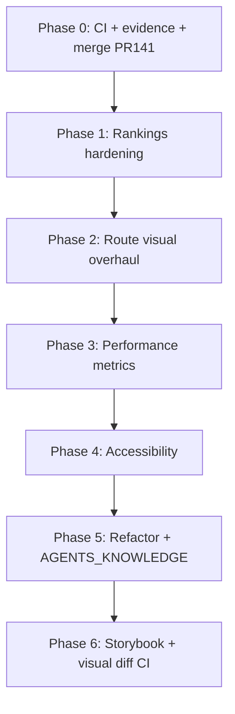

# 10 — Completion Plan (No Shortcuts)

**Purpose:** Finish the Frontend Overhaul + Stability program after PR #141.  
**Status:** PR #141 landed the foundation (rankings contract, cockpit layout, handoff docs). This plan covers everything still required before the work can honestly be called *complete*.  
**Rule:** No item is done without linked evidence (test output, screenshot, or signed checklist row).

---

## Executive summary

| Area | PR #141 state | Still required |
|------|---------------|----------------|
| Rankings upcoming vs live | Implemented + unit tests | Past-mode test, team-event regression, manual sign-off |
| Cockpit layout (no drag) | Implemented | Remove dead resize CSS; verify keyboard/a11y |
| Route visual overhaul | **Dashboard only** | `/matchups`, `/players`, `/lab` material polish |
| Performance program | Constants only | Metrics baseline, render isolation, bundle budget |
| Quality gates | Partial | Before/after diffs, full pytest green, CI green, soak test |
| Handoff docs | Written | DoD checkboxes, AGENTS_KNOWLEDGE sync, merge + deploy |

**Estimated effort:** 4–6 focused work sessions (not one afternoon).

---

## Phase 0 — Merge readiness for PR #141 (blockers)

Do this first. Nothing else ships until CI and evidence gates pass.

### 0.1 Fix CI blockers

| Task | Why | How | Done when |
|------|-----|-----|-----------|
| Fix `test_live_refresh_snapshot_extremely_stale_triggers_on_demand_even_when_runtime_running` | Fails on `main` and branch; CI runs full pytest | Read failure: worker-running path skips on-demand recompute. Align test fixture with current `app.py` behavior **or** fix logic if regression is real | `python3 -m pytest tests/test_live_refresh_runtime.py -q` green |
| Confirm branch did not introduce new pytest failures | Claim integrity | Run full suite on branch vs `main`; diff failures | Same failure set as `main` or all green |
| Do not add new ESLint errors | Branch added ~3 vs `main` (48→51) | Fix new issues in touched files (`prediction-workspace-page.tsx` `Date.now` purity, hook deps) | `npm run lint` error count ≤ `main` |
| Trigger CI on PR #141 | statusCheckRollup was empty | Push fix commit; confirm all 4 jobs green | GitHub checks green |

**Verification commands:**
```bash
cd frontend && npm run typecheck && npm run test && npm run build && npm run lint
python3 -m pytest tests/ -v --tb=short
```

### 0.2 Evidence gaps on PR #141

| Task | Why | How | Done when |
|------|-----|-----|-----------|
| Capture **before** screenshots from `main` | DoD requires before/after | Checkout `main`, build, run `npm run screenshots:matrix` → `docs/screenshots/ui-overhaul-v1/` | 40 PNGs + README |
| Re-capture **after** on branch | Ensure same script version | Run matrix on branch → existing `ui-overhaul-v2/` | README shows all routes yes |
| Add side-by-side index | Reviewer usability | Update `09-evidence-packet-index.md` with v1 vs v2 paths | Linked in PR body |
| Sign manual parity checklist | DoD item unchecked | Human runs 6 flows in `07-test-strategy-and-quality-gates.md`; record pass/fail + date in `verification-*.log` | All 6 checked |
| Check off `DEFINITION_OF_DONE.md` | Auditable closure | Only check items with evidence links | Every row has URL or log line |

### 0.3 Merge + deploy

1. Squash or merge PR #141 after Phase 0 green.
2. Deploy per `08-rollout-and-rollback-plan.md`.
3. Run 10-minute post-deploy soak (API status, `/` upcoming + live columns, no error banner).
4. Record soak results in verification log.

**Exit criteria for Phase 0:** PR merged, deployed, soak logged, DoD items 3–6 and 9–11 checked with evidence.

---

## Phase 1 — Rankings contract hardening (correctness)

PR #141 fixed the core bug. Finish the contract so it cannot regress silently.

### 1.1 Automated coverage gaps

| Task | File(s) | Acceptance criteria |
|------|---------|---------------------|
| Past tab uses upcoming columns | `prediction-workspace-page.test.tsx` | Assert headers include Composite, Form; exclude Model Δ |
| Hydration fallback banner UI test | `prediction-workspace-page.test.tsx` | Mock run with `hydration_section !== requested`; `data-testid="hydration-fallback-banner"` visible |
| Team event notice during live/upcoming | Extend existing `team-event-notice.test.tsx` or workspace test | Rankings board shows notice; no crash on team event section |
| Eligibility failed empty state | `prediction-board.test.ts` + workspace test | When `eligibility.verified === false`, rankings empty + warning string surfaced in UI |
| Deprecate `buildRankingsColumns` alias | `cockpit-columns.tsx` | Grep shows zero callers; remove alias or keep with explicit `@deprecated` + lint rule |

### 1.2 Backend alignment (read-only unless bug found)

| Task | Why |
|------|-----|
| Document upcoming empty rankings when eligibility fails | `05-rankings-behavior-contract` references `dashboard_runtime.py` |
| Confirm `live_player_board` only populated in live section | Prevents future hydration mistakes |
| Add frontend integration test with fixture JSON | Snapshot fixture per section in `tests/fixtures/` or frontend `__fixtures__/` |

**Verification:** Rankings test file count ≥ 4; all green; manual spot-check upcoming vs live on real snapshot.

---

## Phase 2 — Route visual overhaul (the missing 70%)

PR #141 changed **`/` cockpit** only. Goals doc requires material polish on **`/matchups`, `/players`, `/lab`**. This is the largest remaining UX gap.

### 2.1 Per-route work packages

Follow `04-route-by-route-implementation-spec.md` and `docs/plans/ui-overhaul-2026.md`.

#### `/matchups` (`picks-page.tsx`, 648 lines)

| Change | Detail |
|--------|--------|
| Unified `PageHeader` | Match dashboard terminal header pattern |
| Replace local `EmptyState` | Import `@/components/ui/empty-state` |
| Loading/error | Use `LoadingState` / `ErrorState` from `feedback-state.tsx` |
| Filter bar | Sticky, compact; book chips + min edge visible at glance |
| Diagnostics strip | Collapsible by default; expand for detail layer |
| Visual delta | Screenshot diff vs v1 must show structural change, not font-only |

#### `/players` (`players-page.tsx`, 660 lines)

| Change | Detail |
|--------|--------|
| KPI strip at glance layer | Skill profile summary above fold |
| Collapsible profile sections | Progressive disclosure per ui-overhaul-2026 |
| Field list + spotlight | Consistent grid density with `ProDataGrid` |
| Remove page-local `EmptyState` | Shared component |
| Mobile 375px pass | No horizontal overflow on search + list |

#### `/lab` and `/lab/picks`

| Change | Detail |
|--------|--------|
| Lab lane banner | Visible, semantic amber; test `data-testid` |
| Reuse cockpit tab pattern | Same segment tabs as dashboard center column |
| `/lab/picks` log CTA | Prominent, keyboard reachable |
| Lane fallback copy | When lab snapshot missing, banner matches backend state |

#### `/grading`, `/track-record`, `/research/*` (consistency pass)

| Change | Detail |
|--------|--------|
| `PageHeader` + spacing tokens | No one-off margins |
| Shared empty/loading | No bespoke spinners |
| Lower priority than picks/players/lab | Can ship in Phase 2b after core three |

### 2.2 Design system cleanup

| Task | Why |
|------|-----|
| Delete dead `.cockpit-resize-handle*` CSS (~80 lines) | Handles removed; dead code confuses future agents |
| Consolidate 5+ local `EmptyState` implementations | `page-shared`, `picks-page`, `players-page`, `legacy-routes`, workspace inline |
| Audit inline styles in page modules | Replace with tokens from `themes.css` |
| Confirm `terminal-visual-v2.css` import order | Non-regression from goals doc |

### 2.3 Visual evidence for Phase 2

After each route package:
1. Re-run screenshot matrix.
2. Pixel-compare v1 vs v2 for that route (Playwright or manual side-by-side).
3. Update evidence index.

**Exit criteria:** Reviewer agrees `/`, `/matchups`, `/players`, `/lab` look *materially* different (DoD item 2).

---

## Phase 3 — Performance and stability (measurable, not claimed)

PR #141 centralized polling constants. The plan requires **measured** improvement or no regression.

### 3.1 Baseline capture (before Phase 3 code)

Record on `main` and again after Phase 3:

| Metric | How to measure |
|--------|----------------|
| Snapshot JSON TTFB | Network tab, `/api/live-refresh/snapshot` |
| Time to rankings grid paint | Performance mark in workspace page |
| Long tasks during 10s poll | Chrome Performance → Main thread >50ms |
| JS bundle size | `npm run build` gzip of `index-*.js` |

Store in `docs/frontend-overhaul/performance-baseline.json`.

### 3.2 Implementation tasks

| Task | Priority | Notes |
|------|----------|-------|
| Extract `LiveSnapshotProvider` from `App.tsx` (995 lines) | High | Route-scoped consumers; reduce full-tree re-renders |
| Memo boundaries audit on workspace page (1487 lines) | High | Split into subcomponents; move derived state down |
| Lazy-load echarts routes | Medium | `/grading`, `/track-record` charts |
| `rollup-plugin-visualizer` + budget in CI | Medium | Fail if main chunk grows >5% without approval |
| Snapshot hydration cache key | Low | Avoid re-hydrating identical section JSON |

### 3.3 Runtime instrumentation (optional but planned)

Add dev-only timing logs (guarded by `import.meta.env.DEV`):
- `hydrate_ms`
- `rankings_render_ms`

**Exit criteria:** Documented baseline + treatment numbers in PR; no metric regresses >10% without written justification.

---

## Phase 4 — Accessibility and interaction quality

### 4.1 Keyboard and ARIA

| Task | Verification |
|------|--------------|
| Segment tabs: roving tabindex, Enter/Space activate | Manual keyboard script in `07-test-strategy` |
| Focus-visible on all cockpit tabs | No focus traps in sheet/drawer |
| `ProDataGrid` row actions keyboard reachable | Tab to player link |
| Hydration banner: `role="status"` or `alert` | Screen reader announces fallback |

### 4.2 Automated a11y (plan called for this)

| Task | Steps |
|------|-------|
| Add `@axe-core/playwright` dev dependency | One spec: dashboard + matchups |
| Wire into CI (frontend job) | Fail on critical violations only |
| Document exceptions | Known legacy issues in `07-test-strategy` |

---

## Phase 5 — Architecture and maintainability (prevent future breakage)

### 5.1 File size and coupling

| File | Lines | Action |
|------|-------|--------|
| `prediction-workspace-page.tsx` | ~1487 | Split: `usePastReplay`, `RankingsBoard`, `TopPicksBoard`, `MarketsBoard` |
| `App.tsx` | ~995 | Provider extraction; route-level data hooks |
| `picks-page.tsx` | ~648 | Extract filter bar + table shells |

**Rule:** No new logic in split PRs — move only, tests must stay green.

### 5.2 Agent documentation

Update `docs/AGENTS_KNOWLEDGE.md`:
- Rankings column builders and hydration rules
- Cockpit tab layout (no resize panels)
- Screenshot + verification commands
- Link to `docs/frontend-overhaul/`

---

## Phase 6 — Tooling and CI hardening (longer horizon)

Not required to merge PR #141, but required for “completely finish” per original plan:

| Item | From plan | Recommendation |
|------|-----------|----------------|
| Storybook | Research phase | Add for `ProDataGrid`, `CockpitSegmentTabs`, `EmptyState` only |
| Visual diff CI | Anti-shortcut gate | Playwright snapshot compare v1 folder on PR |
| Feature-flag rollback | Workstream 1 risk note | Optional `feature_flags.yaml` `cockpit_layout: tabbed` — only if deploy risk warrants |
| `@axe-core/playwright` | Phase 4 | Required for “complete” |

---

## Workstream sequencing (dependencies)



**Parallel allowed:** Phase 1 tests while Phase 0 CI fixes run. Phase 4 can start during Phase 2b.

---

## PR strategy (avoid mega-PR recurrence)

| PR | Scope | ~Size |
|----|-------|-------|
| **#141** (open) | Foundation | Already large — merge after Phase 0 |
| **#142** | Rankings tests + eligibility UI + dead CSS cleanup | Small |
| **#143** | `/matchups` visual overhaul | Medium |
| **#144** | `/players` visual overhaul | Medium |
| **#145** | `/lab` + `/lab/picks` | Medium |
| **#146** | Performance provider split + metrics | Medium |
| **#147** | a11y + visual diff CI | Small |

Each PR: screenshot diff for touched routes, tests, verification log append.

---

## Definition of Done — final audit checklist

Copy into final merge PR when **all** are true:

- [ ] Before (`ui-overhaul-v1`) and after (`ui-overhaul-v2`) screenshots for all core routes
- [ ] Material visual delta on `/`, `/matchups`, `/players`, `/lab` (reviewer sign-off)
- [ ] No draggable handles in production UX; dead CSS removed
- [ ] Upcoming / live / past rankings behavior tested automatically
- [ ] Manual parity checklist signed with date
- [ ] `npm run typecheck`, `test`, `build`, `lint` green
- [ ] `pytest` fully green (including live_refresh test)
- [ ] Performance baseline documented; no unjustified regression
- [ ] axe critical violations = 0 on dashboard + matchups
- [ ] Post-deploy soak logged
- [ ] `AGENTS_KNOWLEDGE.md` updated
- [ ] `DEFINITION_OF_DONE.md` every row checked with evidence link

---

## Anti-shortcut rules (repeat)

1. **No “looks fine locally”** — attach command output or screenshot path.
2. **No theme-only passes** as overhaul complete.
3. **No skipping `/matchups` and `/players`** — goals doc names them explicitly.
4. **No new lint/test debt** in touched files.
5. **No claiming performance wins** without numbers in `performance-baseline.json`.

---

## Immediate next actions (start here)

1. Fix `test_live_refresh_snapshot_extremely_stale_*` and push to PR #141.
2. Capture `ui-overhaul-v1` screenshot matrix from `main`.
3. Run manual parity checklist; log results.
4. Fix 3 new ESLint issues in `prediction-workspace-page.tsx`.
5. Open Phase 1 PR (#142) for rankings test gaps + eligibility UI banner.

---

*Last updated: 2026-06-04 — post PR #141*
