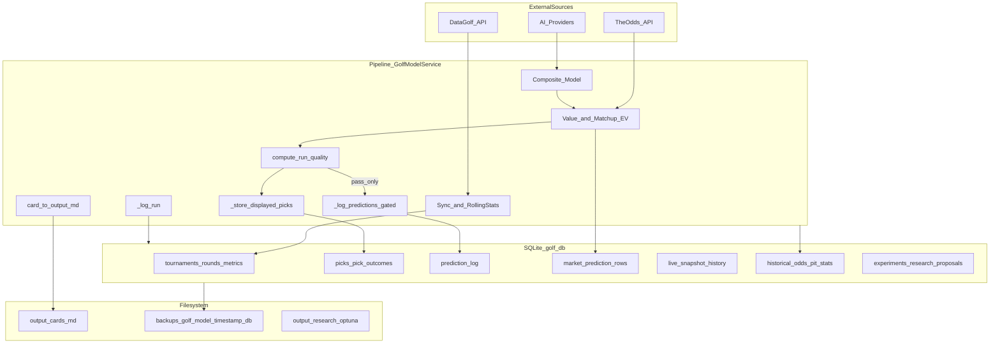

# Data Platform and Regression Plan (2026-05-31)

## Executive summary (plain language)

Your golf bot **already saves a lot** in one database file on the live server (`data/golf.db`). The hard part is not “we have no data”—it is that **the same information lives in several places** (database tables, markdown cards in `output/`, live snapshot JSON), and **some logging steps are skipped** when a run fails quality checks. That makes backtests and “did we break something?” tests harder than they should be.

**This plan keeps costs at $0** by upgrading what you have (SQLite on the existing VPS, free backups, free CI tests)—not buying Postgres or a cloud warehouse unless evidence later proves it is necessary.

**What we learned in this workspace:** local `[data/golf.db](data/golf.db)` has **schema only** (0 tournaments, 0 picks, 0 runs). Real 2026 history is almost certainly on production at `[/opt/golf-model](docs/AGENTS_KNOWLEDGE.md)` with nightly backups via `golf-backup.timer` and `[src/backup.py](src/backup.py)`. Git tracks **10** committed card/report files under `[output/](output/)` (e.g. Genesis Feb 17, Houston Mar 25) but **not** the database (`[.gitignore](.gitignore)` line 6).

**What we will build first:** a read-only **coverage audit** (script + API health panel) and written **data contracts** so every report and backtest knows which table to trust. Then phased **regression tests** (golden math → frozen tournament DB → replay CLI).

**What you do once:** on the server, run the audit against the real DB (or copy latest backup from `backups/` locally for planning agents).

### Will this solve “memory” / huge database problems?

**Partly — and only after we add the storage track (Epic P9 below).**

| Problem type | Does the original plan fix it? | What actually helps |
|--------------|-------------------------------|---------------------|
| “Database file is massive on disk” | **Not by itself** | Per-table size audit; prune + **VACUUM**; stop duplicating full JSON in every row |
| “Server runs out of RAM” | **Indirectly** | Caps on live snapshot rows already exist; reduce load-all-tables patterns; optional cold archive |
| “Backtests / history feel broken” | **Yes** | Data contracts, fixture DB, replay CLI |
| “We built it stupidly” | **Honest: some bloat, not all** | Append-heavy tick tables are the main self-inflicted cost; `rounds` backfill is large but legitimate |

**Bottom line:** The system is **not a total mess** — it has real engineering (walk-forward, prune hooks, backup rotation, integrity fixes). It **did** accumulate weight from **high-frequency snapshot logging** and **one giant SQLite file for everything**. That is fixable without throwing away SQLite.

---

## Blunt architecture review (“built well?”)

### Built well (keep and extend)

- **Walk-forward / no leakage:** PIT tables + tests (`test_pit_temporal_leakage_guards`) — serious quant hygiene.
- **Integrity after Cognizant audit:** pre-tournament gate, `prediction_log` `INSERT OR IGNORE`, field filter — shows the team fixes real bugs.
- **Live-refresh guardrails:** `SNAPSHOT_HISTORY_RETAIN_DAYS` (210), periodic prune in [`dashboard_runtime._maybe_prune_snapshot_history_tables`](backtester/dashboard_runtime.py), row caps on matchup payloads ([`src/config.py`](src/config.py) L448–453).
- **Ops safety:** [`src/backup.py`](src/backup.py), deploy disk floor, `golf-backup.timer`, pre-update backup skip when disk tight.
- **Safety rails:** champion-challenger byte-identical test; autoresearch guardrails on CLV/calibration regression.
- **Orchestration:** `GolfModelService` as single pipeline entry — right direction vs scattered scripts.

### Built poorly or costly (fix in P9)

1. **`market_prediction_rows` + `live_snapshot_history`** — append **every refresh tick**, store **full bet JSON again** in `payload_json` while also storing scalar columns ([`_build_market_prediction_rows`](backtester/dashboard_runtime.py)). This is the #1 suspect for “why is golf.db huge.”
2. **Prune without reclaiming disk** — [`prune_snapshot_history_tables`](src/db.py) DELETEs rows but **no `VACUUM` / `wal_checkpoint`** anywhere in repo → file size on disk can stay bloated after deletes.
3. **Everything in one 55-table DB** — live ticks, years of `rounds`, research proposals, AI memory, shadow MC — works until it doesn’t; hard to reason about size and backup time.
4. **Unbounded tables (likely)** — `rounds`, `metrics`, `ai_decisions`, `challenger_predictions`, `intel_events` have no symmetric retention policy like snapshot history (verify on prod).
5. **Split brain** — markdown cards in `output/` vs `picks` in DB → confusion, not necessarily size.
6. **Schema sprawl** — monolithic [`src/db.py`](src/db.py), no FK constraints, naming drift (`dg_id` vs `player_dg_id`) — maintainability debt, not direct “memory” but feels “retarded” when debugging.
7. **No prod-sized fixture** — CI uses empty DB; you cannot see bloat or regression against real volume locally.

### Verdict (plain language)

**Not built “retarded” end-to-end** — it is an ambitious solo-operator quant stack with **good safety ideas** and **one expensive logging design** (dense live ticks + JSON duplication). The original data-platform plan fixes **trust and structure**; you also need a **storage hygiene** epic or the file will keep growing until the VPS complains (disk and/or RAM during big queries).

---

## Current state




**Authoritative references:** `[docs/AGENTS_KNOWLEDGE.md](docs/AGENTS_KNOWLEDGE.md)` §5 (v5 store contract), `[src/db.py](src/db.py)` (~55 tables, inline migrations), `[backtester/autoresearch_data_health.py](backtester/autoresearch_data_health.py)`.

---

## 2026 YTD coverage report


| Month    | Tournaments | Runs | Picks | Graded outcomes | prediction_log | market_prediction_rows | Notes                                                                                                                  |
| -------- | ----------- | ---- | ----- | --------------- | -------------- | ---------------------- | ---------------------------------------------------------------------------------------------------------------------- |
| Jan 2026 | TBD         | TBD  | TBD   | TBD             | TBD            | TBD                    | Requires prod `golf.db` or latest `backups/golf_model_*.db`                                                            |
| Feb 2026 | TBD         | TBD  | TBD   | TBD             | TBD            | TBD                    | Repo has `[output/the_genesis_invitational_20260217.md](output/the_genesis_invitational_20260217.md)` — cross-check DB |
| Mar 2026 | TBD         | TBD  | TBD   | TBD             | TBD            | TBD                    | Repo has Houston sandbox cards + `[output/backtests/](output/backtests/)`                                              |
| Apr 2026 | TBD         | TBD  | TBD   | TBD             | TBD            | TBD                    | `[output/recovery/baseline_pack_20260413_160558.json](output/recovery/baseline_pack_20260413_160558.json)`             |
| May 2026 | 0*        | 20172 | 212590 | TBD             | 2848           | 32144909               | *`tournaments.date` often empty; picks logged via live refresh (`created_at`) |

### Production audit (2026-05-31, `/opt/golf-model/data/golf.db`)

| Metric | Value |
|--------|-------|
| File size | **54.68 GB** |
| `market_prediction_rows` | **32,144,909** rows (primary bloat — prune + VACUUM) |
| `picks` | 212,590 |
| `prediction_log` | 4,638 |
| `live_snapshot_history` | 20,672 |
| `challenger_predictions` | 1,169,146 |
| 2026 tournaments (by `year`) | 11 (5 with picks) |
| Status | **red** — see `output/data_health_2026.json` |

**Remediation:** `SNAPSHOT_HISTORY_RETAIN_DAYS=210 python3 scripts/prune_snapshot_history.py --vacuum` during a maintenance window.


**Audit command (production, read-only):** after SSH to VPS per [AGENTS_KNOWLEDGE §11](docs/AGENTS_KNOWLEDGE.md):

```bash
cd /opt/golf-model
./venv/bin/python -m src.backup --print-path
sqlite3 "$(./venv/bin/python -m src.backup --print-path)" "
  SELECT strftime('%Y-%m', created_at) AS mo, COUNT(*) FROM runs GROUP BY mo;
  SELECT strftime('%Y-%m', date) AS mo, COUNT(*) FROM tournaments WHERE year=2026 GROUP BY mo;
"
```

**Deliverable:** implement `[scripts/audit_data_coverage.py](scripts/audit_data_coverage.py)` (read-only) producing JSON + markdown month table; wire results into plan doc on first implementation PR.

**Production size diagnosis (run on real DB):**

```bash
# File size on disk (DB + WAL sidecars)
ls -lh data/golf.db data/golf.db-wal data/golf.db-shm 2>/dev/null
du -sh data/ backups/

# Top tables by estimated row count + payload weight
sqlite3 data/golf.db "
SELECT 'market_prediction_rows' AS t, COUNT(*) FROM market_prediction_rows
UNION ALL SELECT 'live_snapshot_history', COUNT(*) FROM live_snapshot_history
UNION ALL SELECT 'rounds', COUNT(*) FROM rounds
UNION ALL SELECT 'metrics', COUNT(*) FROM metrics
UNION ALL SELECT 'challenger_predictions', COUNT(*) FROM challenger_predictions;
"
# Optional: dbstat per table (SQLite 3.28+)
sqlite3 data/golf.db "SELECT name, SUM(pgsize) AS bytes FROM dbstat GROUP BY name ORDER BY bytes DESC LIMIT 15;"
```

---

## Findings (evidence-based)

### 1. Split brain: SQLite vs `output/`

- Cards are written to `[output/{event}_{date}.md](src/output_manager.py)` while grading uses `[picks](src/db.py)` + `[pick_outcomes](src/learning.py)`.
- Risk: card exists in Git but DB row missing (or vice versa) → backtests disagree with “what we showed.”

### 2. Overlapping stores (v5 contract — intentional but under-documented for operators)


| Question                     | Canonical store                             | Caveat                                                                                                                                                                                        |
| ---------------------------- | ------------------------------------------- | --------------------------------------------------------------------------------------------------------------------------------------------------------------------------------------------- |
| What did we display / stake? | `picks` (`source=cockpit`, `model_variant`) | `_store_displayed_picks` runs even when quality fails (`[golf_model_service.py` L471-477](src/services/golf_model_service.py))                                                                |
| Calibration time series?     | `prediction_log`                            | **Gated:** placement rows only if `compute_run_quality` passes (L478-481); `INSERT OR IGNORE` keeps first row per `(tournament_id, player_key, bet_type)` (`[db.log_predictions](src/db.py)`) |
| Every book line every tick?  | `market_prediction_rows`                    | Written by live refresh (`[dashboard_runtime.py](backtester/dashboard_runtime.py)`); best for dense analytics                                                                                 |
| Walk-forward replay?         | `historical_`* + `pit_*`                    | Separate from live `metrics`; `[validate_autoresearch_data_health](backtester/autoresearch_data_health.py)` warns if sparse                                                                   |


### 3. Backtest path ≠ live path

- Live pipeline uses current `metrics` / composite; backtester replays via `[backtester/strategy.py](backtester/strategy.py)` + PIT tables.
- Months of **live** picks do not automatically populate **historical_odds** / **pit_rolling_stats** — backfill scripts required (`[backtester/backfill.py](backtester/backfill.py)`).

### 4. Regression test gaps


| Layer           | Exists                                                                                                                                   | Gap                                                                                       |
| --------------- | ---------------------------------------------------------------------------------------------------------------------------------------- | ----------------------------------------------------------------------------------------- |
| Unit            | ~400+ pytest modules                                                                                                                     | Strong per-module coverage                                                                |
| Golden hashes   | `[tests/test_ev_tier_golden.py](tests/test_ev_tier_golden.py)`, `[tests/test_champion_challenger.py](tests/test_champion_challenger.py)` | Not tied to real 2026 tournaments                                                         |
| Integration     | `[tests/integration/test_pipeline_e2e.py](tests/integration/test_pipeline_e2e.py)`                                                       | **Does not** run full `GolfModelService.run_analysis` (avoids DG HTTP); seeds DB manually |
| E2E prod replay | None                                                                                                                                     | No “replay tournament X” CLI with diff vs stored picks                                    |
| CI              | `[.github/workflows/ci.yml](.github/workflows/ci.yml)`                                                                                   | No prod DB fixture; empty schema only                                                     |


### 5. Prior work to extend (not redo)

- `[docs/plans/2026-03-02-data-pipeline-integrity-v42.md](docs/plans/2026-03-02-data-pipeline-integrity-v42.md)` fixed timing gates, phantom field, `prediction_log` overwrite — plan should **verify** those fixes in 2026 data and add **observability**, not re-litigate.

### 6. Backup posture (good foundation)

- `[src/backup.py](src/backup.py)`: timestamped copies in `backups/`, rotation, deploy pre-update backup with disk guard (`[scripts/deploy-update-steps.sh](scripts/deploy-update-steps.sh)`).
- Production: `golf-backup.timer` at 03:00 UTC (AGENTS_KNOWLEDGE §11).
- Gap: backups are **not** in Git; no anonymized **fixture DB** for CI/regression.

### 7. Storage bloat drivers (disk + “feels like memory”)

- **Live refresh** started storing `market_prediction_rows` around **2026-04-17** per [`scripts/value_bet_audit_6mo.py`](scripts/value_bet_audit_6mo.py) — weeks of multi-book, multi-tick rows add up fast.
- **Retention:** 210-day prune is configured but must be **running in prod** (worker calls `_maybe_prune_snapshot_history_tables`); if worker was down, rows accumulate.
- **`rounds` backfill:** legitimately large (every round for years) — should stay, but belongs in **reporting** as “expected bulk,” not confused with tick spam.
- **WAL files:** `PRAGMA journal_mode=WAL` ([`get_conn`](src/db.py)) — `golf.db-wal` can grow large; checkpoint/VACUUM policy should be documented for ops.

---

## Target architecture options


| Criterion              | A: Enhanced SQLite (recommended)            | B: SQLite + Parquet/JSONL export layer        | C: Self-hosted Postgres on same VPS      |
| ---------------------- | ------------------------------------------- | --------------------------------------------- | ---------------------------------------- |
| Cost $/mo              | $0                                          | $0 (disk only)                                | $0 infra, higher ops risk                |
| Backtest speed         | Good with indexes + PIT cache               | Better for heavy analytics offline            | Marginal gain for current scale          |
| Regression testability | High (fixture DB in repo)                   | High (immutable exports per tournament)       | High but migration cost                  |
| Risk to prod           | Low (incremental migrations in `db.py`)     | Low                                           | Medium (dual-write period)               |
| Sophistication         | Contracts, SQL views, health API, audit CLI | Adds data-lake pattern without leaving SQLite | Overkill unless DB >10GB or multi-writer |


**Recommendation: Option A + selective B.** Keep SQLite as system of record; add scheduled **export** (Parquet or JSONL per tournament) for long-term archive and CI fixtures. Reject C unless prod audit shows SQLite limits (size, lock contention, query pain).

---

## Canonical data contracts

Define in `[docs/data-contracts.md](docs/data-contracts.md)` (new) and enforce via SQL views in `[src/db.py](src/db.py)` or `[src/data_views.py](src/data_views.py)` (new, thin).

1. **PipelineRun** — `runs` row: `tournament_id`, `status`, `result_json` (field_size, duration, errors), `created_at`. Today populated by `[_log_run](src/services/golf_model_service.py)` but not surfaced in UI.
2. **DisplayedPick** — `picks` where `source IN ('cockpit','ui_display','lab')`: unique key `(tournament_id, model_variant, source, player_key, bet_type, opponent_key, market_book, market_odds)`; immutable after grade.
3. **CalibrationObservation** — `prediction_log`: first pre-tournament row per key; requires `odds_timing`; outcomes filled post-grade in `[learning.log_predictions_for_tournament](src/learning.py)`.
4. **MarketLineSnapshot** — `market_prediction_rows`: append-only ticks; `payload_json` is source of truth for book-level lines.
5. **GradedOutcome** — `pick_outcomes` JOIN `picks`; profit, hit, model_hit.
6. **PITFeatureRow** — `pit_rolling_stats` / `pit_course_stats`: keyed by `(event_id, year, player_key)`; backtest-only, no future leakage (existing guards in `[tests/test_pit_temporal_leakage_guards.py](tests/test_pit_temporal_leakage_guards.py)`).

**View examples (implementation later):**

- `v_displayed_picks_graded` — picks LEFT JOIN pick_outcomes
- `v_tournament_data_health` — per tournament: has picks, has prediction_log, has results, has pit stats, has historical_odds
- `v_2026_monthly_coverage` — drives dashboard “Data health” tab

---

## Regression and backtest harness (phased)

### Phase 0 — Inventory and operator visibility (S)

- **Script:** `[scripts/audit_data_coverage.py](scripts/audit_data_coverage.py)` — month table, gap list (card in `output/` without `picks`), autoresearch health summary.
- **API:** `GET /api/data-health` — wraps audit + `validate_autoresearch_data_health(years=[2026])`.
- **UI:** small “Data health” panel on dashboard (green/yellow/red, plain English).
- **Acceptance:** operator can see “Feb: 3 tournaments, 2 missing prediction_log” without SQL.

### Phase 1 — Frozen fixture DB + golden pipeline (M)

- Export **anonymized** subset from prod (one complete tournament: metrics, picks, outcomes, prediction_log) → `[tests/fixtures/golf_2026_one_event.db](tests/fixtures/)` (committed, no API keys).
- Extend `[tests/integration/test_pipeline_e2e.py](tests/integration/test_pipeline_e2e.py)` OR add `test_pipeline_replay_fixture.py`: recompute composite/value on fixture → hash compare to stored picks (tolerance for float).
- **Acceptance:** CI fails if EV tier logic changes golden cases or fixture replay diverges.

### Phase 2 — Replay CLI (M)

- `python scripts/replay_tournament.py --tournament-id N --as-of YYYY-MM-DD` — walk-forward safe replay using PIT path only.
- Diff report: model_prob / ev vs `picks` and `prediction_log`.
- **Acceptance:** replay Cognizant-scale event in <2 min on VPS.

### Phase 3 — Scheduled regression on backup (L)

- GitHub Action or `golf-backup` post-hook: run audit + replay on latest backup; artifact upload (free Actions storage).
- Optional: compare `baseline` vs `v5` `model_variant` on same events (`[COCKPIT_SNAPSHOT_MODEL_VARIANT](docs/AGENTS_KNOWLEDGE.md)`).
- **Acceptance:** weekly email/log if regression detected.

**Non-goals for v1:** Postgres migration, rewriting composite model, changing 95/5 blend without calibration evidence.

### Phase 4 — Storage and disk reclamation (S–M) — **required for “massive DB”**

- Extend audit script: **per-table row counts + estimated bytes** (dbstat), flag tables >30% of file size.
- After scheduled prune: run **`VACUUM`** (or `PRAGMA wal_checkpoint(TRUNCATE)`) in [`scripts/prune_snapshot_history.py`](scripts/prune_snapshot_history.py) or monthly cron — **only when disk allows** (same guards as backup).
- **Policy doc:** what must stay forever (`picks`, `pick_outcomes`, `prediction_log`, `rounds` for model) vs what can age out (ticks, raw `ai_decisions` blobs).
- **Optional slim mode (M):** stop writing redundant `payload_json` for rows where scalar columns are complete; or store one compressed payload per `snapshot_id` instead of per line.
- **Cold archive (B):** export ticks older than N days to `data/exports/*.parquet`, DELETE from SQLite, VACUUM — keeps $0 cost.
- **Acceptance:** prod `golf.db` size drops measurably after prune+VACUUM OR operator sees dashboard “DB health: 2.1GB, 68% market_prediction_rows” with recommended action.

---

## Schema, migration, and backup strategy

- **Migrations:** continue inline `_run_migrations` in `[src/db.py](src/db.py)`; bump `schema_version`; no Alembic until schema churn exceeds ~2 migrations/month.
- **FK constraints:** add gradually on new tables/views first; avoid blocking migration on 40+ legacy tables in v1.
- **New columns (candidate):** `runs.run_id` UUID, `picks.pipeline_run_id`, `prediction_log.run_quality_pass` — link rows to PipelineRun for audit trail.
- **Backup cadence:** keep `golf-backup.timer`; document `DEPLOY_BACKUP_KEEP` in `.env`; add **monthly** manual `python -m src.backup --keep 30` before major releases.
- **Never lose history:** (1) nightly backup, (2) pre-deploy backup, (3) Parquet export script `scripts/export_tournament_archive.py` → `data/exports/YYYY/` (gitignored, rsync to laptop), (4) committed anonymized fixture for CI.

**Rollback:** restore from `backups/golf_model_*.db`; deploy script already backs up before pull.

---

## Roadmap (small PR-sized epics)


| Epic   | PR scope                                                                                                                                                    | Effort  |
| ------ | ----------------------------------------------------------------------------------------------------------------------------------------------------------- | ------- |
| **P0** | Write `[docs/plans/2026-05-31-data-platform-and-regression-plan.md](docs/plans/2026-05-31-data-platform-and-regression-plan.md)` + `audit_data_coverage.py` | S       |
| **P1** | `docs/data-contracts.md` + SQL views + unit tests                                                                                                           | S       |
| **P2** | `GET /api/data-health` + dashboard panel                                                                                                                    | M       |
| **P3** | Prod audit run; fill coverage table in plan; gap remediation list                                                                                           | S (ops) |
| **P4** | Anonymized fixture DB + CI replay test                                                                                                                      | M       |
| **P5** | `replay_tournament.py` + diff markdown report                                                                                                               | M       |
| **P6** | Export archive script + operator runbook section in README                                                                                                  | S       |
| **P7** | Extend autoresearch preflight to include live picks coverage                                                                                                | S       |
| **P8** | Optional: unify reporting to read views only (deprecate ad-hoc SQL in scripts)                                                                              | L       |
| **P9** | Storage audit (dbstat) + post-prune VACUUM + retention matrix + dashboard “DB size” line                                                                    | M       |


Branch for plan-only PR: `plan/data-platform-regression`.

---

## Operator one-time steps (copy-paste)

On VPS (`root@204.168.147.6`, path `/opt/golf-model` per AGENTS_KNOWLEDGE):

```bash
cd /opt/golf-model
./venv/bin/python -m src.backup --keep 7
ls -lt backups/ | head -5
./venv/bin/python scripts/audit_data_coverage.py --year 2026 --output output/data_health_2026.json
```

To analyze offline: `scp` latest `backups/golf_model_*.db` to laptop, point `GOLF_DB_PATH` at copy, run same audit script.

---

## Open questions

None blocking. Assumption: production DB has been collecting since early 2026; audit will confirm or produce a **gap remediation** backlog (re-grade from `output/`, backfill historical tables).

---

## Implementation of this planning pass

After you approve this plan, the **first execution PR** should:

1. Add the full markdown plan at `[docs/plans/2026-05-31-data-platform-and-regression-plan.md](docs/plans/2026-05-31-data-platform-and-regression-plan.md)` (content = this document, expanded with prod audit results when available).
2. Add `[scripts/audit_data_coverage.py](scripts/audit_data_coverage.py)` (read-only).
3. Open PR `plan/data-platform-regression` — **no** production schema changes in that PR.

