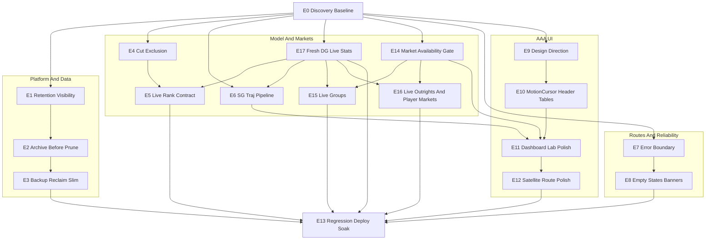

# Golf Model GTM Production Hardening Plan

Date: 2026-06-14
Status: Draft for Composer 2.5 execution
Target repo: `golf-model`

## 1. Executive Summary

- Ship one coordinated GTM hardening program, not separate bug/UI/storage plans. Estimated size: 18 PR-sized epics, one PR per epic unless explicitly split.
- Execute in four parallel tracks after shared discovery: Platform/Data, Model/Market Correctness, Reliability/Routes, and AAA UI.
- Highest-risk P0s are live rankings correctness, route crash visibility, and live market availability. These directly affect operator trust.
- Storage decision: stay on SQLite on the existing VPS, but make it enterprise-safe with archive-before-delete, backup integrity checks, slim tick logging, and disk-safe reclaim.
- UI direction: keep the operator-terminal DNA but raise the execution quality to a premium product level with real type, spacing, hierarchy, elevation, and screenshot evidence.
- New market-correctness requirement: only display plays that are actually available on books. The current "NEW LIVE" badge is misleading because it only means a row appeared since the previous snapshot.
- New live-model requirement: Data Golf live stats must feed the live opportunity refresh, not just the leaderboard. The UI must say when the model is truly live-adjusted versus degraded to leaderboard-only data.
- Matchups remain primary. Secondary markets now include live groups/3-balls, outrights, and player/placement markets, all gated by book availability and rolled out shadow-first where model confidence is new.
- Route crash plan starts by surfacing the hidden underlying error. Current evidence suggests stale lazy chunks or a non-resetting boundary are more likely than null data in the pages.
- Preserve PR #153 reliability fixes: early snapshot publish, worker heartbeat/stale ops health, recompute timeouts, and watchdog timer.
- Final acceptance is evidence-based: tests, a11y, screenshot matrix, visual diff, production deploy, and 24-hour soak.
- Section 10 contains a request coverage matrix that maps every product, data, UI, storage, market, and live-stats request from this chat to explicit epics and acceptance gates.

---

## 2. Storage Architecture Decision Record

Chosen path: **SQLite primary + cold archive + hardened backup + slim logging**.

This is the best option for the current product because it costs $0 extra, matches the existing single-writer architecture, avoids a risky database migration during GTM hardening, and addresses the real source of pain: append-heavy tick bloat, not a fundamental SQLite limit.

Rejected options:

- Managed Postgres now: rejected for this program. It adds cost and migration risk before the system has exhausted hardened SQLite. Revisit only if post-cleanup DB size remains high, backups remain too slow, or multiple concurrent writers become real.
- Cloud warehouse/S3-first architecture now: rejected as primary storage. It may become an offsite archive destination later, but it is too much operational surface for the current VPS product.

Current evidence:

- `docs/plans/2026-05-31-data-platform-and-regression-plan.md` reports production DB size around 54.68 GB.
- `market_prediction_rows` is the main bloat source, with more than 32M rows and repeated `payload_json`.
- `src/db.py::prune_snapshot_history_tables()` deletes `live_snapshot_history` and `market_prediction_rows` without archive-first enforcement.
- `backtester/dashboard_runtime.py::_maybe_prune_snapshot_history_tables()` runs automatic prune from the worker, but does not run VACUUM.
- `scripts/ops_verify_production.sh` prunes with VACUUM on deploy at a different retention window than the worker.
- `src/backup.py` uses the SQLite online backup API, but does not run an integrity check on backups.
- `src/data_health.py::find_latest_backup()` exists but is not exposed in `GET /api/data-health`.

Retention policy:

- Keep forever: `picks`, `pick_outcomes`, `prediction_log`, `results`, `tournaments`, `runs`, `rounds`, `metrics`, `weight_sets`, `calibration_curve`, `market_performance`.
- Archive then prune: `live_snapshot_history`, `market_prediction_rows`, and later high-volume shadow tables such as `challenger_predictions` and `inplay_*` after explicit policy.
- Slim: reduce or remove redundant `market_prediction_rows.payload_json` duplication once one compressed snapshot-level payload is available.
- Investigate: `ai_decisions`, `intel_events`, `shadow_event_simulations`, `challenger_predictions`, and any new live secondary-market shadow tables.

Migration triggers:

- Operational DB remains above roughly 15-20 GB after archive, prune, slim logging, and disk reclaim.
- Nightly backup or deploy backup becomes unreliable after cleanup.
- Multiple concurrent writers become necessary.
- Analytics queries routinely block the live worker or dashboard.

Important reclaim rule:

- Do not run a naive full `VACUUM` on the 54 GB production DB without a maintenance window and free-disk precheck. Prefer archive, prune, then a disk-guarded `VACUUM INTO`/swap runbook if available.

---

## 3. AAA Design Direction Summary

Target quality: premium operator terminal, not generic dark dashboard.

The existing UX doc in `docs/frontend-overhaul/03-target-ux-and-design-system.md` says "flat, grid-aligned, semantic color only." That remains useful as product DNA, but the execution must become more premium: better typography, hierarchy, rhythm, elevation, spacing, and route-level polish.

New design doc to create:

- `docs/design/aaa-visual-direction-2026-06.md`

Design north star:

- Dense enough for a betting operator.
- Structured enough to scan in seconds.
- Polished enough to feel like a serious enterprise sports analytics tool.
- Inspired by Linear, Stripe Dashboard, Vercel, and premium trading/sports analytics UIs, without copying them or adding generic AI-dashboard gradients.

Design anti-patterns to ban:

- Token rename only.
- "Shipped" with no before/after screenshots.
- Purple-gradient generic dashboards.
- Keeping `MotionCursor`.
- Cramming metadata into fixed-height headers.
- Displaying markets that are not actually bettable.

Evidence gate:

- Capture `npm run screenshots:matrix:v3`.
- Run `npm run visual:diff`.
- Include route screenshots for `/`, `/lab`, `/compare`, `/eval`, `/players`, `/results`, `/system`.
- Owner review must confirm the UI is visibly more professional.

---

## 4. Success Metrics / Definition of Done

- Live rankings: 0 CUT/WD/DQ/DNS/MDF/MC players in the competitive live top 50.
- Eliminated players, if shown, are separated into an unranked "Eliminated" section.
- Live point-in-time ranks move materially after poor scoring or lower in-play win probability.
- Live model freshness: every live snapshot exposes Data Golf live-stat source, fetch timestamp, max row age, and freshness state. Rows older than the configured live freshness window must not be described as "live model" inputs.
- Live stats integration: current-round score, thru, round SG total, SG OTT, SG APP, SG ARG, SG PUTT, and SG T2G are used where available to adjust live ranking, SG Traj, group pricing, and player-market pricing.
- Freshest-source rule: implementation must attempt the official Data Golf API first. If the needed live stats are unavailable through the API, Composer must evaluate an authorized, rate-limited live-stats adapter fallback and document the result. If neither an API source nor a permitted fallback is available, the app must stay in degraded mode rather than pretending to be fully live-adjusted.
- Degraded mode: if Data Golf live stats are unavailable or stale, the UI shows a clear "leaderboard-only live model" or "stale live stats" notice and does not pretend the model is fully live-adjusted.
- Actionable plays: 0 displayed rows without a current book line and a supported live market type.
- "NEW LIVE" no longer means only "new since previous snapshot"; it must not imply bettability unless the row is actually bettable.
- If no live matchups are posted, the UI shows an honest empty state instead of stale tournament-matchup rows.
- Secondary live markets include groups/3-balls, outrights, and player/placement markets where available, but only behind market availability gates.
- SG Traj is non-null for at least 80 percent of field rows when composite trend data exists.
- Compare, Eval, Players, and Results never white-screen in live/upcoming/past modes.
- Lab page has one clear stale/snapshot banner, not duplicate smashed warnings.
- MotionCursor is removed completely.
- Data-health panel shows DB size, WAL size, top storage offenders, last backup, retention policy, archive/prune stats, and backup integrity status.
- Archive files exist before any prune DELETE in automated tests.
- `picks`, `pick_outcomes`, `prediction_log`, `results`, `rounds`, and `metrics` are untouched by prune tests.
- `cd frontend && npm run test:a11y` passes with 0 critical violations on `/`, `/lab`, `/compare`, `/eval`, `/players`, `/results`.
- Full verification commands pass before final deploy.
- Production deploy completes with healthy `GET /api/ops/health`, active worker heartbeat, no snapshot stale state, and 24-hour soak.

---

## 5. Dependency Graph



---

## 6. Epics

Every epic must include these verification commands in its PR checklist:

```bash
export PATH="$HOME/.local/bin:$PATH"
python3 -m pytest tests/ -v --tb=short
cd frontend && npm run typecheck && npm run test && npm run build && npm run lint
cd frontend && npm run test:a11y
```

UI epics must additionally run:

```bash
cd frontend && npm run screenshots:matrix:v3 && npm run visual:diff && npm run bundle:budget
```

### E0. Discovery, Baselines, And Failing Tests

Priority: P0
Track: All
Goal: Make every known failure reproducible and freeze the shared contracts before implementation starts.

Root cause:

- Current route failures hide the real error.
- Ranking and market row shapes are not documented enough for parallel backend/frontend work.
- Screenshot evidence is mandatory because prior UI work was marked shipped while the user still saw little visual change.

Files to touch:

- `frontend/src/components/route-error-boundary.tsx`
- `docs/frontend-overhaul/05-rankings-behavior-contract-upcoming-vs-live.md`
- `docs/data-contracts.md`
- `docs/screenshots/gtm-2026-06-14/README.md`
- `tests/test_live_refresh_runtime.py`
- `frontend/src/lib/prediction-board.test.ts`
- `frontend/src/lib/cockpit-columns.test.ts`
- `frontend/src/pages/compare-page.test.tsx`
- New `tests/test_live_market_availability.py`

Implementation steps:

1. Add temporary dev-only visibility in `RouteErrorBoundary`: render `error.message` and component stack when `import.meta.env.DEV` is true.
2. Capture baseline screenshots for `/`, `/lab`, `/compare`, `/eval`, `/players`, `/results`, `/system` at 375, 1280, and 1920.
3. Add failing or explicitly xfail tests for live CUT exclusion, SG Traj live hydration, non-bettable live matchup display, stale/missing Data Golf live stats, and lazy route failure handling.
4. Update the rankings contract with the intended live row shape: `finish_state`, `start_rank`, `current_rank`, `rank_delta`, `momentum_trend`, `momentum_direction`, `live_stats_source`, `live_stats_fetched_at`, `live_stats_age_seconds`, `live_stats_fresh`, `market_provenance`, `live_bettable`, and `last_seen_tick`.
5. Document that E4, E5, E6, E14, E15, E16, and E17 must consume this contract.

Tests to add/update:

- `tests/test_live_refresh_runtime.py`: in-play leaderboard `current_pos="CUT"` with empty DB finish state must fail until E4.
- `frontend/src/lib/prediction-board.test.ts`: live board with model `momentum_trend` must fail until E6.
- `tests/test_live_market_availability.py`: 72-hole fallback row must not be treated as live bettable, xfail until E14.
- New live-stats test: stale or missing Data Golf live stats must mark the snapshot as degraded, xfail until E17.
- Route test: rejected lazy route import should show a route fallback and reset on navigation, xfail until E7.

Verification commands:

```bash
export PATH="$HOME/.local/bin:$PATH"
python3 -m pytest tests/ -v --tb=short
cd frontend && npm run typecheck && npm run test && npm run build && npm run lint
cd frontend && npm run test:a11y
```

Manual QA:

- Open each core route and capture screenshots.
- Confirm dev route errors show the real error message instead of only "Route failed to render."

Rollback:

- Revert E0 branch. No production behavior should change except dev-only diagnostics.

Composer effort: M

### E1. Retention Matrix And Data-Health Visibility

Priority: P1
Track: Platform/Data
Goal: Make storage state and retention policy visible before changing prune behavior.

Root cause:

- `src/data_health.py` skips `dbstat` table bytes for DBs >= 2 GB, hiding the biggest production offenders.
- `find_latest_backup()` exists but is not included in the API response.
- `docs/storage-retention.md`, worker prune defaults, and deploy prune behavior are not aligned.

Files to touch:

- `src/data_health.py`
- `src/routes/data_health.py`
- `frontend/src/components/data-health-panel.tsx`
- `frontend/src/lib/api.ts`
- `frontend/src/lib/types.ts`
- `docs/storage-retention.md`
- `docs/AGENTS_KNOWLEDGE.md`

Implementation steps:

1. Extend `GET /api/data-health` to include DB size, WAL size, row counts, top table offenders, retention policy, latest backup, and storage warnings even for large DBs.
2. Add a fallback approximate-size mode when `dbstat` is skipped.
3. Add table classifications: KEEP FOREVER, ARCHIVE THEN PRUNE, SLIM, INVESTIGATE.
4. Update `/system` or existing ops panel to show this information clearly.
5. Reconcile documented retention windows and make the chosen value explicit.

Tests to add/update:

- Backend data-health test with a fake latest backup and large-DB stat fallback.
- Frontend test for `DataHealthPanel` showing last backup, top offenders, retention status, and warnings.

Verification commands:

```bash
export PATH="$HOME/.local/bin:$PATH"
python3 -m pytest tests/ -v --tb=short
cd frontend && npm run typecheck && npm run test && npm run build && npm run lint
cd frontend && npm run test:a11y
```

Manual QA:

- Open `/system`.
- Expected: DB health clearly shows size, WAL, latest backup, top tables, and a plain-English warning when tick tables dominate.

Rollback:

- API fields are additive. Revert frontend panel first, then API additions if needed.

Composer effort: M

### E2. Cold Archive Pipeline And Archive-Before-Prune Gate

Priority: P1
Track: Platform/Data
Goal: Guarantee old tick rows are exported before deletion.

Root cause:

- `scripts/export_tournament_archive.py` is manual-only and does not export `live_snapshot_history` or `market_prediction_rows`.
- `src/db.py::prune_snapshot_history_tables()` deletes rows without requiring archive evidence.
- Worker prune can be triggered by disk pressure and can shorten retention to 14 or 30 days without a cold archive.

Files to touch:

- `scripts/export_tournament_archive.py`
- `scripts/prune_snapshot_history.py`
- `src/db.py`
- `backtester/dashboard_runtime.py`
- New `tests/test_archive_before_prune.py`
- `docs/storage-retention.md`

Implementation steps:

1. Extend archive export to support `live_snapshot_history` and `market_prediction_rows` by time window.
2. Write archives under `data/exports/` with manifest, row counts, table names, time window, checksum, and creation time.
3. Make prune refuse to delete archive-eligible rows unless a verified archive exists for the same window.
4. Keep archive and prune stats in the live snapshot diagnostics and data-health API.
5. Document the operator runbook, including optional offsite rsync.

Tests to add/update:

- Fixture DB with old tick rows and keep-forever rows.
- Assert prune fails without archive.
- Assert archive is written before delete.
- Assert `picks`, `pick_outcomes`, `prediction_log`, `rounds`, and `metrics` are untouched.

Verification commands:

```bash
export PATH="$HOME/.local/bin:$PATH"
python3 -m pytest tests/ -v --tb=short
cd frontend && npm run typecheck && npm run test && npm run build && npm run lint
cd frontend && npm run test:a11y
```

Manual QA:

- Run archive on a fixture/local DB.
- Expected: archive files and manifest exist before prune removes eligible tick rows.

Rollback:

- Disable automatic archive-required prune through a config flag if needed, but do not deploy delete-only behavior as the default.

Composer effort: L

### E3. Backup Hardening, Disk Reclaim, And Slim Tick Logging

Priority: P1
Track: Platform/Data
Goal: Stop new storage bloat and reclaim disk safely.

Root cause:

- Automatic prune does not VACUUM.
- Deploy prune uses a different retention window than worker prune.
- Backup has no integrity check.
- Pre-deploy backup may skip on large DBs due to strict free-space math.
- `market_prediction_rows.payload_json` duplicates large JSON on every tick row.

Files to touch:

- `src/backup.py`
- `src/db.py`
- `backtester/dashboard_runtime.py`
- `scripts/deploy-update-steps.sh`
- `scripts/ops_verify_production.sh`
- `docs/storage-retention.md`
- `docs/AGENTS_KNOWLEDGE.md`
- `tests/test_db.py`
- `tests/test_backup.py`

Implementation steps:

1. Add post-backup SQLite `quick_check` or integrity check and expose backup integrity in data health.
2. Add monthly long-retention backup policy.
3. Add disk-guarded reclaim workflow, preferring `VACUUM INTO`/safe swap for huge DBs.
4. Add slim logging option for `market_prediction_rows`: store normalized columns plus one snapshot-level compressed payload instead of repeating full JSON per row.
5. Preserve read compatibility for existing rows.
6. Update deploy and ops verification docs to avoid unplanned long locks during active tournaments.

Tests to add/update:

- `tests/test_backup.py`: successful backup passes integrity check; corrupt test backup reports failure.
- `tests/test_db.py`: slim market rows remain queryable; old rows with `payload_json` still work.
- Fixture reclaim test proves row counts unchanged after reclaim.

Verification commands:

```bash
export PATH="$HOME/.local/bin:$PATH"
python3 -m pytest tests/ -v --tb=short
cd frontend && npm run typecheck && npm run test && npm run build && npm run lint
cd frontend && npm run test:a11y
```

Manual QA:

- On non-prod fixture DB, archive, prune, reclaim, then verify size decreased and data-health remains green.

Rollback:

- Slim logging behind a config flag. Revert to legacy payload logging if downstream readers break.

Composer effort: L

### E4. Live Rankings Cut Exclusion

Priority: P0
Track: Model/Market Correctness
Goal: Prevent CUT/WD/DQ/DNS/MDF/MC players from appearing in competitive live ranks.

Root cause:

- `src/datagolf.py::parse_in_play_leaderboard()` sees `current_pos`/`position`, but sets `finish_state` to `None`.
- `backtester/dashboard_runtime.py::_is_cut_or_inactive()` returns false for empty state.
- `_extract_rankings()` and `_build_live_point_in_time_rankings()` exclude only by DB `rounds.fin_text`, which can be empty during live play.

Files to touch:

- `src/datagolf.py`
- `backtester/dashboard_runtime.py`
- `frontend/src/components/monitoring/dashboard/prediction-workspace-page.tsx`
- `frontend/src/lib/cockpit-columns.tsx`
- `frontend/src/lib/types.ts`
- `tests/test_live_refresh_runtime.py`
- `docs/frontend-overhaul/05-rankings-behavior-contract-upcoming-vs-live.md`

Implementation steps:

1. Normalize live status labels from in-play leaderboard rows into `finish_state`.
2. Recognize `CUT`, `MC`, `MDF`, `WD`, `DQ`, and `DNS`.
3. Merge in-play finish states into the runtime `finish_states` map before ranking.
4. Exclude inactive players from competitive ranking builders during live mode.
5. Add an optional separated "Eliminated" group with no competitive rank number.
6. Update the behavior contract doc.

Tests to add/update:

- `parse_in_play_leaderboard` returns `finish_state="CUT"` when `current_pos="CUT"`.
- `_build_live_point_in_time_rankings` excludes a cut player even when DB finish state is empty.
- Frontend test asserts eliminated rows are not displayed as ranked top players.

Verification commands:

```bash
export PATH="$HOME/.local/bin:$PATH"
python3 -m pytest tests/ -v --tb=short
cd frontend && npm run typecheck && npm run test && npm run build && npm run lint
cd frontend && npm run test:a11y
```

Manual QA:

- During or simulated after-cut live event, confirm CUT players do not appear in top-ranked "Model now."

Rollback:

- Revert E4. Since logic is live-mode-gated, upcoming and past rankings should remain unaffected.

Composer effort: M

### E5. Live Point-In-Time Ranking Contract

Priority: P0
Track: Model/Market Correctness
Goal: Ensure live ranks reflect in-play performance, not just pre-tournament order.

Root cause:

- `_build_live_point_in_time_rankings()` uses pre-event composite as base and applies in-play win probability or score-to-par adjustment, but this is not documented or tested as a product contract.

Files to touch:

- `backtester/dashboard_runtime.py`
- `tests/test_live_refresh_runtime.py`
- `docs/frontend-overhaul/05-rankings-behavior-contract-upcoming-vs-live.md`

Implementation steps:

1. Document the live rank formula inputs: pre-event composite, Data Golf in-play win probability, total-to-par, baseline rank, and current rank.
2. Add tests proving a poor in-play score lowers a previously high-ranked player materially.
3. Add tests proving `start_rank`, `current_rank`, and `rank_delta` are stable in snapshot output.
4. Preserve walk-forward integrity: do not use future/final results to alter live ranks.

Tests to add/update:

- A top pre-event player with bad in-play score and low win probability drops in current rank.
- A player with no live scoring data falls back deterministically without crashing.

Verification commands:

```bash
export PATH="$HOME/.local/bin:$PATH"
python3 -m pytest tests/ -v --tb=short
cd frontend && npm run typecheck && npm run test && npm run build && npm run lint
cd frontend && npm run test:a11y
```

Manual QA:

- In a live fixture, verify visible rank delta makes intuitive sense after bad rounds.

Rollback:

- Revert tests/doc updates and any ranking formula changes. Do not alter archived data.

Composer effort: S

### E6. SG Traj Data Pipeline End-To-End

Priority: P1
Track: Model/Market Correctness
Goal: Show real SG Traj values on live rows.

Root cause:

- `momentum_trend` originates in `src/models/composite.py`.
- `_extract_rankings()` and `_build_live_point_in_time_rankings()` carry it.
- `_build_live_player_board()` drops it from the live board.
- `frontend/src/lib/prediction-board.ts` live branch does not map it.
- `buildLiveRankingsColumns()` currently lacks the SG Traj column.

Files to touch:

- `backtester/dashboard_runtime.py`
- `frontend/src/lib/prediction-board.ts`
- `frontend/src/lib/cockpit-columns.tsx`
- `frontend/src/lib/types.ts`
- `frontend/src/lib/prediction-board.test.ts`
- `frontend/src/lib/cockpit-columns.test.ts`
- `docs/frontend-overhaul/05-rankings-behavior-contract-upcoming-vs-live.md`

Implementation steps:

1. Add `momentum_trend` and `momentum_direction` to `live_player_board` model payload.
2. Map those fields in `buildPredictionRunFromSection()` live-player-board path.
3. Add SG Traj column to live rankings, matching upcoming behavior but adapted for live density.
4. Update tests that currently assert live columns do not include SG Traj.

Tests to add/update:

- Backend live player board includes `momentum_trend`.
- Frontend live hydration preserves `momentum_trend`.
- Live columns include SG Traj.

Verification commands:

```bash
export PATH="$HOME/.local/bin:$PATH"
python3 -m pytest tests/ -v --tb=short
cd frontend && npm run typecheck && npm run test && npm run build && npm run lint
cd frontend && npm run test:a11y
```

Manual QA:

- Live board shows varied SG Traj bars rather than all `0.0`.

Rollback:

- Revert frontend column and mapping. Additive backend fields can remain harmless if needed.

Composer effort: M

### E7. Route Error Boundary And Lazy Chunk Hardening

Priority: P0
Track: Reliability/Routes
Goal: Stop route-level white-screens and expose useful error information.

Root cause:

- `RouteErrorBoundary` logs only to console, stores no error, shows no message, and never resets on navigation.
- `React.lazy` route import failures after deploy can poison all routes until refresh.
- `PlayerProfileView` has nested unguarded profile access.

Files to touch:

- `frontend/src/components/route-error-boundary.tsx`
- `frontend/src/App.tsx`
- `frontend/src/pages/players-page.tsx`
- `frontend/src/components/ui/feedback-state.tsx`
- `frontend/src/pages/compare-page.test.tsx`
- `frontend/src/pages/eval-page.test.tsx`
- New `frontend/src/pages/players-page.test.tsx`
- New `frontend/src/pages/results-page.test.tsx`

Implementation steps:

1. Store the caught error and render dev-only details.
2. Reset the boundary on route/pathname changes.
3. Wrap lazy imports with a retry-on-dynamic-import-failure strategy.
4. Use route-level `ErrorState` fallbacks with retry.
5. Harden `PlayerProfileView` optional nested fields.

Tests to add/update:

- Simulated lazy import rejection shows fallback, then navigation resets it.
- Partial player profile does not throw.
- Compare, Eval, Players, Results render with null/empty snapshot/provider data.

Verification commands:

```bash
export PATH="$HOME/.local/bin:$PATH"
python3 -m pytest tests/ -v --tb=short
cd frontend && npm run typecheck && npm run test && npm run build && npm run lint
cd frontend && npm run test:a11y
```

Manual QA:

- Switch among Compare, Eval, Players, Results in past/no-event state.
- Expected: graceful empty states, no generic full-route crash.

Rollback:

- Revert route-boundary changes and profile guards.

Composer effort: M

### E8. PAST Empty States And Lab Banner Deduplication

Priority: P1
Track: Reliability/Routes
Goal: Make empty/stale states understandable and remove duplicate warnings.

Root cause:

- `PredictionWorkspacePage` renders `snapshotNotice` through both `WorkspaceAlerts` and `buildLaneTrustState()` -> `TrustStatusBanner`.
- `CockpitLabPage` adds its own lab banners on top.
- PAST mode lacks a clear event-selection/replay CTA.

Files to touch:

- `frontend/src/components/monitoring/dashboard/prediction-workspace-page.tsx`
- `frontend/src/components/monitoring/dashboard/workspace-alerts.tsx`
- `frontend/src/features/model-workspace/use-lane-trust.ts`
- `frontend/src/pages/cockpit-lab-page.tsx`
- `frontend/src/components/ui/empty-state.tsx`
- `frontend/src/pages/page-shared.tsx`
- `frontend/src/pages/prediction-workspace-page.test.tsx`

Implementation steps:

1. Pick one owner for `snapshotNotice`.
2. Ensure Lab lane status, stale snapshot status, and fallback status are visually distinct but not duplicated.
3. Add a clear PAST empty state with select-event/replay copy.
4. Consolidate duplicate empty-state components or choose one canonical usage pattern.

Tests to add/update:

- Snapshot notice appears once.
- Lab fallback and partial-lane banners do not stack duplicate copy.
- PAST mode shows explicit replay CTA when no event is loaded.

Verification commands:

```bash
export PATH="$HOME/.local/bin:$PATH"
python3 -m pytest tests/ -v --tb=short
cd frontend && npm run typecheck && npm run test && npm run build && npm run lint
cd frontend && npm run test:a11y
```

Manual QA:

- Open `/lab` with stale or fallback snapshot.
- Expected: one clear warning, not smashed text.

Rollback:

- Revert banner routing.

Composer effort: S

### E9. AAA Visual Direction And Token Foundation

Priority: P1
Track: AAA UI
Goal: Establish the visual rules before route polish.

Root cause:

- `themes.css` and terminal styles lack a real spacing scale and elevation system.
- Current type scale is extremely small and contributes to cramped, low-hierarchy UI.
- Existing design docs emphasize terminal density but not premium quality.

Files to touch:

- New `docs/design/aaa-visual-direction-2026-06.md`
- `docs/frontend-overhaul/03-target-ux-and-design-system.md`
- `frontend/src/styles/themes.css`
- `frontend/src/styles/terminal-visual-v2.css`
- `frontend/src/styles/page-layouts.css`

Implementation steps:

1. Write the design direction doc: typography, spacing, table density, cards, banners, status colors, motion policy, and anti-slop rules.
2. Add token scales for type, spacing, elevation/shadow, radii, and semantic surfaces.
3. Keep changes additive where possible to avoid breaking current routes.
4. Capture route screenshots before broad component work.

Tests to add/update:

- No behavior tests required beyond existing UI build/typecheck.
- Screenshot matrix becomes the acceptance evidence.

Verification commands:

```bash
export PATH="$HOME/.local/bin:$PATH"
python3 -m pytest tests/ -v --tb=short
cd frontend && npm run typecheck && npm run test && npm run build && npm run lint
cd frontend && npm run test:a11y
cd frontend && npm run screenshots:matrix:v3 && npm run visual:diff && npm run bundle:budget
```

Manual QA:

- Review the new design direction doc and baseline screenshots.

Rollback:

- Revert token additions and doc updates.

Composer effort: M

### E10. Remove MotionCursor, Fix Header Overlap, Refresh Core Components

Priority: P1
Track: AAA UI
Goal: Deliver the first highly visible UI quality lift.

Root cause:

- `MotionCursor` hides the native cursor via `motion-cursor-active`.
- Rankings header crams multiple block labels into `.card-header` with fixed `height: 30px`.
- Tables use tiny text, weak hierarchy, and cramped cells.

Files to touch:

- `frontend/src/components/monitoring/motion-cursor.tsx`
- `frontend/src/App.tsx`
- `frontend/src/components/monitoring/index.ts`
- `frontend/src/components/monitoring/monitoring-shell.tsx`
- `frontend/src/styles/terminal-monitoring-v3.css`
- `frontend/src/components/monitoring/dashboard/workspace-center-board.tsx`
- `frontend/src/styles/terminal-base.css`
- `frontend/src/components/ui/pro-data-grid.tsx`
- `frontend/src/components/monitoring/hero-data-grid.tsx`

Implementation steps:

1. Delete/disable `MotionCursor` and remove all app references.
2. Remove `motion-cursor-active` CSS so the native cursor never disappears.
3. Move baseline/subtitle labels from fixed card header into chips or a metadata row.
4. Refresh `ProDataGrid`/`HeroDataGrid` density, header contrast, row spacing, and toolbar placement.
5. Keep accessibility and keyboard behavior intact.

Tests to add/update:

- Existing component tests should pass.
- Add a small render test that rankings header metadata exists without duplicating title text.

Verification commands:

```bash
export PATH="$HOME/.local/bin:$PATH"
python3 -m pytest tests/ -v --tb=short
cd frontend && npm run typecheck && npm run test && npm run build && npm run lint
cd frontend && npm run test:a11y
cd frontend && npm run screenshots:matrix:v3 && npm run visual:diff && npm run bundle:budget
```

Manual QA:

- Confirm native cursor works.
- Confirm "Columns", baseline, and "Compare with Lab" no longer overlap.
- Confirm table rows are more readable.

Rollback:

- Revert PR. No backend impact.

Composer effort: L

### E11. AAA Route Polish: Dashboard And Lab

Priority: P1
Track: AAA UI
Goal: Make `/` and `/lab` feel like the premium command center.

Root cause:

- Main dashboard carries most user-visible credibility issues: cramped plays, confusing banners, table density, weak hierarchy, and live market trust.

Files to touch:

- `frontend/src/components/monitoring/dashboard/prediction-workspace-page.tsx`
- `frontend/src/components/monitoring/dashboard/workspace-center-board.tsx`
- `frontend/src/components/monitoring/dashboard/workspace-alerts.tsx`
- `frontend/src/pages/cockpit-lab-page.tsx`
- `frontend/src/lib/cockpit-columns.tsx`
- `frontend/src/styles/terminal-monitoring-v3.css`
- `frontend/src/styles/product-shell.css`

Implementation steps:

1. Apply the E9/E10 design system to Dashboard and Lab.
2. Coordinate with E6 for SG Traj live column.
3. Coordinate with E14/E15/E16 for market provenance and book availability badges.
4. Coordinate with E17 for live-stat freshness badges, degraded-mode copy, and per-row live SG fields.
5. Redesign actionable plays so primary matchups, secondary groups, outrights, and player markets are visually distinct.
6. Re-capture screenshots and compare to baseline.

Tests to add/update:

- `frontend/src/pages/prediction-workspace-page.test.tsx`: market sections render in correct priority order.
- Visual acceptance through screenshot matrix.

Verification commands:

```bash
export PATH="$HOME/.local/bin:$PATH"
python3 -m pytest tests/ -v --tb=short
cd frontend && npm run typecheck && npm run test && npm run build && npm run lint
cd frontend && npm run test:a11y
cd frontend && npm run screenshots:matrix:v3 && npm run visual:diff && npm run bundle:budget
```

Manual QA:

- Review `/` upcoming/live/past and `/lab`.
- Expected: clear premium hierarchy, no cramped header, no duplicated warnings, honest market status.

Rollback:

- Revert UI PR. Backend fields remain additive.

Composer effort: L

### E12. AAA Route Polish: Compare, Eval, Players, Results, System

Priority: P2
Track: AAA UI
Goal: Bring all secondary routes to the same premium standard.

Root cause:

- Satellite routes are utilitarian and inconsistent with the desired GTM-quality shell.
- Some routes have ad-hoc empty/error states.

Files to touch:

- `frontend/src/pages/compare-page.tsx`
- `frontend/src/pages/eval-page.tsx`
- `frontend/src/pages/players-page.tsx`
- `frontend/src/pages/results-page.tsx`
- `frontend/src/pages/legacy-routes.tsx`
- `frontend/src/pages/system-page.tsx`
- `frontend/src/components/ui/terminal-page-header.tsx`
- `frontend/src/components/ui/feedback-state.tsx`
- `frontend/src/styles/page-layouts.css`

Implementation steps:

1. Standardize page headers with `TerminalPageHeader`.
2. Standardize loading, empty, and error states.
3. Improve spacing, typography, cards, and route-specific hierarchy.
4. Ensure a11y route coverage includes `/compare`, `/eval`, `/players`, `/results`, and `/system`.
5. Re-capture before/after screenshots.

Tests to add/update:

- Existing compare/eval tests updated for new stable labels.
- Add players/results render tests with empty data.
- A11y coverage extended if needed.

Verification commands:

```bash
export PATH="$HOME/.local/bin:$PATH"
python3 -m pytest tests/ -v --tb=short
cd frontend && npm run typecheck && npm run test && npm run build && npm run lint
cd frontend && npm run test:a11y
cd frontend && npm run screenshots:matrix:v3 && npm run visual:diff && npm run bundle:budget
```

Manual QA:

- Visit `/compare`, `/eval`, `/players`, `/results`, `/system` at desktop and mobile widths.
- Expected: no crashes, polished layout, clear empty states.

Rollback:

- Revert route polish PR.

Composer effort: L

### E13. Full Regression, Production Deploy, And 24-Hour Soak

Priority: P0
Track: All
Goal: Ship safely after all workstreams land.

Root cause:

- This program touches live data, storage, routing, and core UI, so final verification must cover the whole stack.

Files to touch:

- `docs/frontend-overhaul/verification-2026-06-14.log`
- `docs/runbooks/live-refresh-incident.md` if deployment/runbook changes are discovered
- `docs/AGENTS_KNOWLEDGE.md` if new commands, env vars, or conventions were added

Implementation steps:

1. Run all backend and frontend verification commands.
2. Run screenshot matrix, visual diff, bundle budget, and a11y.
3. Verify backup integrity before deploy.
4. Deploy from the VPS with `./deploy.sh --update-local`.
5. Verify `GET /api/ops/health`, `GET /api/live-refresh/status`, and `GET /api/live-refresh/snapshot`.
6. Soak for 24 hours, checking worker heartbeat, snapshot freshness, Lab lane, and data-health.
7. Document verification evidence and rollback plan in the PR.

Tests to add/update:

- No new unit tests unless soak reveals gaps.
- Verification log required.

Verification commands:

```bash
export PATH="$HOME/.local/bin:$PATH"
python3 -m pytest tests/ -v --tb=short
cd frontend && npm run typecheck && npm run test && npm run build && npm run lint
cd frontend && npm run test:a11y
```

Manual QA:

- Production URL `https://golf.ancc.blog` loads all target routes.
- Live refresh status is healthy.
- No route crash fallback appears.
- Actionable plays only shows available markets.
- Live model mode shows `full_live_stats` when Data Golf live stats are fresh, or a clear degraded state when they are stale/unavailable.

Rollback:

- Revert merged PRs as needed.
- Restore latest verified backup for storage-related emergency only.
- Restart `golf-live-refresh` and `golf-dashboard` after rollback.

Composer effort: M

### E14. Live Market Availability Gate

Priority: P0
Track: Model/Market Correctness
Goal: Only display plays that are actually available on books.

Root cause:

- `backtester/dashboard_runtime.py::_build_live_opportunity_groups()` sets `is_new_live_opportunity` by snapshot diff only.
- `src/services/golf_model_service.py` live `round-matchups` mode includes `tournament_matchups` as 72-hole fallback.
- There is no row-level `market_status`, `available`, `is_live`, `last_seen`, `line_age`, or `live_bettable` field.
- DG `preds/in-play` is a probability/leaderboard feed, not a book-availability feed.

Files to touch:

- `backtester/dashboard_runtime.py`
- `src/services/golf_model_service.py`
- `src/datagolf.py`
- `frontend/src/lib/prediction-board.ts`
- `frontend/src/lib/cockpit-columns.tsx`
- `frontend/src/lib/types.ts`
- `frontend/src/components/monitoring/dashboard/prediction-workspace-page.tsx`
- New `tests/test_live_market_availability.py`
- `docs/frontend-overhaul/05-rankings-behavior-contract-upcoming-vs-live.md`

Implementation steps:

1. Add row fields: `market_provenance`, `market_type`, `line_seen_at`, `live_bettable`, `availability_reason`.
2. In live mode, stop labeling 72-hole `tournament_matchups` as "NEW LIVE."
3. Move non-live 72-hole fallback rows to a clearly labeled non-actionable section or hide them from actionable plays.
4. Display live picks only when the row has a real book source, supported live market type, and was seen this tick.
5. Rename or redefine the badge so it does not imply live book availability unless `live_bettable=true`.
6. Add honest empty state: "No live matchups posted by books right now."
7. Document feed limitations: if the data provider cannot verify per-book live availability, the UI must say so instead of guessing.

API/data contract:

- Bet rows in snapshot sections may include:
  - `market_provenance`: `round_matchups`, `tournament_matchups`, `3_balls`, `outright`, `player_market`, or `unknown`.
  - `live_bettable`: boolean.
  - `availability_reason`: human-readable reason for display/hiding.
  - `line_seen_at`: timestamp for the current refresh tick.

Tests to add/update:

- `tests/test_live_market_availability.py`: 72-hole fallback row is not live bettable.
- Live row with stale/no current line is hidden from actionable plays.
- Current supported live market row is displayed.
- Frontend test asserts empty state when no live bettable rows exist.

Verification commands:

```bash
export PATH="$HOME/.local/bin:$PATH"
python3 -m pytest tests/ -v --tb=short
cd frontend && npm run typecheck && npm run test && npm run build && npm run lint
cd frontend && npm run test:a11y
```

Manual QA:

- During live event with no live matchups on bet365, confirm the UI does not show bet365 matchup rows as actionable.
- Confirm available live markets show source/book/provenance clearly.

Rollback:

- Gate with `LIVE_MARKET_AVAILABILITY_GATING`. Disable flag if row filtering unexpectedly hides all markets.

Composer effort: M

### E15. Live Groups / 3-Balls, Shadow-First

Priority: P1
Track: Model/Market Correctness
Goal: Add live groups as a secondary market behind matchups, only when book lines are available.

Root cause:

- `feature_flags.yaml` has `3ball: true`.
- `src/value.py::find_3ball_value_bets()` prices 3-balls pre-tournament, but live `round-matchups` mode skips 3-balls.
- DG blend for 3-balls is effectively dead because `_get_dg_probabilities()` never populates a `3ball` probability.
- There is no live 3-way group probability model.
- Frontend has no explicit group market plumbing.

Files to touch:

- `src/value.py`
- `src/datagolf.py`
- `src/services/golf_model_service.py`
- New `src/models/inplay_group.py`
- `src/services/inplay_shadow.py`
- `src/db.py`
- `backtester/dashboard_runtime.py`
- `frontend/src/lib/types.ts`
- `frontend/src/lib/record-summary.ts`
- `frontend/src/pages/page-shared.tsx`
- `frontend/src/lib/cockpit-columns.tsx`
- New `tests/test_inplay_group.py`
- New `tests/test_live_secondary_markets.py`

Implementation steps:

1. Fix the dead DG 3-ball probability/blend path or explicitly document model-only pricing until a DG probability feed exists.
2. Add live group probability v1 using the in-play win-probability feed renormalized across group participants.
3. Evaluate a v2 correlated simulation using the existing in-play Brownian-bridge machinery from `src/models/inplay_round_matchup.py`.
4. Ingest live `3_balls` odds only when currently returned by the provider.
5. Log shadow rows before surfacing as actionable.
6. Add stable dedupe keys for groups: player plus both opponents.
7. Add frontend grouping, labels, and record-summary support for `group`/`3ball`.
8. Only display group plays when E14 `live_bettable=true`.

Tests to add/update:

- `tests/test_inplay_group.py`: probabilities sum to 1 and respond to score/win-prob changes.
- `tests/test_live_secondary_markets.py`: live group rows are shadow-logged and not displayed without a current book line.
- Frontend test: group rows appear under secondary markets, not matchups.

Verification commands:

```bash
export PATH="$HOME/.local/bin:$PATH"
python3 -m pytest tests/ -v --tb=short
cd frontend && npm run typecheck && npm run test && npm run build && npm run lint
cd frontend && npm run test:a11y
```

Manual QA:

- During live event, confirm 3-ball rows only appear if the book actually has the group market.
- Confirm matchups remain visually primary.

Rollback:

- Gate with `LIVE_GROUPS_SHADOW` and `LIVE_GROUPS_DISPLAY_ENABLED`.

Composer effort: L

### E16. Live Outrights And Player / Placement Markets

Priority: P1
Track: Model/Market Correctness
Goal: Add live player markets as secondary markets, using only available book lines.

Root cause:

- Outrights and placement markets are priced pre-tournament through `find_value_bets()`.
- Live mode uses `round-matchups`, so `_fetch_value_bets()` is skipped.
- Data Golf `preds/in-play` already exposes per-player live `win` probability, but it is used only for live leaderboard sorting.
- Player market support needs book availability and clear labels so it does not look like stale pre-tournament value.

Files to touch:

- `src/datagolf.py`
- `src/value.py`
- `src/services/golf_model_service.py`
- `backtester/dashboard_runtime.py`
- `frontend/src/lib/types.ts`
- `frontend/src/lib/prediction-board.ts`
- `frontend/src/lib/cockpit-columns.tsx`
- `frontend/src/components/monitoring/dashboard/prediction-workspace-page.tsx`
- `frontend/src/lib/record-summary.ts`
- `frontend/src/pages/page-shared.tsx`
- New `tests/test_live_player_markets.py`

Implementation steps:

1. Define supported live player markets: outright/win, top 5, top 10, top 20, make cut where applicable, and any provider-supported player markets discovered at implementation time.
2. Use `preds/in-play` live win probability for live outrights where book outright odds are currently available.
3. For placement/player markets, only price markets where a reliable live probability input exists; if only static pre-tournament probabilities exist, do not display as live actionable.
4. Add market provenance and availability fields from E14.
5. Place player markets as secondary to matchups and groups.
6. Use conservative EV thresholds and label uncertainty clearly.
7. Add tests that stale/static placement rows do not surface as live.

API/data contract:

- Secondary market rows should include `bet_type`, `market_provenance`, `live_bettable`, `book`, `odds`, `model_prob`, `market_prob`, `ev`, and `availability_reason`.

Tests to add/update:

- `tests/test_live_player_markets.py`: live outright uses in-play win probability, not stale pre-event probability.
- Stale top-market row without live probability is hidden.
- Frontend shows live player markets in secondary section only when `live_bettable=true`.

Verification commands:

```bash
export PATH="$HOME/.local/bin:$PATH"
python3 -m pytest tests/ -v --tb=short
cd frontend && npm run typecheck && npm run test && npm run build && npm run lint
cd frontend && npm run test:a11y
```

Manual QA:

- During live event, confirm player-market rows match markets visible on the chosen book.
- Confirm unavailable player markets produce a clear empty/no-market state.

Rollback:

- Gate with `LIVE_PLAYER_MARKETS_SHADOW` and `LIVE_PLAYER_MARKETS_DISPLAY_ENABLED`.

Composer effort: L

### E17. Fresh Data Golf Live Stats Ingestion And Live Model Refresh

Priority: P0
Track: Model/Market Correctness
Goal: Make live opportunity refreshes a true live model representation using the freshest Data Golf live stats available, not only stale pre-event composites or leaderboard position.

Root cause:

- The current live refresh path uses Data Golf `preds/in-play` mainly for leaderboard rows, total-to-par, and win probability.
- The screenshot evidence shows Data Golf exposes live round stats such as score, thru, round SG total, SG PUTT, SG ARG, SG APP, SG OTT, and SG T2G.
- Those current-round SG/stat values are not yet a first-class input to live rankings, SG Traj, group pricing, player-market pricing, or the UI's live model status.
- Without explicit freshness metadata, the UI can make stale or partial data look like a fully live model.

Files to touch:

- `src/datagolf.py`
- `src/config.py`
- New `src/live_stats_source.py` or equivalent adapter module if the existing Data Golf client becomes too crowded
- `backtester/dashboard_runtime.py`
- `src/models/composite.py`
- `src/models/momentum.py`
- `src/value.py`
- `src/services/golf_model_service.py`
- `frontend/src/lib/types.ts`
- `frontend/src/lib/prediction-board.ts`
- `frontend/src/lib/cockpit-columns.tsx`
- `frontend/src/components/monitoring/dashboard/prediction-workspace-page.tsx`
- `docs/data-contracts.md`
- `docs/frontend-overhaul/05-rankings-behavior-contract-upcoming-vs-live.md`
- New `tests/test_live_stats_ingestion.py`
- `tests/test_live_refresh_runtime.py`
- `frontend/src/lib/prediction-board.test.ts`

Implementation steps:

1. Verify the exact Data Golf endpoint and payload shape for live stats during implementation. Do not assume one endpoint name from screenshots; inspect `src/datagolf.py`, current Data Golf docs/API responses, production-safe sample payloads, and the operator's Data Golf subscription access.
2. Implement a source-selection adapter with this priority: official Data Golf API live stats first; authorized fallback adapter second if the API lacks the needed live stats; no live-stat source third. The fallback must be rate-limited, cached, observable, and must not bypass login, paywalls, bot protections, or access controls.
3. Add a Data Golf live-stats fetcher/parser that extracts per-player current-round fields: `score`, `thru`, `round`, `round_sg_total`, `round_sg_putt`, `round_sg_arg`, `round_sg_app`, `round_sg_ott`, `round_sg_t2g`, source timestamp, and provider freshness.
4. Add live-stat freshness config in `src/config.py`, such as cache TTL, max accepted row age, minimum field completeness, and source priority. Update `docs/AGENTS_KNOWLEDGE.md` if new env vars are introduced.
5. Keep final historical `rounds` table integrity intact. Treat live stats as ephemeral point-in-time inputs unless the provider marks them final; do not overwrite historical Data Golf round records with partial in-progress stats.
6. Merge live stats into the live snapshot as `live_stats_by_player` and per-row model/scoring fields on `live_player_board`.
7. Feed live stats into `_build_live_point_in_time_rankings()` so score-to-par, thru, live SG total, and category SG can influence the current rank when fresh.
8. Feed live stats into live SG Traj so the column reflects recent current-round movement where available, not only pre-tournament momentum.
9. Feed live stats into E15/E16 pricing inputs so groups, outrights, and player markets use the freshest live state available.
10. Add degraded-mode flags: `live_stats_fresh`, `live_stats_age_seconds`, `live_model_mode` (`full_live_stats`, `leaderboard_only`, `stale_live_stats`, `no_live_stats`), and `live_stats_warning`.
11. Surface degraded mode in the Dashboard/Lab UI so the operator knows whether the current refresh is fully live-adjusted or using fallback state.
12. Preserve PR #153: write the snapshot early after core live snapshot assembly; live-stat persistence, archive/history rows, and shadow-market logging remain best-effort tail work.

API/data contract:

- Live snapshot sections should include:
  - `live_stats_source`: provider/source name.
  - `live_stats_fetched_at`: timestamp.
  - `live_stats_age_seconds`: numeric age of the freshest accepted stats.
  - `live_stats_fresh`: boolean.
  - `live_model_mode`: `full_live_stats`, `leaderboard_only`, `stale_live_stats`, or `no_live_stats`.
  - `live_stats_by_player`: map keyed by normalized player key with score, thru, round, and SG category values.
- Each live board row should include the player's live stat subset when available.

Tests to add/update:

- `tests/test_live_stats_ingestion.py`: parser accepts a representative Data Golf live-stats payload and normalizes score, thru, SG total, and SG category fields.
- `tests/test_live_stats_ingestion.py`: stale rows are rejected or marked stale according to config.
- `tests/test_live_stats_ingestion.py`: source-selection adapter chooses official API data first and falls back only to an explicitly enabled, authorized fallback.
- `tests/test_live_refresh_runtime.py`: live snapshot includes `live_model_mode="full_live_stats"` when fresh stats exist.
- `tests/test_live_refresh_runtime.py`: live snapshot falls back to `leaderboard_only` or `stale_live_stats` and emits a warning when stats are absent/stale.
- `tests/test_live_refresh_runtime.py`: live ranking uses fresh live SG/score inputs and changes rank direction in an expected scenario.
- `frontend/src/lib/prediction-board.test.ts`: live stats hydrate into frontend row data.
- Frontend render test: degraded-mode notice appears when `live_model_mode` is not `full_live_stats`.

Verification commands:

```bash
export PATH="$HOME/.local/bin:$PATH"
python3 -m pytest tests/ -v --tb=short
cd frontend && npm run typecheck && npm run test && npm run build && npm run lint
cd frontend && npm run test:a11y
```

Manual QA:

- During a live tournament, compare the app's player rows against Data Golf's live stats page for score, thru, and SG categories.
- Expected: a fresh Data Golf stat update changes the live model snapshot on the next refresh cycle.
- Expected: if Data Golf live stats are stale/missing, the app clearly says the model is using leaderboard-only or stale fallback data.
- Expected: live opportunities are recomputed from current tournament state, not just pre-event rankings.
- Expected: if API access does not expose live stats and the fallback adapter is unavailable or not permitted, the system does not fake it; it remains in degraded mode with a clear explanation.

Rollback:

- Gate with `LIVE_STATS_MODEL_REFRESH_ENABLED`.
- If live stat parsing fails in production, disable the flag and fall back to existing leaderboard/win-prob behavior while keeping the UI degraded-mode notice.

Composer effort: L

---

## 7. Composer 2.5 Execution Playbook

Branch naming:

- `fix/e0-discovery-baselines`
- `fix/e1-retention-visibility`
- `fix/e2-archive-before-prune`
- `fix/e3-backup-reclaim-slim`
- `fix/e4-live-cut-exclusion`
- `fix/e5-live-rank-contract`
- `fix/e6-sg-traj-live`
- `fix/e7-route-boundary`
- `fix/e8-empty-states-banners`
- `fix/e9-aaa-design-direction`
- `fix/e10-motioncursor-header-tables`
- `fix/e11-dashboard-lab-polish`
- `fix/e12-route-polish`
- `fix/e13-regression-deploy-soak`
- `fix/e14-market-availability`
- `fix/e15-live-groups`
- `fix/e16-live-player-markets`
- `fix/e17-fresh-live-stats`

Execution order:

1. E0 first. It creates the failing tests and shared contracts.
2. After E0, run tracks in parallel worktrees:
   - Platform/Data: E1 -> E2 -> E3.
   - Model/Markets: E4 -> E17 -> E5, E6, E14 -> E15/E16.
   - Reliability/Routes: E7 -> E8.
   - UI: E9 -> E10 -> E11 -> E12.
3. E13 runs only after all workstreams land.

Parallelization rules:

- E2 must merge before E3 deletes/reclaims anything.
- E14 must merge before E15 and E16 display live secondary markets.
- E17 should merge before E5, E6, E15, and E16, because those epics depend on fresh live stat inputs.
- E6 and E14 should land before E11, because E11 consumes live SG Traj and market provenance fields.
- E7 should land before E12, because satellite routes should share the improved boundary and empty-state behavior.

Review policy:

- Run Bugbot/code review subagent on E2, E3, E4, E7, E10, E14, E15, E16, E17, and any diff over 50 changed lines.
- Run security/data-integrity review on E2/E3 because they touch archive, prune, backup, and persistent data.
- All changes must be pushed as PRs for iteration.

Deploy policy:

- Do not deploy storage prune/reclaim or live market behavior changes during an active tournament unless the operator explicitly approves.
- Merge to `main`, then deploy on the VPS with `cd /opt/golf-model && ./deploy.sh --update-local`.
- Verify `GET /api/ops/health`, `GET /api/live-refresh/status`, and `GET /api/live-refresh/snapshot`.

---

## 8. Risk Register

1. Production DB reclaim risk
   - Risk: 54 GB DB reclaim can exhaust disk or lock SQLite too long.
   - Mitigation: archive first, prune first, free-disk precheck, maintenance window, prefer `VACUUM INTO`/swap.

2. Data loss during prune
   - Risk: deleting tick history before archive.
   - Mitigation: archive-before-delete gate and fixture test proving keep-forever tables untouched.

3. Market availability cannot be perfectly verified from current feeds
   - Risk: Data Golf may not provide per-book live availability flags.
   - Mitigation: require current-line provenance, honest availability reasons, and empty states. Do not imply certainty that feeds cannot prove.

4. Live stats may be misread or stale
   - Risk: partial current-round Data Golf stats could be treated as final historical data, or stale stats could over-influence the model.
   - Mitigation: E17 keeps live stats ephemeral, records freshness metadata, rejects stale rows, and surfaces degraded mode in the UI.

5. Live secondary markets are under-calibrated
   - Risk: groups/player markets may look actionable before they are proven.
   - Mitigation: shadow-first flags, conservative thresholds, explicit uncertainty labels, charter promotion gates.

6. Route crash root cause may differ from lazy chunk hypothesis
   - Risk: real render-time bug hidden by boundary.
   - Mitigation: E0/E7 surface actual errors before hardening, then add tests around discovered cause.

7. AAA UI regressions
   - Risk: polish changes break density, a11y, or operator scan speed.
   - Mitigation: screenshot matrix, visual diff, a11y, owner perceptual review.

8. PR #153 reliability regression
   - Risk: moving live recompute logic blocks early snapshot publish or watcher health.
   - Mitigation: keep `_write_snapshot()` early; tail work remains best-effort; verify watchdog and ops health in E13.

---

## 9. Out Of Scope

- Postgres migration unless migration triggers are met after cleanup.
- Cloud warehouse or paid archive service as a required dependency.
- Mobile app.
- New betting markets beyond matchups, groups/3-balls, outrights, and player/placement markets.
- Automated staking or bet placement.
- Changing model blend weights or promoting a new champion model without charter gates.
- Scraping sportsbook websites to confirm live availability.
- Unauthorized scraping, auth bypass, paywall bypass, bot-protection bypass, or any data acquisition path that cannot be safely maintained. Data Golf live-stats fallback work is in scope only as an authorized, rate-limited adapter when the official API does not expose the needed fields.
- Rewriting FastAPI or React architecture.

---

## 10. Request Coverage Matrix

This section is the audit checklist for this chat. Composer should treat any uncovered item here as a planning failure.

- **Create one comprehensive, end-to-end plan:** Covered by this document as a single GTM program with Platform/Data, Model/Market Correctness, Reliability/Routes, and AAA UI tracks.
- **All changes as PRs:** Covered by `## 7. Composer 2.5 Execution Playbook`; one epic equals one PR, with branch naming and review policy.
- **Live rankings show CUT players at top ranks:** Covered by E4 and E5. Acceptance: 0 eliminated players in competitive live top 50 and point-in-time rank movement tests.
- **Live rankings must use freshest available data:** Covered by E17 feeding E5/E6/E15/E16. Acceptance: live snapshot exposes live stat source/freshness and uses current score/thru/SG stats when fresh.
- **Use Data Golf live stats:** Covered by E17. Acceptance: official API-first live-stat parser, source-selection adapter, freshness config, live model mode, and degraded fallback.
- **If API lacks live stats, evaluate fallback acquisition:** Covered by E17. Acceptance: authorized fallback adapter considered and documented; if not available/permitted, the UI degrades honestly instead of faking full live model behavior.
- **Actionable plays are not actually actionable:** Covered by E14. Acceptance: no displayed play without a real book line, supported live market type, current tick provenance, and `live_bettable=true`.
- **"NEW LIVE" is misleading:** Covered by E14. Acceptance: badge semantics no longer imply book availability from snapshot novelty alone.
- **No live bet365 matchups:** Covered by E14. Acceptance: 72-hole or stale matchups are hidden from Actionable plays or moved to a clearly non-actionable research section.
- **Expand to group bets if needed/possible:** Covered by E15. Acceptance: live groups/3-balls shadow-first, only displayed when a current book line exists.
- **Include outrights and player markets as secondary:** Covered by E16. Acceptance: live outright/player-market rows use live probability inputs where available and never display stale pre-event probabilities as live.
- **Matchups remain primary:** Covered by E14/E15/E16 and E11. Acceptance: UI priority order keeps matchups first, then groups, then outrights/player markets.
- **SG Traj shows 0.0:** Covered by E6 and E17. Acceptance: `momentum_trend` survives live board hydration and current live SG stats influence live trajectory where available.
- **Compare/Eval/Players/Results route crashes:** Covered by E7 and E8. Acceptance: route boundary resets, lazy chunk failures recover, pages render empty states in live/upcoming/past.
- **PAST mode/no event loaded should not throw:** Covered by E7/E8. Acceptance: explicit replay/select-event empty state.
- **Duplicate Lab banners/stale refresh warning:** Covered by E8. Acceptance: exactly one clear snapshot/lab status message.
- **AAA redesign from C-level to premium:** Covered by E9/E10/E11/E12. Acceptance: design direction doc, component refresh, route-by-route polish, screenshot matrix, visual diff, and owner perceptual review.
- **Remove custom mouse cursor:** Covered by E10. Acceptance: `MotionCursor` component, mount, export, and CSS removed; native cursor always works.
- **Header overlap and cramped tables:** Covered by E10/E11. Acceptance: rankings metadata no longer sits in fixed-height header, table density and hierarchy visibly improve.
- **Storage: never lose performance history or historical Data Golf data:** Covered by E1/E2/E3. Acceptance: keep-forever table policy, archive-before-delete test, and prune tests prove protected tables untouched.
- **Cold archive before prune:** Covered by E2. Acceptance: prune refuses to delete archive-eligible rows without verified archive.
- **VACUUM/reclaim and backup hardening:** Covered by E3. Acceptance: backup integrity check, disk-guarded reclaim, and data-health visibility.
- **Data-health/ops visibility:** Covered by E1/E3. Acceptance: `/system` or ops panel shows DB/WAL size, top offenders, last backup, archive/prune stats, and warnings.
- **Preserve PR #153 reliability fixes:** Covered by E13 and explicitly called out in E17. Acceptance: early snapshot publish remains, tail work stays best-effort, ops health and watchdog pass soak.
- **No shortcuts/no fake live behavior:** Covered by E14/E17. Acceptance: unavailable/stale data produces a clear degraded or empty state, never a misleading actionable/live label.

---

## 11. Open Questions For Product Owner

1. If current APIs cannot prove per-book live availability, should the product hide uncertain rows entirely or show them in a separate "not verified on book" research section? Recommended: hide from Actionable plays, allow research-only display.
2. Do you have a preferred maintenance window for the one-time production DB reclaim? Recommended: between tournaments or outside live tournament hours.
3. Which books should be the first live-availability target besides bet365? Recommended: start with bet365 plus whichever book the operator actually uses most.

---

## Composer Kickoff Prompt

```text
You are Composer 2.5 executing Epic E0 from docs/plans/2026-06-14-gtm-production-hardening-plan.md.

Branch: fix/e0-discovery-baselines

Goal: create discovery baselines and failing/xfail tests only. Do not implement the bug fixes yet.

Read first:
- docs/AGENTS_KNOWLEDGE.md
- docs/frontend-overhaul/05-rankings-behavior-contract-upcoming-vs-live.md
- docs/frontend-overhaul/02-current-state-and-failure-lessons.md
- backtester/dashboard_runtime.py
- src/datagolf.py
- frontend/src/App.tsx
- frontend/src/components/route-error-boundary.tsx
- frontend/src/components/monitoring/dashboard/prediction-workspace-page.tsx

Tasks:
1. Add dev-only error details to frontend/src/components/route-error-boundary.tsx so route failures expose error.message and component stack in development.
2. Capture the screenshot matrix for /, /lab, /compare, /eval, /players, /results, /system and save an evidence README under docs/screenshots/gtm-2026-06-14/.
3. Add failing or xfail tests for:
   - in-play current_pos="CUT" with empty DB finish state must be excluded from live rankings.
   - live player board preserves momentum_trend through frontend hydration.
   - a 72-hole tournament_matchups fallback row must not be treated as live bettable or "NEW LIVE."
   - stale or missing Data Golf live stats must mark the live snapshot as degraded, not fully live-adjusted.
   - route lazy import failure shows a fallback and resets on navigation.
4. Update docs/frontend-overhaul/05-rankings-behavior-contract-upcoming-vs-live.md with the shared live row contract for E4, E5, E6, E14, E15, E16, and E17.

Verification:
export PATH="$HOME/.local/bin:$PATH"
python3 -m pytest tests/ -v --tb=short
cd frontend && npm run typecheck && npm run test && npm run build && npm run lint
cd frontend && npm run test:a11y

Open a PR when done. Expected result: new bug tests may be xfail/failing by design and should clearly point to the later epics that will make them pass.
```
